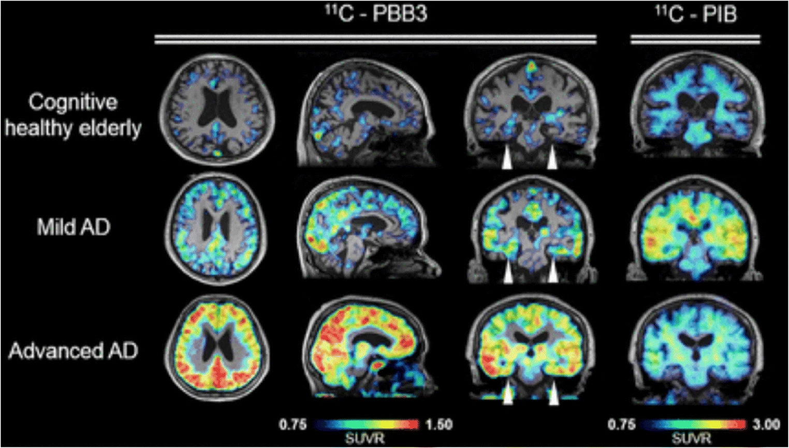

```{=html}
<style>
.reveal .fragment.blur-reveal { opacity: 1 !important; visibility: visible !important; }
.reveal .fragment.blur-reveal img { filter: blur(22px); transition: filter 600ms ease; }
.reveal .fragment.blur-reveal.visible img { filter: blur(0); }
.reveal .fragment.blur-reveal figcaption { color: #6272a4; font-style: italic; }
</style>
```

## Outline
- 20 minutes on "Dementia", to give a modern framework for understanding
- 20 minutes on the development of symptomatic treatments
- 5 minute break
- 20 minutes on "Disease modifying" treatments.
- 5 minutes for questions for me on the material presented
- 10-20 minutes Q and A patient with me
- 10 minutes Qs from students

## Part 1: Dementia {background-color="#44475a"}

::: {.r-fit-text style="color:#bd93f9;"}
A modern framework
:::

## Alzheimer’s disease is not synonymous with dementia {.smaller}
::: {.incremental}
Dementia is an umbrella term used to describe a state where an individual has lost the ability to carry out daily life activities independently, because of cognitive impairment.

There are many types and causes of dementia.

The most common ones are:

1. Alzheimer’s disease (AD) `pathological definition`
2. Vascular dementia `aetiological definition`
3. Dementia with Lewy bodies `molecular definition`
4. Frontotemporal dementia `anatomical definition`
:::


## Question 1

<iframe src="https://wall.sli.do/event/edVDqsrhZmU8mVxZdQfbXV" width="1280" height="720" style="border:0;"></iframe>


## Alzheimer’s disease is a disease like any other

- AD refers to the abnormal presence of Aβ and tau proteins which define AD among many other neurodegenerative diseases

- Some individuals may have dementia without Aβ or tau pathology, while others (rarely) may have no clinical symptoms, even in the presence of Aβ pathology.

##

<iframe src="Widgets/alzheimer_timeline.html" width="1480" height="840" style="border:0;"></iframe>

## Biological vs clinical definition {.small}

:::: {.columns}

::: {.column width="45%"}
**The old way** `pre-2010`

- Clinical syndrome → "probable AD"
- Pathology only confirmed at post-mortem
- Heterogeneous cohorts in trials
- *"Dementia of the Alzheimer type"*
:::
::: {.column width="5%"}
:::
::: {.column width="45%"}
**The modern way** `2018 NIA-AA, 2024 revised criteria`

- Biology defines the disease `Aβ + tau`
- Clinical stage is described separately
- Biomarkers in life: CSF, plasma, PET
- Allows pre-symptomatic diagnosis
:::

::::

##
<iframe src="Widgets/biomarker_cascade.html" width="1480" height="800" style="border:0;"></iframe>

##

## Question 2, Higher or Lower?

<iframe src="https://wall.sli.do/event/edVDqsrhZmU8mVxZdQfbXV" width="1280" height="720" style="border:0;"></iframe>

## The AT(N)(X) framework {.smaller}

::: {.panel-tabset}

### A: Amyloid
:::: {.columns}

::: {.column width="55%"}
What it measures: cerebral Aβ pathology.

- CSF Aβ42/40 ratio `low = abnormal`
- Plasma Aβ42/40 `replaces some lumbar punctures`
- Amyloid-PET `florbetapir, flutemetamol`
:::

::: {.column width="45%"}
::: {.fragment .blur-reveal}

:::
:::

::::
### T: Tau

:::: {.columns}

::: {.column width="55%"}
What it measures: tau pathology.

- CSF p-tau181, p-tau217
- **Plasma p-tau217**
- Tau-PET `flortaucipir, tracks Braak staging`
:::

::: {.column width="45%"}

:::

::::

### N: Neurodegeneration

:::: {.columns}

::: {.column width="55%"}
What it measures: downstream injury, not specific to AD.

- Structural MRI atrophy `MTA score`
- FDG-PET `temporo-parietal hypometabolism`
- CSF total tau
:::

::: {.column width="45%"}

:::

::::

### X: Other

:::: {.columns}

::: {.column width="55%"}
What it measures: vascular, inflammatory, synaptic axes added in 2024.

- Vascular markers `WMH, infarcts`
- Inflammatory `GFAP, astrocyte activation`
- Synaptic `neurogranin, SNAP-25`
:::

::: {.column width="45%"}

:::

::::

:::


## Question 3

<iframe src="https://wall.sli.do/event/edVDqsrhZmU8mVxZdQfbXV" width="1280" height="720" style="border:0;"></iframe>

## The global prevalence of dementia is increasing {.smaller}
::: {.incremental}

- There are many causes of dementia, but AD is the most common cause in individuals older than 65 years of age.

- In 2020, it was estimated that over 55 million people worldwide were living with neurodegenerative disease at the *dementia* stage.

- The number of people affected is set to rise to **139 million** by 2050, with the most significant increases in lower-middle-income (LMIC) countries.

- Dementia (including dementia due to AD) incidence and prevalence are increasing globally but are likely to be underestimated because of underdiagnosis and misdiagnosis

- As global lifespan continues to increase, the number of people affected by dementia is expected to rise. Up to three-quarters of those with dementia worldwide have not received a diagnosis.
:::

## 55M to 139M by 2050 {.smaller}

::: {style="border:2px dashed #6272a4;padding:2em;margin:1em auto;text-align:center;color:#6272a4;border-radius:8px;max-width:80%;"}
**[FIGURE PLACEHOLDER]**

bar chart, global dementia prevalence 2020 (**55M**) vs 2050 projection (**139M**) · +84M growth, most in low- and middle-income countries · ≈ 75% currently undiagnosed
:::

## Historical development of Alzheimer’s disease diagnostic criteria {.smaller}

:::: {.columns}

::: {.column width="45%"}
- The 2023 revised criteria for diagnosis and staging of AD emphasizes that AD is a disease defined by its biology
- However, to avoid misdiagnosis, only biomarkers that have been proven to be accurate with respect to an accepted reference standard should be used for diagnosis
- It is important to note that biomarker tests should always be interpreted with clinical judgment
:::
::: {.column width="5%"}
:::
::: {.column width="45%"}
The clinician's expertise is crucial in the following situations:

1. When the biomarker test result contradicts the clinical presentation
2. When evaluating the probable contribution of AD versus other pathologies to clinical symptoms
3. When assessing how other medical conditions could possibly impact the biomarker results
:::

::::

## Alzheimer’s disease diagnostic biomarkers {.smaller}

:::: {.columns}

::: {.column width="45%"}
**Core 1** `currently accepted for diagnosis`

- CSF Aβ42/40
- CSF p-tau181/Aβ42
- CSF t-tau/Aβ42
- Accurate plasma assays
- Amyloid-PET
:::
::: {.column width="5%"}
:::
::: {.column width="45%"}
**Core 2** `emerging / research-grade`

- Plasma p-tau217 `near-CSF accuracy`
- Plasma MTBR-tau243
- GFAP `astrocyte activation`
- NfL `non-specific neurodegeneration`
- Tau-PET `Braak staging in life`
:::

::::

## Differential diagnosis {.smaller}

::: {.panel-tabset}

### AD

- **Onset**: insidious, episodic memory first
- **Signature**: temporo-parietal cognition; language; getting lost
- **Imaging**: medial temporal and parietal atrophy
- **Treatment cue**: AChEi and memantine; now anti-amyloid eligible

### DLB

- **Onset**: fluctuating cognition, visual hallucinations, REM sleep behaviour disorder, parkinsonism
- **Signature**: attention/executive > memory early; very neuroleptic-sensitive
- **Imaging**: relatively preserved MTL; DAT scan abnormal
- **Treatment cue**: rivastigmine often helpful; **avoid antipsychotics**

### FTD

- **Onset**: typically <65 y; behavioural variant or primary progressive aphasia
- **Signature**: disinhibition, apathy, loss of empathy, dietary change *(bvFTD)*
- **Imaging**: frontal / anterior temporal atrophy
- **Treatment cue**: AChEi unhelpful or may worsen behaviour; SSRIs, environmental management

### VaD

- **Onset**: stepwise, after vascular events
- **Signature**: executive dysfunction, slowed processing, focal neurology
- **Imaging**: infarcts, white matter hyperintensities, microbleeds
- **Treatment cue**: aggressive vascular risk control; modest AChEi benefit
:::

## Reversible mimics 

::: {.callout-warning title="Treatable contributors to cognitive impairment"}
- B12 / folate deficiency
- Hypothyroidism
- Depression `pseudo-dementia`
- Normal pressure hydrocephalus `gait, urinary, cognitive`
- Drug effects `anticholinergics, benzodiazepines, opioids`
- Delirium `often superimposed`
- Obstructive sleep apnoea
- Subdural haematoma
- Alcohol misuse
:::

## Assessment {.smaller}
::: {.panel-tabset}

### Clinical History
:::: {.columns}

::: {.column width="45%"}
A medical history from the patient and collateral history from an
appropriate informant.

- Educational attainment `quantitative and qualitative`
- Occupational attainment `manual/ skilled/ professional`
- Head Injury / Contact sports `rugby and boxing`
- Lifetime Alcohol + substances `peak, sustained`
- Smoking history
:::
::: {.column width="45%"}
- Rapid forgetfulness
- Repetitive questioning
- Loss of recent memory `with relative preservation of remote`
- Functional decline `IADLs first, then ADLs`
- BPSD `agitation, depression, sleep`
:::
::::

### Cognitive examination
A cognitive, functional, behavioural and mental state examination (preferably using validated assessment scales)

- RBANS `sensitive to different sorts of decline`
- Addenbrookes' Cognitive Evaluation (III) `(90% of UK memory clinics)`
- Mini Mental State Examination `insensitive to early decline`
- Montreal Cognitive Assessment `better than MMSE, retains ceiling effects`

### Examination
Physical examination, laboratory tests (to exclude comorbid conditions that may be impairing cognitive function), and review of medication (to identify drugs that may be impairing cognitive function)

### Neuroimaging

- **Structural MRI** `first-line`: medial temporal atrophy (MTA score), parietal atrophy (Koedam), white-matter disease, microbleeds
- **FDG-PET**: temporo-parietal hypometabolism in AD; frontal in FTD
- **Amyloid-PET**: confirms or excludes Aβ pathology in life
- **Tau-PET**: research and disease-modifying treatment selection
- **DAT scan**: supports DLB when uncertain

<!-- TODO: Pictures/atrophy_montage.png — coronal MRI grid AD/DLB/FTD/VaD -->

### Biomarkers

- **CSF panel**: Aβ42/40, p-tau181, t-tau `requires lumbar puncture`
- **Plasma p-tau217** `near-CSF accuracy, primary care feasible`
- **Plasma Aβ42/40, GFAP, NfL**: pre-screening tools
- **APOE genotyping**: risk stratification; mandatory before anti-amyloid antibodies
- **Genetic testing**: *APP, PSEN1, PSEN2* in early-onset / familial cases

:::

## Part 2: Symptomatic treatments {background-color="#44475a"}

## The cholinergic hypothesis (1976) {.smaller}

- Bowen, Davies, Perry independently observed loss of choline acetyltransferase in post-mortem AD brain
- Source: degenerating cholinergic projections from the **nucleus basalis of Meynert**
- Implication: boost acetylcholine, improve cognition

## The drug approval timeline

::: {style="border:2px dashed #6272a4;padding:2em;margin:1em auto;text-align:center;color:#6272a4;border-radius:8px;max-width:80%;"}
**[FIGURE PLACEHOLDER]**

horizontal timeline 1993–2024 · **symptomatic** group: tacrine 1993 · donepezil 1996 · rivastigmine 2000 · galantamine 2001 · memantine 2003 · brexpiprazole 2023 (BPSD) · **disease-modifying** group: aducanumab 2021 · lecanemab 2023 · donanemab 2024
:::

## AChE inhibitor mechanism {.smaller}

:::: {.columns}

::: {.column width="45%"}
::: {style="border:2px dashed #6272a4;padding:1.5em;margin:0;text-align:center;color:#6272a4;border-radius:8px;height:90%;display:flex;flex-direction:column;justify-content:center;"}
**[FIGURE PLACEHOLDER]**

cholinergic synapse · presynaptic ACh release · AChE breaking ACh in cleft · **AChEi blocking AChE → more ACh available**
:::
:::
::: {.column width="5%"}
:::
::: {.column width="45%"}
- AD brains have loss of cortical and hippocampal ACh
- AChEi inhibit synaptic breakdown of ACh, increasing transmitter availability per release
- Effect is presynaptic compensation; does not modify disease
- Side-effects from cholinergic excess: ↑ vagal tone, GI cramping, bradycardia, vivid dreams
:::

::::

## AChE inhibitors: clinical use {.smaller}

::: {.panel-tabset}

### Donepezil

- Once daily, oral; 5 mg → 10 mg after 4 weeks `most common UK first-line`
- Long half-life
- Side effects: GI upset, vivid dreams, bradycardia
- Cardiac history → ECG before starting

### Rivastigmine

- BD oral or **transdermal patch** `useful when swallowing or compliance issues`
- Inhibits both AChE and butyrylcholinesterase
- Patch reduces GI side-effects substantially
- **Drug of choice in DLB and PDD**

### Galantamine

- BD oral; also a **nicotinic allosteric modulator**
- Cardiac caution `rare reports of bradyarrhythmia`
- Less commonly used in UK
:::

## Memantine: NMDA receptor antagonism {.smaller}

:::: {.columns}

::: {.column width="45%"}
::: {style="border:2px dashed #6272a4;padding:1.5em;margin:0;text-align:center;color:#6272a4;border-radius:8px;height:90%;display:flex;flex-direction:column;justify-content:center;"}
**[FIGURE PLACEHOLDER]**

glutamatergic synapse · NMDA receptor channel · excess glutamate driving pathological tonic activation · **memantine** sitting in the channel as an uncompetitive, low-affinity antagonist
:::
:::
::: {.column width="5%"}
:::
::: {.column width="45%"}
- Glutamatergic excitotoxicity → tonic NMDA-R activation → calcium overload
- Memantine sits in the channel only when it's pathologically open `voltage-dependent`
- Strong physiological NMDA bursts displace it, preserving physiological learning
- **Indication**: moderate to severe AD, or AChEi-intolerant
- Often combined with donepezil
:::

::::

## Effect size of symptomatic treatment {.smaller}

::: {style="border:2px dashed #6272a4;padding:2em;margin:1em auto;text-align:center;color:#6272a4;border-radius:8px;max-width:80%;"}
**[FIGURE PLACEHOLDER]**

two cognitive-decline curves running in parallel, untreated vs on AChEi, **offset horizontally by ≈ 6 months**, with annotation: *curves run parallel; disease trajectory unchanged · ADAS-cog ~2–3 points · MMSE ~1 point*
:::

## Differential responsiveness across subtypes {.smaller}

:::: {.columns}

::: {.column width="48%"}
**Helpful in**

- **AD** `modest, all severities`
- **DLB** `often substantial; rivastigmine first choice`
- **PDD** `cholinergic deficit prominent`
- **VaD** `mixed disease often benefits`
:::
::: {.column width="4%"}
:::
::: {.column width="48%"}
**Limited or harmful in**

- **bvFTD** `no benefit, may worsen agitation`
- **Pure VaD** `inconsistent`
- **Severe AD** `memantine takes over`
:::

::::

## BPSD {.smaller}

::: {.incremental}
- **B**ehavioural and **P**sychological **S**ymptoms of **D**ementia
- Up to 90% of patients experience at least one over the course of illness
- Drives `caregiver burden`, `institutionalisation`, `mortality`
- Five clusters:
  1. Agitation / aggression
  2. Psychosis `delusions, hallucinations`
  3. Depression / anxiety
  4. Apathy
  5. Sleep disturbance
:::

## Non-pharmacological management of BPSD {.smaller}

::: {.incremental}
- **Always rule out a precipitant**: pain, infection (UTI, chest), constipation, drug effect, sensory deprivation
- **Cognitive Stimulation Therapy** `NICE-recommended, group-based`
- **Exercise** `aerobic + resistance`
- **Music therapy**: strong evidence in agitation
- **Environmental modification**: light, routine, signage, familiar objects
- **Caregiver education and support**: often high-yield
:::

## Pharmacological management of BPSD

::: {.callout-important title="Antipsychotics are last-resort"}
- ↑ stroke and all-cause mortality `CATIE-AD, FDA black box`
- **Severe sensitivity in DLB**: can cause irreversible parkinsonism / NMS
- Use only when behaviour endangers patient or others, lowest dose, short duration, regular review
:::

- **SSRIs** for depression (citalopram has agitation evidence, but QTc concern)
- **Brexpiprazole**: first FDA approval for agitation in AD, 2023 `not yet NICE-approved on NHS for this indication`
- **Trazodone**: sleep, agitation; mostly off-label
- **Avoid benzodiazepines**: falls, paradoxical agitation, dependence

## Limits of symptomatic treatment 

- They do not slow neuronal loss
- They do not clear Aβ or tau
- They do not change underlying trajectory
- A patient on AChEi 5 years from diagnosis has the same brain pathology as one untreated

## 5 minute break {background-color="#44475a"}

::: {.r-fit-text style="color:#50fa7b;"}

:::

## Part 3: Disease-modifying treatments {background-color="#44475a"}

## The amyloid hypothesis (Hardy & Higgins, 1992)

- **Aβ accumulation** is the upstream driver of AD
- Genetic anchor: every gene mutation that causes autosomal-dominant AD `APP, PSEN1, PSEN2` alters Aβ production or clearance
- Down syndrome (trisomy 21 → 3 copies of *APP*) → near-universal AD pathology by age 50
- Tau pathology, inflammation, neurodegeneration: downstream
- Predicted: lower Aβ → less downstream damage → better outcome

## Failed anti-amyloid trials {.smaller}

- **Solanezumab**: Eli Lilly; failed Phase 3 in mild AD (2014, 2016)
- **Bapineuzumab**: Pfizer/J&J; failed (2012); high rate of vasogenic edema
- **Crenezumab**: Roche; failed (2019)
- **Gantenerumab**: Roche; first GRADUATE trials negative (2022); reformulated for prevention
- Lessons learned:
  - Treating too late `pathology has spread for 15+ years`
  - Targeting the wrong species `monomer vs oligomer vs plaque`
  - Insufficient brain penetration / dosing
  - Endpoint too noisy in mild populations

## Aducanumab (2021) 

- Two Phase 3 trials (EMERGE, ENGAGE): discordant; pre-specified analysis was negative
- Post-hoc reanalysis at high dose suggested cognitive benefit on EMERGE
- **FDA accelerated approval** June 2021, over near-unanimous advisory panel objection
- EMA **refused** authorisation
- NHS / NICE: **not commissioned**
- Eli Lilly withdrew it from market 2024

## Lecanemab: CLARITY-AD (2023) 

- **CLARITY-AD**, Phase 3, 1795 participants, early symptomatic AD
- Targets **soluble Aβ protofibrils** specifically
- Primary outcome: CDR-SB at 18 months
- **27% slowing** of clinical decline vs placebo (–0.45 points on CDR-SB)
- ARIA-E in 13%; ARIA-H in 17%; mostly asymptomatic
- FDA full approval July 2023; EMA approved 2024
- **NICE rejected** for NHS use (Aug 2024); benefit not judged cost-effective at list price

<!-- TODO: Pictures/clarity_ad_curves.png — CDR-SB separation curves from van Dyck et al. NEJM 2023 -->

## Donanemab: TRAILBLAZER-ALZ 2 (2024) 

- **TRAILBLAZER-ALZ 2**, Phase 3, 1736 participants, MCI / mild AD
- Targets **pyroglutamate-modified Aβ** found only in established plaques
- **iADRS slowing 35%** in low/medium-tau population over 76 weeks
- **Stop-when-cleared** design: patients with negative amyloid-PET stopped treatment
- ARIA-E 24%; ARIA-H 31%; serious in ~1.6%
- FDA approval July 2024
- NICE: also rejected for NHS use 2024

<!-- TODO: Pictures/donanemab_curves.png — iADRS curves from Sims et al. JAMA 2023 -->

## Antibody specificity 
::: {style="border:2px dashed #6272a4;padding:2em;margin:1em auto;text-align:center;color:#6272a4;border-radius:8px;max-width:80%;"}
**[FIGURE PLACEHOLDER]**

Aβ aggregation pathway, **monomer → oligomer → protofibril → plaque** · **aducanumab** binds oligomers and fibrils · **lecanemab** selective for protofibrils · **donanemab** binds pyroglutamate-modified plaques only
:::

## Patient selection 

::: {.incremental}
- **Confirmed Aβ pathology**: amyloid-PET or CSF Aβ42/40
- **Disease stage**: MCI or mild AD dementia (not moderate or severe)
- **MRI suitable**: no severe cerebral amyloid angiopathy, ≤4 microbleeds, no superficial siderosis
- **Anticoagulation**: caution or contraindication
- **APOE4 genotyping**: needed for ARIA risk counselling
- **Capable of attending infusions** every 2–4 weeks for 18+ months
- **Capacity** to consent
:::

## ARIA {.smaller}

:::: {.columns}

::: {.column width="48%"}
**ARIA-E** `oedema, effusion`

- Vasogenic oedema, leptomeningeal effusion
- Best seen on **FLAIR**
- Most asymptomatic; caught on surveillance MRI
- Can present with headache, confusion, focal symptoms, seizures
:::
::: {.column width="4%"}
:::
::: {.column width="48%"}
**ARIA-H** `haemorrhage`

- Microbleeds, superficial siderosis
- Best seen on **SWI / GRE**
- Usually asymptomatic
- Persists indefinitely after resolution
:::

::::

- Severity is mostly mild; ~3% serious; rare deaths reported
- Surveillance MRI before infusions 5, 7, 14 (lecanemab) or before 2, 3, 4, 7 (donanemab)

<!-- TODO: Pictures/aria_examples.png — FLAIR ARIA-E + SWI ARIA-H montage -->

## APOE4 and ARIA risk {.smaller}

| APOE genotype | Lecanemab ARIA-E | Donanemab ARIA-E |
|---|---|---|
| Non-carrier | ~5% | ~16% |
| Heterozygote | ~11% | ~23% |
| **Homozygote** | **~33%** | **~41%** |

- ε4 homozygotes are ~2% of the population but bear most of the risk
- **Counselling**: genotype results have implications beyond the individual `family members, life insurance`
- Donanemab US label restricts use in homozygotes; EMA mandates discussion of relative risk
- Patients can decline genotyping but must be counselled to the higher-risk assumption

## UK implementation {.smaller}

::: {.incremental}
- **Drug cost**: £20–25k per patient per year (lecanemab list)
- **Infrastructure**: infusion suite every 2 (lecanemab) or 4 (donanemab) weeks
- **Surveillance MRI**: 4–7 scans per patient course
- **Workforce**: trained nurses, neurologists, neuroradiologists
- **NICE August 2024**: rejected lecanemab for NHS commissioning; benefit too small at price
- Currently available only privately in the UK; major equity concern
- Open question whether amyloid lowering alone is sufficient or whether combinations will be needed
:::

## Other approaches 

- **Anti-tau antibodies**: E2814, JNJ-2056 (zagotenemab discontinued 2023) `Phase 2`
- **Tau ASOs** `intrathecal antisense oligonucleotides, BIIB080`
- **Inflammation**: TREM2 agonists in early trials
- **Vaccines**: UB-311, ABvac40 (Phase 2)
- **Prevention trials** in pre-symptomatic carriers:
  - **DIAN-TU**: autosomal-dominant AD families
  - **AHEAD 3-45**: sporadic, plasma p-tau217 stratified
  - *A4 closed early; solanezumab failed*

## Current state 

::: {.incremental}
- The first disease-modifying drugs exist. Their effect size is modest. ARIA limits use. Access in the UK is restricted.
- **Diagnosis**: plasma p-tau217 may make primary-care testing feasible.
- **Prevention** may matter more at a population level than any antibody:
  - *Lancet Commission 2024: 14 modifiable risk factors account for ~45% of dementia risk*
  - Hearing, education, BP, smoking, obesity, depression, physical inactivity, diabetes, alcohol, social isolation, air pollution, head injury, vision, cholesterol
:::

## Questions on the material (5 min) {background-color="#44475a"}

::: {.r-fit-text style="color:#8be9fd;"}
?
:::

## Q&A with our patient (10–20 min) {background-color="#44475a"}

::: {.r-fit-text style="color:#50fa7b;"}
Welcome
:::

::: {.notes}
Confirm consent before introducing patient. Briefly orient students to respectful Q&A: open questions, no diagnostic queries.
:::

## Student questions (10 min) {background-color="#44475a"}

::: {.r-fit-text style="color:#ffb86c;"}
over to you
:::

## Summary {.smaller}

::: {.incremental}
1. **Dementia is a syndrome; AD is defined biologically.** Aβ and tau can be detected in life via CSF, plasma p-tau217, or PET.

2. **Symptomatic treatments help modestly and do not change disease course.** AChEi and memantine offer about a 6-month delay. Non-pharmacological BPSD interventions are first-line. Antipsychotics carry mortality risk.

3. **Anti-amyloid antibodies are the first disease-modifying drugs.** Effect size is modest. ARIA limits use. NICE has rejected them for the NHS. Prevention may matter more.
:::

## References

::: {#refs}
:::

::: {.notes}
Key sources for the deck:

- Jack et al. 2018: NIA-AA AT(N) framework (Alzheimer's & Dementia)
- Bateman / Schindler 2022: plasma p-tau217 performance
- van Dyck et al. 2023: CLARITY-AD lecanemab (NEJM)
- Sims et al. 2023: TRAILBLAZER-ALZ 2 donanemab (JAMA)
- Livingston et al. 2024: Lancet Commission on dementia prevention
:::
