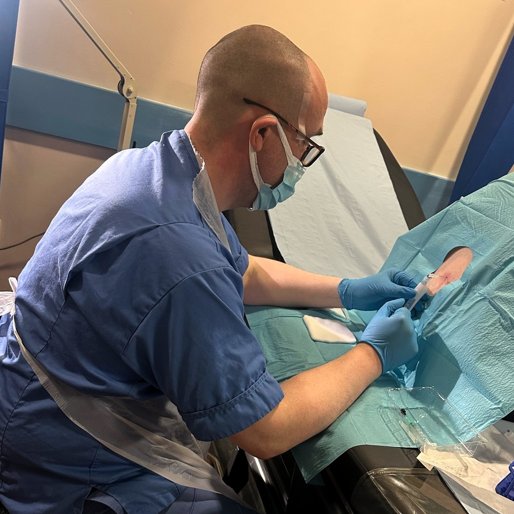
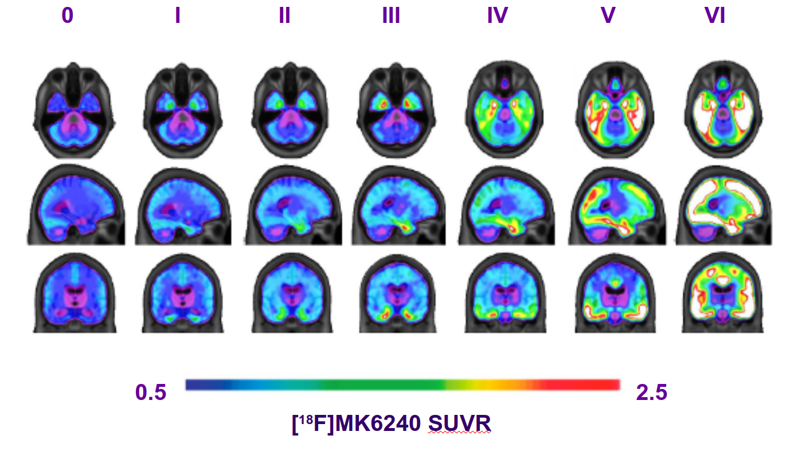
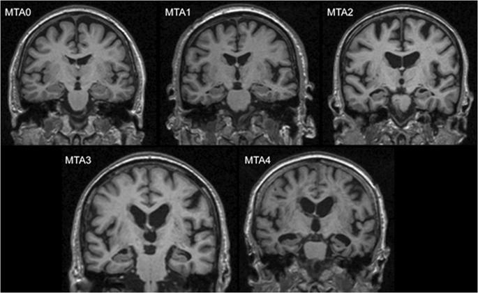
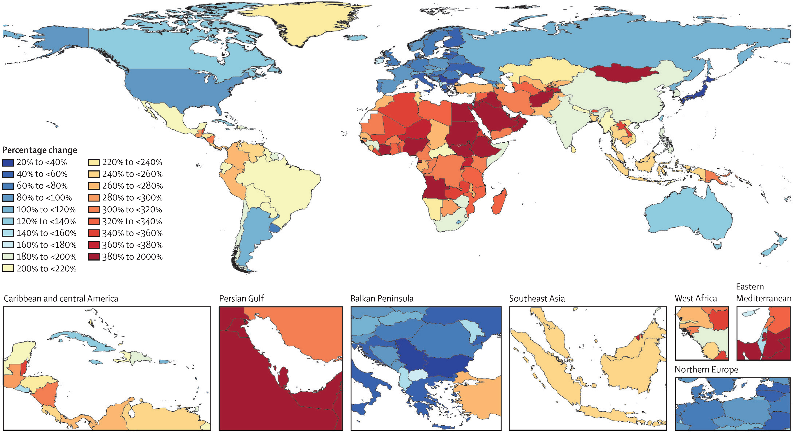
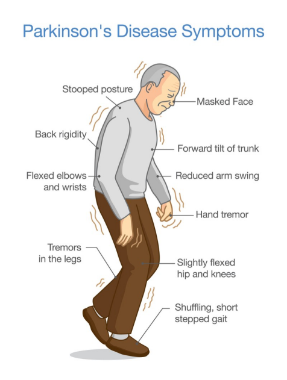
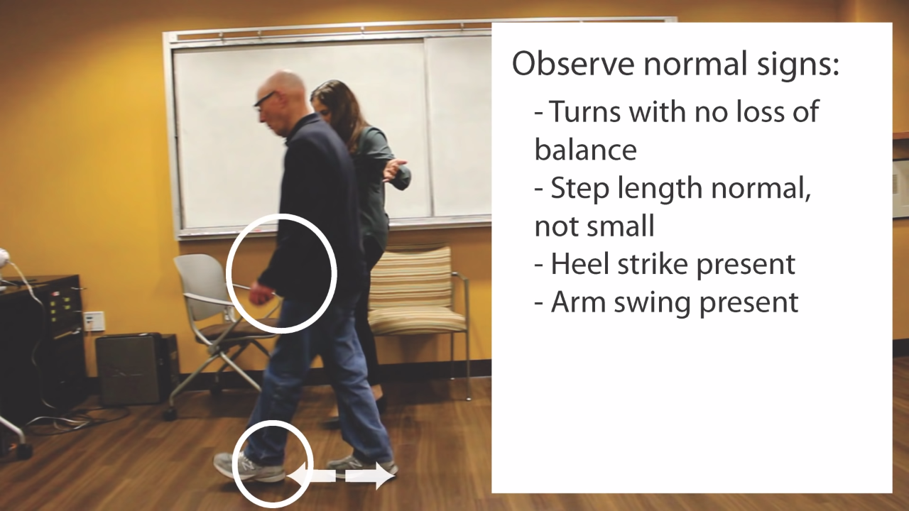
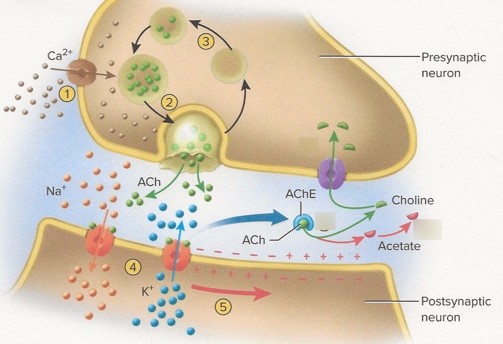
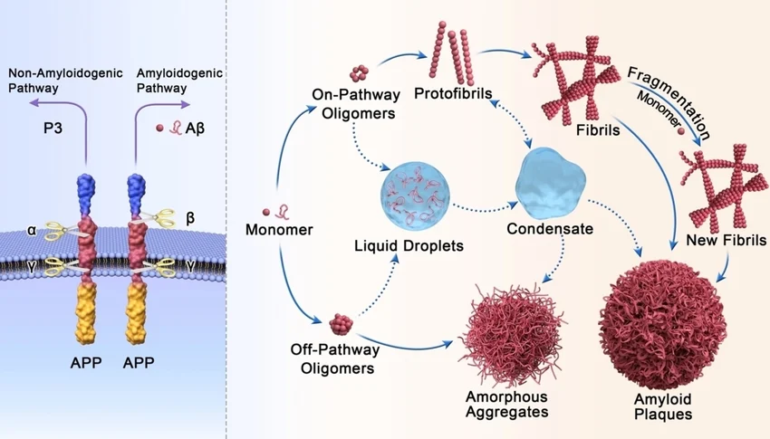

```{=html}
<svg width="0" height="0" style="position:absolute" aria-hidden="true">
  <defs>
    <filter id="chalk" x="-15%" y="-15%" width="130%" height="130%">
      <feTurbulence type="fractalNoise" baseFrequency="0.62" numOctaves="3" seed="7"/>
      <feDisplacementMap in="SourceGraphic" scale="2.4"/>
    </filter>
  </defs>
</svg>
<style>
  /* ── Paper-style panel-tabset ───────────────────────────────────── */
.reveal .panel-tabset > .nav-tabs {
  border-bottom: none;
  margin-bottom: 0;
  padding: 0 0.4em;
  gap: 0.25em;
}

.reveal .panel-tabset > .nav-tabs .nav-link {
  background: rgba(245, 240, 226, 0.05);
  color: rgba(245, 240, 226, 0.62);
  border: 1px solid rgba(245, 240, 226, 0.14);
  border-bottom: none;
  border-radius: 10px 10px 0 0;
  padding: 0.45em 1.1em;
  font-weight: 500;
  letter-spacing: 0.01em;
  position: relative;
  top: 1px;
  transition: background 180ms, color 180ms, transform 180ms;
}

.reveal .panel-tabset > .nav-tabs .nav-link:hover {
  background: rgba(245, 240, 226, 0.10);
  color: rgba(245, 240, 226, 0.95);
}

.reveal .panel-tabset > .nav-tabs .nav-link.active {
  background: rgba(245, 240, 226, 0.10);
  color: #f8f8f2;
  border-color: rgba(245, 240, 226, 0.24);
  font-weight: 600;
  z-index: 2;
  box-shadow: 0 -3px 8px rgba(0, 0, 0, 0.20);
}

.reveal .panel-tabset > .tab-content {
  background:
    linear-gradient(180deg,
      rgba(245, 240, 226, 0.10) 0%,
      rgba(245, 240, 226, 0.04) 35%,
      rgba(245, 240, 226, 0.06) 100%),
    radial-gradient(ellipse at top left,
      rgba(245, 240, 226, 0.08) 0%, transparent 60%);
  border: 1px solid rgba(245, 240, 226, 0.22);
  border-radius: 0 12px 12px 12px;
  padding: 1.1em 1.3em;
  box-shadow:
    0 6px 18px rgba(0, 0, 0, 0.22),
    0 0 0 1px rgba(245, 240, 226, 0.04),
    inset 0 1px 0 rgba(245, 240, 226, 0.06);
}

.reveal .fragment.blur-reveal { opacity: 1 !important; visibility: visible !important; }
.reveal .fragment.blur-reveal img { filter: blur(22px); transition: filter 600ms ease; }
.reveal .fragment.blur-reveal.visible img { filter: blur(0); }
.reveal .fragment.blur-reveal figcaption { color: #6272a4; font-style: italic; }

.reveal .trial-meta { text-align:center; color:#6272a4; font-size:0.55em; font-style:italic; margin:0 0 0.6em; }
.reveal .trial-grid { display:grid; grid-template-columns:1fr 1fr 1fr; gap:0.7em; }
.reveal .trial-block { background:rgba(68,71,90,0.35); border:1px solid #44475a; border-radius:8px; padding:0.75em 0.9em; }
.reveal .trial-cat { font-size:0.42em; letter-spacing:0.18em; text-transform:uppercase; color:#bd93f9; margin-bottom:0.75em; font-weight:600; }
.reveal .trial-block.efficacy .trial-cat { color:#50fa7b; }
.reveal .trial-block.safety   .trial-cat { color:#ff79c6; }
.reveal .trial-block.context  .trial-cat { color:#8be9fd; }
.reveal .trial-stat { margin-bottom:0.6em; line-height:1.05; }
.reveal .trial-stat:last-child { margin-bottom:0; }
.reveal .trial-num { font-size:0.95em; font-weight:700; color:#f8f8f2; display:block; }
.reveal .trial-block.efficacy .trial-num { color:#50fa7b; }
.reveal .trial-block.safety   .trial-num { color:#ff79c6; }
.reveal .trial-block.context  .trial-num { color:#8be9fd; }
.reveal .trial-lab { display:block; font-size:0.4em; color:#6272a4; letter-spacing:0.04em; margin-top:0.1em; line-height:1.25; }
.reveal .trial-ref { text-align:center; color:#6272a4; font-size:0.42em; font-style:italic; margin-top:0.7em; border-top:1px solid #44475a; padding-top:0.55em; }
.reveal .trial-chart { width:100%; height:auto; display:block; margin:0.4em 0 0.7em; }

/* ── Spell-out: per-letter staggered pop-in ─────────────────────── */
.reveal .spell-out { display: inline-block; }
.reveal .spell-out > span {
  display: inline-block;
  opacity: 0;
  transform: scale(0.2) translateX(-0.4em);
  transform-origin: 0% 50%;
  will-change: opacity, transform;
}
.reveal .spell-out.running > span {
  animation: spell-out-letter 380ms cubic-bezier(0.34, 1.56, 0.64, 1) forwards;
  animation-delay: calc(var(--i, 0) * var(--spell-stagger, 80ms));
}
@keyframes spell-out-letter {
  0%   { opacity: 0; transform: scale(0.2) translateX(-0.4em); }
  60%  { opacity: 1; transform: scale(1.08) translateX(0); }
  100% { opacity: 1; transform: scale(1)    translateX(0); }
}

</style>
<script>
(function () {
  function split(el) {
    if (el.dataset.spellSplit === 'true') return;
    el.dataset.spellSplit = 'true';
    var text = el.textContent;
    el.textContent = '';
    var i = 0;
    for (var ch of text) {
      var s = document.createElement('span');
      s.textContent = ch === ' ' ? ' ' : ch;
      s.style.setProperty('--i', i);
      el.appendChild(s);
      i++;
    }
  }
  function activate(slide) {
    if (!slide) return;
    slide.querySelectorAll('.spell-out').forEach(function (el) {
      split(el);
      el.classList.remove('running');
      void el.offsetWidth;          // force reflow so the animation replays
      el.classList.add('running');
    });
  }
  document.addEventListener('DOMContentLoaded', function () {
    document.querySelectorAll('.spell-out').forEach(split);
  });
  function hookReveal() {
    if (typeof Reveal === 'undefined') { setTimeout(hookReveal, 100); return; }
    if (Reveal.isReady && Reveal.isReady()) {
      activate(Reveal.getCurrentSlide());
    } else {
      Reveal.on('ready', function (e) { activate(e.currentSlide); });
    }
    Reveal.on('slidechanged', function (e) { activate(e.currentSlide); });
  }
  hookReveal();
})();
</script>
```

## Outline :watch:
- 20 minutes on "Dementia", to give a modern framework for understanding
- 20 minutes on the development of symptomatic treatments
- 5 minute break
- 20 minutes on "Disease modifying" treatments.
- 5 minutes for questions for me on the material presented
- 10-20 minutes Q and A trial participant with me
- 10 minutes Qs from students

## Part 1: Dementia {background-color="#44475a"}

::: {.r-fit-text style="color:#bd93f9;"}
A modern framework
:::

## Alzheimer’s disease is not synonymous with dementia {.smaller}
::: {.incremental}
Dementia is an umbrella term used to describe a state where an individual has lost the ability to carry out daily life activities independently, because of cognitive impairment.

There are many types and causes of dementia.

The most common ones are:

1. Alzheimer’s disease (AD) `pathological definition`
2. Vascular dementia `aetiological definition`
3. Dementia with Lewy bodies `molecular definition`
4. Frontotemporal dementia `anatomical definition`
:::

## Nature Neuroscience overview

<iframe width="1280" height="720"
        src="https://www.youtube-nocookie.com/embed/zTd0-A5yDZI?rel=0&modestbranding=1"
        title="Nature Neuroscience overview"
        frameborder="0"
        allow="accelerometer; autoplay; clipboard-write; encrypted-media; gyroscope; picture-in-picture; web-share"
        allowfullscreen
        style="border:0;"></iframe>

## Question 1

<iframe src="https://wall.sli.do/event/edVDqsrhZmU8mVxZdQfbXV" width="1280" height="720" style="border:0;"></iframe>


## Alzheimer’s disease is a disease like any other

- AD refers to the abnormal presence of Aβ and tau proteins which define AD among many other neurodegenerative diseases

- Some individuals may have dementia without Aβ or tau pathology, while others (rarely) may have no clinical symptoms, even in the presence of Aβ pathology.

##

<iframe src="Widgets/alzheimer_timeline.html" width="1480" height="840" style="border:0;"></iframe>

## Biological vs clinical definition {.small}

:::: {.columns}

::: {.column width="45%"}
**The old way** `pre-2010`

- Clinical syndrome → "probable AD"
- Pathology only confirmed at post-mortem
- Heterogeneous cohorts in trials
- *"Dementia of the Alzheimer type"*
:::
::: {.column width="5%"}
:::
::: {.column width="45%"}
**The modern way** `2018 NIA-AA, 2024 revised criteria`

- Biology defines the disease `Aβ + tau`
- Clinical stage is described separately
- Biomarkers in life: CSF, plasma, PET
- Allows pre-symptomatic diagnosis
:::

::::

##
<iframe src="Widgets/biomarker_cascade.html" width="1480" height="800" style="border:0;"></iframe>

##

## Question 2, Higher or Lower?

<iframe src="https://wall.sli.do/event/edVDqsrhZmU8mVxZdQfbXV" width="1280" height="720" style="border:0;"></iframe>

## The AT(N)(X) framework {.smaller}

::: {.panel-tabset}

### A: Amyloid
:::: {.columns}

::: {.column width="55%"}
What it measures: cerebral Aβ pathology.

- CSF Aβ42/40 ratio `low = abnormal`
- Plasma Aβ42/40 `replaces some lumbar punctures`
- Amyloid-PET `florbetapir, flutemetamol`
:::

::: {.column width="45%"}
::: {.fragment .blur-reveal}

:::
:::

::::
### T: Tau

:::: {.columns}

::: {.column width="55%"}
What it measures: tau pathology.

- CSF p-tau181, p-tau217
- **Plasma p-tau217**
- Tau-PET `flortaucipir, tracks Braak staging`
:::

::: {.column width="45%"}

:::

::::

### N: Neurodegeneration

:::: {.columns}

::: {.column width="55%"}
What it measures: downstream injury, not specific to AD.

- Structural MRI atrophy `MTA score`
- FDG-PET `temporo-parietal hypometabolism`
- CSF total tau
:::

::: {.column width="45%"}

:::

::::

### X: Other

:::: {.columns}

::: {.column width="55%"}
What it measures: vascular, inflammatory, synaptic axes added in 2024.

- Vascular markers `WMH, infarcts`
- Inflammatory `GFAP, astrocyte activation`
- Synaptic `neurogranin, SNAP-25`
:::

::: {.column width="45%"}

:::

::::

:::


## Question 3

<iframe src="https://wall.sli.do/event/edVDqsrhZmU8mVxZdQfbXV" width="1280" height="720" style="border:0;"></iframe>

## The global prevalence of dementia is increasing {.smaller}
::: {.incremental}

- There are many causes of dementia, but AD is the most common cause in individuals older than 65 years of age.

- In 2020, it was estimated that over 55 million people worldwide were living with neurodegenerative disease at the *dementia* stage.

- The number of people affected is set to rise to **152 million** by 2050, with the most significant increases in lower-middle-income (LMIC) countries.

- Dementia (including dementia due to AD) incidence and prevalence are increasing globally but are likely to be underestimated because of underdiagnosis and misdiagnosis

- As global lifespan continues to increase, the number of people affected by dementia is expected to rise. Up to three-quarters of those with dementia worldwide have not received a diagnosis.
:::

## 57.4M to 153M by 2050

<!-- ::: {style="border:2px dashed #6272a4;padding:2em;margin:1em auto;text-align:center;color:#6272a4;border-radius:8px;max-width:80%;"}
**[FIGURE PLACEHOLDER]**

bar chart, global dementia prevalence 2020 (**55M**) vs 2050 projection (**139M**) · +84M growth, most in low- and middle-income countries · ≈ 75% currently undiagnosed
::: -->


## Regions of greatest change




## Historical development of Alzheimer’s disease diagnostic criteria {.smaller}

:::: {.columns}

::: {.column width="45%"}
- The 2023 revised criteria for diagnosis and staging of AD emphasizes that AD is a disease defined by its biology
- However, to avoid misdiagnosis, only biomarkers that have been proven to be accurate with respect to an accepted reference standard should be used for diagnosis
- It is important to note that biomarker tests should always be interpreted with clinical judgment
:::
::: {.column width="5%"}
:::
::: {.column width="45%"}
The clinician's expertise is crucial in the following situations:

1. When the biomarker test result contradicts the clinical presentation
2. When evaluating the probable contribution of AD versus other pathologies to clinical symptoms
3. When assessing how other medical conditions could possibly impact the biomarker results
:::

::::

## Alzheimer’s disease diagnostic biomarkers {.smaller}

:::: {.columns}

::: {.column width="45%"}
**Core 1** `currently accepted for diagnosis`

- CSF Aβ42/40
- CSF p-tau181/Aβ42
- CSF t-tau/Aβ42
- Accurate plasma assays
- Amyloid-PET
:::
::: {.column width="5%"}
:::
::: {.column width="45%"}
**Core 2** `emerging / research-grade`

- Plasma p-tau217 `near-CSF accuracy`
- Plasma MTBR-tau243
- GFAP `astrocyte activation`
- NfL `non-specific neurodegeneration`
- Tau-PET `Braak staging in life`
:::

::::

##
<iframe src="https://wall.sli.do/event/edVDqsrhZmU8mVxZdQfbXV" width="1280" height="720" style="border:0;"></iframe>

:::

## Differential diagnosis 

::: {.panel-tabset}

### AD

- **Onset**: insidious, episodic memory first
- **Signature**: temporo-parietal cognition; language; getting lost
- **Imaging**: medial temporal and parietal atrophy
- **Treatment cue**: AChEi and memantine; now anti-amyloid eligible

### DLB

- **Onset**: fluctuating cognition, visual hallucinations, REM sleep behaviour disorder, parkinsonism
- **Signature**: attention/executive > memory early; very neuroleptic-sensitive
- **Imaging**: relatively preserved MTL; DAT scan abnormal
- **Treatment cue**: rivastigmine often helpful; **avoid antipsychotics**

### FTD

- **Onset**: typically <65 y; behavioural variant or primary progressive aphasia
- **Signature**: disinhibition, apathy, loss of empathy, dietary change *(bvFTD)*
- **Imaging**: frontal / anterior temporal atrophy
- **Treatment cue**: AChEi unhelpful or may worsen behaviour; SSRIs, environmental management

### VaD

- **Onset**: stepwise, after vascular events
- **Signature**: executive dysfunction, slowed processing, focal neurology
- **Imaging**: infarcts, white matter hyperintensities, microbleeds
- **Treatment cue**: aggressive vascular risk control; modest AChEi benefit
:::

## Reversible mimics 

::: {.callout-warning title="Treatable contributors to cognitive impairment"}
- B12 / folate deficiency
- Hypothyroidism
- Depression `pseudo-dementia`
- Normal pressure hydrocephalus `gait, urinary, cognitive`
- Drug effects `anticholinergics, benzodiazepines, opioids`
- Delirium `often superimposed`
- Obstructive sleep apnoea
- Subdural haematoma
- Alcohol misuse
:::

##
<iframe src="https://wall.sli.do/event/edVDqsrhZmU8mVxZdQfbXV" width="1280" height="720" style="border:0;"></iframe>

:::

## Assessment {.smaller}
::: {.panel-tabset}

### Clinical History
:::: {.columns}

::: {.column width="45%"}
A medical history from the patient and collateral history from an
appropriate informant.

- Educational attainment `quantitative and qualitative`
- Occupational attainment `manual/ skilled/ professional`
- Head Injury / Contact sports `rugby and boxing`
- Lifetime Alcohol + substances `peak, sustained`
- Smoking history
:::
::: {.column width="45%"}
- Rapid forgetfulness
- Repetitive questioning
- Loss of recent memory `with relative preservation of remote`
- Functional decline `IADLs first, then ADLs`
- BPSD `agitation, depression, sleep`
:::
::::

### Cognitive examination
A cognitive, functional, behavioural and mental state examination (preferably using validated assessment scales)

- RBANS `sensitive to different sorts of decline`
- Addenbrookes' Cognitive Evaluation (III) `(90% of UK memory clinics)`
- Mini Mental State Examination `insensitive to early decline`
- Montreal Cognitive Assessment `better than MMSE, retains ceiling effects`

### Examination
Physical examination, laboratory tests (to exclude comorbid conditions that may be impairing cognitive function), and review of medication (to identify drugs that may be impairing cognitive function)

:::: {.columns}

::: {.column width=33%}




:::

::: {.column width=6%}


:::

::: {.column width=60%}




:::

::::


### Neuroimaging

- **Structural MRI** `first-line`: medial temporal atrophy (MTA score), parietal atrophy (Koedam), white-matter disease, microbleeds
- **FDG-PET**: temporo-parietal hypometabolism in AD; frontal in FTD
- **Amyloid-PET**: confirms or excludes Aβ pathology in life
- **Tau-PET**: research and disease-modifying treatment selection
- **DAT scan**: supports DLB when uncertain

<!-- TODO: Pictures/atrophy_montage.png — coronal MRI grid AD/DLB/FTD/VaD -->

### Biomarkers

- **CSF panel**: Aβ42/40, p-tau181, t-tau `requires lumbar puncture`
- **Plasma p-tau217** `near-CSF accuracy, primary care feasible`
- **Plasma Aβ42/40, GFAP, NfL**: pre-screening tools
- **APOE genotyping**: risk stratification; mandatory before anti-amyloid antibodies
- **Genetic testing**: *APP, PSEN1, PSEN2* in early-onset / familial cases

:::

## Part 2: Symptomatic treatments {background-color="#44475a"}


### 
<iframe src="https://wall.sli.do/event/edVDqsrhZmU8mVxZdQfbXV" width="1280" height="720" style="border:0;"></iframe>

:::


## The cholinergic hypothesis (1976)

- Bowen, Davies, Perry independently observed loss of choline acetyltransferase in post-mortem AD brain
- Source: degenerating cholinergic projections from the **nucleus basalis of Meynert**
- Implication: boost acetylcholine, improve cognition

## AChE inhibitor mechanism {.smaller}

:::: {.columns}

::: {.column width="45%"}

:::
::: {.column width="5%"}
:::
::: {.column width="45%"}
- AD brains have loss of cortical and hippocampal ACh
- AChEi inhibit synaptic breakdown of ACh, increasing transmitter availability per release
- Effect is presynaptic compensation; does not modify disease
- Side-effects from cholinergic excess: ↑ vagal tone, GI cramping, bradycardia, vivid dreams
:::

::::

## AChE inhibitors: clinical use 

::: {.panel-tabset}

### Donepezil

- Once daily, oral; 5 mg increased to 10 mg after 6 weeks `most common UK first-line`
- Long half-life
- Side effects: GI upset, vivid dreams, bradycardia
- Cardiac history → ECG before starting

### Rivastigmine

- BD oral or **transdermal patch** `useful when swallowing or compliance issues`
- Inhibits both AChE and butyrylcholinesterase
- Patch reduces GI side-effects substantially
- **Drug of choice in DLB and PDD**

### Galantamine

- BD oral; also a **nicotinic allosteric modulator**
- Cardiac caution `rare reports of bradyarrhythmia`
- Less commonly used in UK
:::

## Memantine: NMDA receptor antagonism {.smaller}

:::: {.columns}

::: {.column width="45%"}
<!-- ::: {style="border:2px dashed #6272a4;padding:1.5em;margin:0;text-align:center;color:#6272a4;border-radius:8px;height:90%;display:flex;flex-direction:column;justify-content:center;"}
**[FIGURE PLACEHOLDER]**

glutamatergic synapse · NMDA receptor channel · excess glutamate driving pathological tonic activation · **memantine** sitting in the channel as an uncompetitive, low-affinity antagonist
::: -->


:::
::: {.column width="5%"}
:::
::: {.column width="45%"}
- Glutamatergic excitotoxicity → tonic NMDA-R activation → calcium overload
- Memantine sits in the channel only when it's pathologically open `voltage-dependent`
- Strong physiological NMDA bursts displace it, preserving physiological learning
- **Indication**: moderate to severe AD, or AChEi-intolerant
- Often combined with donepezil
:::

::::

## Effect size of symptomatic treatment {.smaller}

<!-- ::: {style="border:2px dashed #6272a4;padding:2em;margin:1em auto;text-align:center;color:#6272a4;border-radius:8px;max-width:80%;"}
**[FIGURE PLACEHOLDER]**

two cognitive-decline curves running in parallel, untreated vs on AChEi, **offset horizontally by ≈ 6 months**, with annotation: *curves run parallel; disease trajectory unchanged · ADAS-cog ~2–3 points · MMSE ~1 point*
::: -->

<iframe src="Widgets/achei_memantine_mmse_trajectory.html" width="1280" height="1020" style="border:0;"></iframe>
## Differential responsiveness across subtypes {.smaller}

:::: {.columns}

::: {.column width="48%"}
**Helpful in**

- **AD** `modest, all severities`
- **DLB** `often substantial; rivastigmine first choice`
- **PDD** `cholinergic deficit prominent`
- **VaD** `mixed disease often benefits`
:::
::: {.column width="4%"}
:::
::: {.column width="48%"}
**Limited or harmful in**

- **bvFTD** `no benefit, may worsen agitation`
- **Pure VaD** `inconsistent`
- **Severe AD** `memantine takes over`
:::

::::

## BPSD {.smaller}

::: {.incremental}
- **B**ehavioural and **P**sychological **S**ymptoms of **D**ementia
- Up to 90% of patients experience at least one over the course of illness
- Drives `caregiver burden`, `institutionalisation`, `mortality`
- Five clusters:
  1. Agitation / aggression
  2. Psychosis `delusions, hallucinations`
  3. Depression / anxiety
  4. Apathy
  5. Sleep disturbance
:::

## Non-pharmacological management of BPSD {.smaller}

::: {.incremental}
- **Always rule out a precipitant**: pain, infection (UTI, chest), constipation, drug effect, sensory deprivation
- **Cognitive Stimulation Therapy** `NICE-recommended, group-based`
- **Exercise** `aerobic + resistance`
- **Music therapy**: strong evidence in agitation
- **Environmental modification**: light, routine, signage, familiar objects
- **Caregiver education and support**: often high-yield
:::

## Pharmacological management of BPSD

::: {.callout-important title="Antipsychotics are last-resort"}
- ↑ stroke and all-cause mortality `CATIE-AD, FDA black box`
- **Severe sensitivity in DLB**: can cause irreversible parkinsonism / NMS
- Use only when behaviour endangers patient or others, lowest dose, short duration, regular review
:::

- **SSRIs** for depression (citalopram has agitation evidence, but QTc concern)
- **Brexpiprazole**: first FDA approval for agitation in AD, 2023 `not yet NICE-approved on NHS for this indication`
- **Trazodone**: sleep, agitation; mostly off-label
- **Avoid benzodiazepines**: falls, paradoxical agitation, dependence

## Limits of symptomatic treatment 

- They do not slow neuronal loss
- They do not clear Aβ or tau
- They do not change underlying trajectory
- A patient on AChEi 5 years from diagnosis has the same brain pathology as one untreated


## What is important in clinical trials?

<iframe src="https://wall.sli.do/event/edVDqsrhZmU8mVxZdQfbXV" width="1280" height="720" style="border:0;"></iframe>


## 5 minute break :potable_water: :toilet:{background-color="#44475a"}

::: {.r-fit-text style="color:#50fa7b;"}

:::

## Part 3: Disease-modifying treatments {background-color="#44475a"}

## The amyloid hypothesis (Hardy & Higgins, 1992)

- **Aβ accumulation** is the upstream driver of AD
- Genetic anchor: every gene mutation that causes autosomal-dominant AD `APP, PSEN1, PSEN2` alters Aβ production or clearance
- Down syndrome (trisomy 21 → 3 copies of *APP*) → near-universal AD pathology by age 50
- Tau pathology, inflammation, neurodegeneration: downstream
- Predicted: lower Aβ → less downstream damage → better outcome

## Failed anti-amyloid trials {.smaller}

- **Solanezumab**: Eli Lilly; failed Phase 3 in mild AD (2014, 2016)
- **Bapineuzumab**: Pfizer/J&J; failed (2012); high rate of vasogenic edema
- **Crenezumab**: Roche; failed (2019)
- **Gantenerumab**: Roche; first GRADUATE trials negative (2022); reformulated for prevention
- Lessons learned:
  - Treating too late `pathology has spread for 15+ years`
  - Targeting the wrong species `monomer vs oligomer vs plaque`
  - Insufficient brain penetration / dosing
  - Endpoint too noisy in mild populations

## Aducanumab (2021) 

- Two Phase 3 trials (EMERGE, ENGAGE): discordant; pre-specified analysis was negative
- Post-hoc reanalysis at high dose suggested cognitive benefit on EMERGE
- **FDA accelerated approval** June 2021, over near-unanimous advisory panel objection
- EMA **refused** authorisation
- NHS / NICE: **not commissioned**
- Eli Lilly withdrew it from market 2024

## Lecanemab: CLARITY-AD (2023) {.smaller}

```{=html}
<div class="trial-meta">Phase 3 · n = 1,795 · 18 months · early symptomatic AD, biomarker-confirmed · target: soluble Aβ protofibrils</div>
<div class="trial-grid">
  <div class="trial-block efficacy">
    <div class="trial-cat">Efficacy · CDR-SB change from baseline</div>
    <svg viewBox="0 0 280 120" class="trial-chart" xmlns="http://www.w3.org/2000/svg">
      <line x1="22" y1="100" x2="262" y2="100" stroke="#44475a" stroke-width="0.7"/>
      <line x1="22" y1="20" x2="22" y2="100" stroke="#44475a" stroke-width="0.7"/>
      <line x1="20" y1="60" x2="22" y2="60" stroke="#44475a" stroke-width="0.5"/>
      <line x1="20" y1="20" x2="22" y2="20" stroke="#44475a" stroke-width="0.5"/>
      <text x="18" y="62" fill="#6272a4" font-size="6" text-anchor="end" font-family="monospace">1.0</text>
      <text x="18" y="22" fill="#6272a4" font-size="6" text-anchor="end" font-family="monospace">2.0</text>
      <polyline points="22,100 62,87.2 102,74 142,62 182,52 222,42 262,33.6" fill="none" stroke="#ff79c6" stroke-width="1.6" stroke-linecap="round"/>
      <polyline points="22,100 62,89.2 102,80 142,71.6 182,63.6 222,57.2 262,51.6" fill="none" stroke="#50fa7b" stroke-width="1.6" stroke-linecap="round"/>
      <circle cx="262" cy="33.6" r="2.2" fill="#ff79c6"/>
      <circle cx="262" cy="51.6" r="2.2" fill="#50fa7b"/>
      <text x="258" y="29" fill="#ff79c6" font-size="6.5" text-anchor="end" font-family="monospace">placebo 1.66</text>
      <text x="258" y="48" fill="#50fa7b" font-size="6.5" text-anchor="end" font-family="monospace">lecanemab 1.21</text>
      <text x="22" y="111" fill="#6272a4" font-size="6" text-anchor="middle" font-family="monospace">0</text>
      <text x="142" y="111" fill="#6272a4" font-size="6" text-anchor="middle" font-family="monospace">9 mo</text>
      <text x="262" y="111" fill="#6272a4" font-size="6" text-anchor="middle" font-family="monospace">18 mo</text>
    </svg>
    <div class="trial-stat"><span class="trial-num">27% slowing</span><span class="trial-lab">−0.45 CDR-SB difference · p &lt; 0.001 primary &amp; all secondaries</span></div>
  </div>
  <div class="trial-block safety">
    <div class="trial-cat">Safety · ARIA-E rate by APOE genotype</div>
    <svg viewBox="0 0 280 120" class="trial-chart" xmlns="http://www.w3.org/2000/svg">
      <line x1="22" y1="100" x2="262" y2="100" stroke="#44475a" stroke-width="0.7"/>
      <line x1="22" y1="20" x2="22" y2="100" stroke="#44475a" stroke-width="0.7"/>
      <line x1="20" y1="60" x2="22" y2="60" stroke="#44475a" stroke-width="0.5"/>
      <line x1="20" y1="20" x2="22" y2="20" stroke="#44475a" stroke-width="0.5"/>
      <text x="18" y="62" fill="#6272a4" font-size="6" text-anchor="end" font-family="monospace">25%</text>
      <text x="18" y="22" fill="#6272a4" font-size="6" text-anchor="end" font-family="monospace">50%</text>
      <rect x="60" y="92" width="50" height="8" fill="#ff79c6" opacity="0.45"/>
      <rect x="125" y="82.4" width="50" height="17.6" fill="#ff79c6" opacity="0.65"/>
      <rect x="190" y="47.2" width="50" height="52.8" fill="#ff79c6"/>
      <text x="85" y="88" fill="#ff79c6" font-size="6.5" text-anchor="middle" font-family="monospace">~5%</text>
      <text x="150" y="78" fill="#ff79c6" font-size="6.5" text-anchor="middle" font-family="monospace">~11%</text>
      <text x="215" y="43" fill="#ff79c6" font-size="7.5" text-anchor="middle" font-family="monospace" font-weight="700">~33%</text>
      <text x="85" y="111" fill="#6272a4" font-size="5.5" text-anchor="middle">noncarrier</text>
      <text x="150" y="111" fill="#6272a4" font-size="5.5" text-anchor="middle">heterozygote</text>
      <text x="215" y="111" fill="#6272a4" font-size="5.5" text-anchor="middle">homozygote</text>
    </svg>
    <div class="trial-stat"><span class="trial-num">12.6% / 17.3%</span><span class="trial-lab">overall ARIA-E / ARIA-H · 9.2% symptomatic ARIA-E in homozygotes</span></div>
  </div>
  <div class="trial-block context">
    <div class="trial-cat">Regulatory</div>
    <div class="trial-stat"><span class="trial-num">FDA · Jul 2023</span><span class="trial-lab">full (traditional) approval</span></div>
    <div class="trial-stat"><span class="trial-num">EMA · 2025</span><span class="trial-lab">approved on appeal, excluding APOE4 homozygotes</span></div>
    <div class="trial-stat"><span class="trial-num">NICE · rejected</span><span class="trial-lab">NHS use, Aug 2024 — not cost-effective at list price</span></div>
  </div>
</div>
<div class="trial-ref">van Dyck CH et al. <em>N Engl J Med</em>. 2023;388(1):9–21</div>
```

## Donanemab: TRAILBLAZER-ALZ 2 (2024) {.smaller}

```{=html}
<div class="trial-meta">Phase 3 · n = 1,736 · 76 weeks · MCI / mild AD · target: pyroglutamate-modified Aβ in plaques · stop-when-cleared design</div>
<div class="trial-grid">
  <div class="trial-block efficacy">
    <div class="trial-cat">Efficacy · iADRS decline, low/intermediate-tau (n = 1,182)</div>
    <svg viewBox="0 0 280 120" class="trial-chart" xmlns="http://www.w3.org/2000/svg">
      <line x1="22" y1="100" x2="262" y2="100" stroke="#44475a" stroke-width="0.7"/>
      <line x1="22" y1="20" x2="22" y2="100" stroke="#44475a" stroke-width="0.7"/>
      <line x1="20" y1="60" x2="22" y2="60" stroke="#44475a" stroke-width="0.5"/>
      <line x1="20" y1="20" x2="22" y2="20" stroke="#44475a" stroke-width="0.5"/>
      <text x="18" y="62" fill="#6272a4" font-size="6" text-anchor="end" font-family="monospace">6 pt</text>
      <text x="18" y="22" fill="#6272a4" font-size="6" text-anchor="end" font-family="monospace">12 pt</text>
      <polyline points="22,100 60,90 98,80 136,70 186,58.7 224,48 262,38" fill="none" stroke="#ff79c6" stroke-width="1.6" stroke-linecap="round"/>
      <polyline points="22,100 60,93.3 98,86.7 136,80 186,72 224,66 262,60" fill="none" stroke="#50fa7b" stroke-width="1.6" stroke-linecap="round"/>
      <circle cx="262" cy="38" r="2.2" fill="#ff79c6"/>
      <circle cx="262" cy="60" r="2.2" fill="#50fa7b"/>
      <text x="258" y="34" fill="#ff79c6" font-size="6.5" text-anchor="end" font-family="monospace">placebo −9.3</text>
      <text x="258" y="56" fill="#50fa7b" font-size="6.5" text-anchor="end" font-family="monospace">donanemab −6.0</text>
      <text x="22" y="111" fill="#6272a4" font-size="6" text-anchor="middle" font-family="monospace">0</text>
      <text x="142" y="111" fill="#6272a4" font-size="6" text-anchor="middle" font-family="monospace">36 wk</text>
      <text x="262" y="111" fill="#6272a4" font-size="6" text-anchor="middle" font-family="monospace">76 wk</text>
    </svg>
    <div class="trial-stat"><span class="trial-num">35% slowing</span><span class="trial-lab">iADRS · CDR-SB slowing 36% · 47% vs 29% no decline at 1 y</span></div>
  </div>
  <div class="trial-block safety">
    <div class="trial-cat">Safety · ARIA in donanemab arm vs placebo</div>
    <svg viewBox="0 0 280 120" class="trial-chart" xmlns="http://www.w3.org/2000/svg">
      <line x1="22" y1="100" x2="262" y2="100" stroke="#44475a" stroke-width="0.7"/>
      <line x1="22" y1="20" x2="22" y2="100" stroke="#44475a" stroke-width="0.7"/>
      <line x1="20" y1="60" x2="22" y2="60" stroke="#44475a" stroke-width="0.5"/>
      <line x1="20" y1="20" x2="22" y2="20" stroke="#44475a" stroke-width="0.5"/>
      <text x="18" y="62" fill="#6272a4" font-size="6" text-anchor="end" font-family="monospace">20%</text>
      <text x="18" y="22" fill="#6272a4" font-size="6" text-anchor="end" font-family="monospace">40%</text>
      <rect x="55" y="96" width="22" height="4" fill="#ff79c6" opacity="0.4"/>
      <rect x="80" y="52" width="22" height="48" fill="#ff79c6"/>
      <text x="66" y="92" fill="#6272a4" font-size="5.5" text-anchor="middle" font-family="monospace">2%</text>
      <text x="91" y="48" fill="#ff79c6" font-size="7.5" text-anchor="middle" font-family="monospace" font-weight="700">24%</text>
      <text x="78" y="111" fill="#6272a4" font-size="6" text-anchor="middle">ARIA-E</text>
      <rect x="160" y="84" width="22" height="16" fill="#ff79c6" opacity="0.4"/>
      <rect x="185" y="37.2" width="22" height="62.8" fill="#ff79c6"/>
      <text x="171" y="80" fill="#6272a4" font-size="5.5" text-anchor="middle" font-family="monospace">8%</text>
      <text x="196" y="33" fill="#ff79c6" font-size="7.5" text-anchor="middle" font-family="monospace" font-weight="700">31%</text>
      <text x="183" y="111" fill="#6272a4" font-size="6" text-anchor="middle">ARIA-H</text>
      <rect x="225" y="28" width="6" height="6" fill="#ff79c6" opacity="0.4"/>
      <text x="234" y="33.5" fill="#6272a4" font-size="5.5">placebo</text>
      <rect x="225" y="38" width="6" height="6" fill="#ff79c6"/>
      <text x="234" y="43.5" fill="#6272a4" font-size="5.5">donanemab</text>
    </svg>
    <div class="trial-stat"><span class="trial-num">5.8% / 1.5%</span><span class="trial-lab">symptomatic / serious ARIA-E · 3 deaths attributed to ARIA</span></div>
  </div>
  <div class="trial-block context">
    <div class="trial-cat">Regulatory · APOE</div>
    <div class="trial-stat"><span class="trial-num">FDA · Jul 2024</span><span class="trial-lab">full approval</span></div>
    <div class="trial-stat"><span class="trial-num">NICE · rejected</span><span class="trial-lab">NHS use, Oct 2024</span></div>
    <div class="trial-stat"><span class="trial-num">OR 4.57</span><span class="trial-lab">ARIA-E in APOE4 homozygotes vs noncarriers</span></div>
  </div>
</div>
<div class="trial-ref">Sims JR et al. <em>JAMA</em>. 2023;330(6):512–527</div>
```

## Antibody specificity 
<!-- ::: {style="border:2px dashed #6272a4;padding:2em;margin:1em auto;text-align:center;color:#6272a4;border-radius:8px;max-width:80%;"}
**[FIGURE PLACEHOLDER]**

Aβ aggregation pathway, **monomer → oligomer → protofibril → plaque** · **aducanumab** binds oligomers and fibrils · **lecanemab** selective for protofibrils · **donanemab** binds pyroglutamate-modified plaques only
::: -->



## Patient selection 

::: {.incremental}
- **Confirmed Aβ pathology**: amyloid-PET or CSF Aβ42/40
- **Disease stage**: MCI or mild AD dementia (not moderate or severe)
- **MRI suitable**: no severe cerebral amyloid angiopathy, ≤4 microbleeds, no superficial siderosis
- **Anticoagulation**: caution or contraindication
- **APOE4 genotyping**: needed for ARIA risk counselling
- **Capable of attending infusions** every 2–4 weeks for 18+ months
- **Capacity** to consent
:::

## ARIA {.smaller}

:::: {.columns}

::: {.column width="48%"}
**ARIA-E** `oedema, effusion`

- Vasogenic oedema, leptomeningeal effusion
- Best seen on **FLAIR**
- Most asymptomatic; caught on surveillance MRI
- Can present with headache, confusion, focal symptoms, seizures
:::
::: {.column width="4%"}
:::
::: {.column width="48%"}
**ARIA-H** `haemorrhage`

- Microbleeds, superficial siderosis
- Best seen on **SWI / GRE**
- Usually asymptomatic
- Persists indefinitely after resolution
:::

::::

- Severity is mostly mild; ~3% serious; rare deaths reported
- Surveillance MRI before infusions 5, 7, 14 (lecanemab) or before 2, 3, 4, 7 (donanemab)

<!-- TODO: Pictures/aria_examples.png — FLAIR ARIA-E + SWI ARIA-H montage -->

## APOE4 and ARIA risk {.smaller}

| APOE genotype | Lecanemab ARIA-E | Donanemab ARIA-E |
|---|---|---|
| Non-carrier | ~5% | ~16% |
| Heterozygote | ~11% | ~23% |
| **Homozygote** | **~33%** | **~41%** |

- ε4 homozygotes are ~2% of the population but bear most of the risk
- **Counselling**: genotype results have implications beyond the individual `family members, life insurance`
- Donanemab US label restricts use in homozygotes; EMA mandates discussion of relative risk
- Patients can decline genotyping but must be counselled to the higher-risk assumption

## UK implementation {.smaller}

::: {.incremental}
- **Drug cost**: £20–25k per patient per year (lecanemab list)
- **Infrastructure**: infusion suite every 2 (lecanemab) or 4 (donanemab) weeks
- **Surveillance MRI**: 4–7 scans per patient course
- **Workforce**: trained nurses, dementia specialists, neuroradiologists, raters, pharmacists
- **NICE August 2024**: rejected lecanemab for NHS commissioning; benefit too small at price
- Currently available only privately in the UK; major equity concern
- Open question whether amyloid lowering alone is sufficient or whether combinations will be needed
:::

## Other approaches 

- **Anti-tau antibodies**: E2814, JNJ-2056 (zagotenemab discontinued 2023) `Phase 2`
- **Tau ASOs** `intrathecal antisense oligonucleotides, BIIB080`
- **Inflammation**: TREM2 agonists in early trials
- **Vaccines**: UB-311, ABvac40 (Phase 2)
- **Prevention trials** in pre-symptomatic carriers:
  - **DIAN-TU**: autosomal-dominant AD families
  - **AHEAD 3-45**: sporadic, plasma p-tau217 stratified
  - *A4 closed early; solanezumab failed*

## Current state 

::: {.incremental}
- The first disease-modifying drugs exist. Their effect size is modest. ARIA limits use. Access in the UK is restricted.
- **Diagnosis**: plasma p-tau217 may make primary-care testing feasible.
- **Prevention** may matter more at a population level than any antibody:
  - *Lancet Commission 2024: 14 modifiable risk factors account for ~45% of dementia risk*
  - Hearing, education, BP, smoking, obesity, depression, physical inactivity, diabetes, alcohol, social isolation, air pollution, head injury, vision, cholesterol
:::


## What is a Brain Health Centre? {.slide-cascade}

::: {.slide-grid-cascade}

::: {.cascade-header}
<h2 class="big-q">Same patient. Same disease. Different future.</h2>
<p class="lede">A Brain Health Centre is not a relabelled memory clinic. It redesigns the pathway so that biomarkers, vascular workup, and behavioural support arrive together, early, before too much brain has been lost.</p>
:::

::: {.cascade-figure}

```{=html}
<svg viewBox="0 0 1500 410" xmlns="http://www.w3.org/2000/svg" class="cascade-svg" role="img" aria-label="Two parallel timelines comparing a Memory Assessment Service journey and a Brain Health Centre journey for the same hypothetical patient, Mary aged 64">

  <!-- Patient header -->
  <rect x="0" y="0" width="1500" height="44" fill="#bd93f9"/>
  <text x="40" y="28" font-family="Fraunces, Georgia, serif" font-size="20" font-weight="800" fill="#fff">Mary, 64.</text>
  <text x="170" y="28" font-family="Inter, Helvetica, Arial, sans-serif" font-size="16" fill="#fff" opacity="0.95" font-style="italic">"My memory's not what it was. My dad had dementia. Should I be worried?"</text>

  <!-- ===== MAS TRACK =====
       Time scale: x=200 (D0) → x=1380 (D365),  3.233 px/day -->
  <text x="40" y="84" font-family="Inter, Helvetica, Arial, sans-serif" font-size="14" font-weight="800" fill="#bd93f9">MEMORY ASSESSMENT SERVICE</text>
  <text x="40" y="101" font-family="Inter, Helvetica, Arial, sans-serif" font-size="11.5" fill="#b1bac4" font-style="italic">cognition-led, no biomarkers, sequential appointments</text>

  <line x1="200" y1="148" x2="879" y2="148" stroke="#bd93f9" stroke-width="3"/>
  <line x1="879" y1="148" x2="1380" y2="148" stroke="#bd93f9" stroke-width="2" stroke-dasharray="3 5" opacity="0.45"/>

  <g font-family="Inter, Helvetica, Arial, sans-serif">
    <!-- D0 GP referral -->
    <circle cx="200" cy="148" r="8" fill="#bd93f9"/>
    <text x="200" y="130" text-anchor="middle" font-size="11" font-weight="700" fill="#f8f8f2">GP referral</text>
    <text x="200" y="172" text-anchor="middle" font-size="10" fill="#6272a4">Day 0</text>
    <!-- D60 MAS letter -->
    <circle cx="394" cy="148" r="8" fill="#bd93f9"/>
    <text x="394" y="130" text-anchor="middle" font-size="11" font-weight="700" fill="#f8f8f2">MAS letter</text>
    <text x="394" y="172" text-anchor="middle" font-size="10" fill="#6272a4">Day 60</text>
    <!-- D90 First visit -->
    <circle cx="491" cy="148" r="8" fill="#bd93f9"/>
    <text x="491" y="130" text-anchor="middle" font-size="11" font-weight="700" fill="#f8f8f2">First visit</text>
    <text x="491" y="172" text-anchor="middle" font-size="10" fill="#6272a4">Day 90 · MMSE 25</text>
    <!-- D180 Repeat MMSE -->
    <circle cx="782" cy="148" r="8" fill="#bd93f9"/>
    <text x="782" y="130" text-anchor="middle" font-size="11" font-weight="700" fill="#f8f8f2">Repeat MMSE</text>
    <text x="782" y="172" text-anchor="middle" font-size="10" fill="#6272a4">Day 180</text>
    <!-- D210 Clinical diagnosis (label BELOW line, emphasised) -->
    <circle cx="879" cy="148" r="11" fill="#bd93f9" stroke="#fff" stroke-width="2"/>
    <text x="879" y="200" text-anchor="middle" font-size="11.5" font-weight="800" fill="#bd93f9">Clinical diagnosis</text>
    <text x="879" y="216" text-anchor="middle" font-size="10" fill="#6272a4">Day 210</text>
  </g>

  <!-- MAS outcome box -->
  <rect x="1080" y="100" width="380" height="96" rx="8" fill="#44475a" stroke="#bd93f9" stroke-width="2"/>
  <text x="1098" y="123" font-family="Fraunces, Georgia, serif" font-size="14" font-weight="800" fill="#bd93f9">"probable Alzheimer's disease"</text>
  <g font-family="Inter, Helvetica, Arial, sans-serif" font-size="11" fill="#f8f8f2">
    <text x="1098" y="144">✗ no biomarkers, no diagnostic certainty</text>
    <text x="1098" y="161">✗ ineligible for disease-modifying therapy</text>
    <text x="1098" y="178">✗ no structured risk-reduction plan</text>
  </g>

  <!-- ===== BHC TRACK ===== -->
  <text x="40" y="244" font-family="Inter, Helvetica, Arial, sans-serif" font-size="14" font-weight="800" fill="#50fa7b">BRAIN HEALTH CENTRE</text>
  <text x="40" y="261" font-family="Inter, Helvetica, Arial, sans-serif" font-size="11.5" fill="#b1bac4" font-style="italic">biomarker-led, integrated, with active follow-up</text>

  <!-- BHC spine: solid up to D42, then active follow-up bar to D365 -->
  <line x1="200" y1="305" x2="336" y2="305" stroke="#00A499" stroke-width="3"/>
  <rect x="336" y="297" width="734" height="16" rx="8" fill="#00A499" opacity="0.25"/>
  <text x="703" y="309" text-anchor="middle" font-family="Inter, Helvetica, Arial, sans-serif" font-size="11" font-weight="700" fill="#50fa7b" letter-spacing="1">ACTIVE FOLLOW-UP · BRAIN HEALTH ADVISOR · RISK MODIFICATION</text>

  <g font-family="Inter, Helvetica, Arial, sans-serif">
    <!-- D0 GP referral -->
    <circle cx="200" cy="305" r="8" fill="#00A499"/>
    <text x="200" y="287" text-anchor="middle" font-size="11" font-weight="700" fill="#f8f8f2">GP referral</text>
    <text x="200" y="329" text-anchor="middle" font-size="10" fill="#6272a4">Day 0</text>
    <!-- D42 ONE-DAY visit (emphasised) -->
    <circle cx="336" cy="305" r="13" fill="#00A499" stroke="#fff" stroke-width="2"/>
    <text x="336" y="284" text-anchor="middle" font-size="11.5" font-weight="800" fill="#50fa7b">ONE-DAY visit</text>
    <text x="336" y="335" text-anchor="middle" font-size="10" fill="#b1bac4">Day 42</text>
    <text x="336" y="349" text-anchor="middle" font-size="10" fill="#b1bac4">pTau217 + MRI + CV (+LP)</text>
  </g>

  <!-- BHC outcome box -->
  <rect x="1080" y="245" width="380" height="96" rx="8" fill="#44475a" stroke="#00A499" stroke-width="2"/>
  <text x="1098" y="268" font-family="Fraunces, Georgia, serif" font-size="14" font-weight="800" fill="#50fa7b">biomarker-confirmed diagnosis</text>
  <g font-family="Inter, Helvetica, Arial, sans-serif" font-size="11" fill="#f8f8f2">
    <text x="1098" y="289">✓ blood pressure normalised, statin started</text>
    <text x="1098" y="306">✓ hearing aid referral, social plan</text>
    <text x="1098" y="323">✓ DMT-ready, in research, year-on review booked</text>
  </g>

  <!-- ===== Day axis ===== -->
  <line x1="200" y1="383" x2="1380" y2="383" stroke="#6272a4" stroke-width="1"/>
  <g font-family="Inter, Helvetica, Arial, sans-serif" font-size="10" fill="#b1bac4">
    <line x1="200"  y1="380" x2="200"  y2="386" stroke="#6272a4"/>
    <text x="200"  y="400" text-anchor="middle">0</text>
    <line x1="491"  y1="380" x2="491"  y2="386" stroke="#6272a4"/>
    <text x="491"  y="400" text-anchor="middle">90</text>
    <line x1="782"  y1="380" x2="782"  y2="386" stroke="#6272a4"/>
    <text x="782"  y="400" text-anchor="middle">180</text>
    <line x1="1073" y1="380" x2="1073" y2="386" stroke="#6272a4"/>
    <text x="1073" y="400" text-anchor="middle">270</text>
    <line x1="1380" y1="380" x2="1380" y2="386" stroke="#6272a4"/>
    <text x="1380" y="400" text-anchor="end" font-weight="700">365 days</text>
  </g>
</svg>
```

:::

::: {.cascade-bottom}

::: {.principle-card}
<div class="principle-num">1</div>
<div class="principle-body"><strong>Confirm with biology, not exclusion.</strong> Plasma pTau217, MRI and CSF give a positive diagnosis of Alzheimer's pathology, instead of a diagnosis of last resort.</div>
:::

::: {.principle-card}
<div class="principle-num">2</div>
<div class="principle-body"><strong>Treat the brain like the heart.</strong> Forty-five percent of dementia worldwide is linked to fourteen modifiable risk factors. Most are vascular and behavioural.</div>
:::

::: {.principle-card}
<div class="principle-num">3</div>
<div class="principle-body"><strong>Be ready for therapy.</strong> Lecanemab and donanemab need confirmed amyloid. Without biomarkers, eligibility is impossible to establish.</div>
:::

:::

:::

::: footer
Today only **1 in 800** UK patients with memory symptoms gets a biomarker-confirmed diagnosis. The other 799 are Mary on the upper track.
:::

---

## Manchester Brain Health Centre {.slide-mbhc}

::: {.slide-grid-mbhc}

::: {.mbhc-partners}
```{=html}
<svg viewBox="0 0 1100 130" xmlns="http://www.w3.org/2000/svg" class="partners-svg" role="img" aria-label="Three-way partnership: GMMH, MFT, Alzheimer's Society, with University of Manchester academic partner">
  <!-- Three core partners -->
  <g>
    <rect x="40"   y="20" width="320" height="90" rx="14" fill="#bd93f9"/>
    <text x="200"  y="58" text-anchor="middle" font-family="Inter, Helvetica, Arial, sans-serif" font-size="22" font-weight="800" fill="#fff">GMMH</text>
    <text x="200"  y="84" text-anchor="middle" font-family="Inter, Helvetica, Arial, sans-serif" font-size="13" fill="#fff" opacity="0.9">mental health · old-age psychiatry · clinical lead</text>
  </g>
  <g>
    <rect x="390"  y="20" width="320" height="90" rx="14" fill="#005EB8"/>
    <text x="550"  y="58" text-anchor="middle" font-family="Inter, Helvetica, Arial, sans-serif" font-size="22" font-weight="800" fill="#fff">MFT</text>
    <text x="550"  y="84" text-anchor="middle" font-family="Inter, Helvetica, Arial, sans-serif" font-size="13" fill="#fff" opacity="0.9">imaging · cardiology · labs · biobank host</text>
  </g>
  <g>
    <rect x="740"  y="20" width="320" height="90" rx="14" fill="#00A499"/>
    <text x="900"  y="58" text-anchor="middle" font-family="Inter, Helvetica, Arial, sans-serif" font-size="22" font-weight="800" fill="#fff">Alzheimer's Society</text>
    <text x="900"  y="84" text-anchor="middle" font-family="Inter, Helvetica, Arial, sans-serif" font-size="13" fill="#fff" opacity="0.9">funding · Brain Health Advisors · public voice</text>
  </g>
  <!-- Academic partner ribbon -->
  <text x="550" y="125" text-anchor="middle" font-family="Inter, Helvetica, Arial, sans-serif" font-size="13" font-style="italic" fill="#b1bac4">academic partner: The University of Manchester</text>
</svg>
```
:::

::: {.mbhc-pathway}
```{=html}
<svg viewBox="0 0 1100 240" xmlns="http://www.w3.org/2000/svg" class="pathway-svg" role="img" aria-label="One-day pathway: triage, blood test, MRI, clinical assessment with cardiovascular check, lumbar puncture if indicated, disclosure and Brain Health Advisor follow-up">
  <!-- Backbone line -->
  <line x1="80" y1="120" x2="1020" y2="120" stroke="#bd93f9" stroke-width="3" stroke-dasharray="2 6"/>

  <!-- Station: Triage -->
  <g>
    <circle cx="100" cy="120" r="34" fill="#fff" stroke="#bd93f9" stroke-width="3"/>
    <text x="100" y="127" text-anchor="middle" font-family="Inter, Helvetica, Arial, sans-serif" font-size="22">📋</text>
    <text x="100" y="80" text-anchor="middle" font-family="Inter, Helvetica, Arial, sans-serif" font-size="13" font-weight="700" fill="#f8f8f2">Triage</text>
    <text x="100" y="180" text-anchor="middle" font-family="Inter, Helvetica, Arial, sans-serif" font-size="11" fill="#b1bac4">MMSE &gt;22</text>
    <text x="100" y="195" text-anchor="middle" font-family="Inter, Helvetica, Arial, sans-serif" font-size="11" fill="#b1bac4">ACE-III &gt;85</text>
  </g>

  <!-- Station: Blood -->
  <g>
    <circle cx="265" cy="120" r="34" fill="#fff" stroke="#e8762a" stroke-width="3"/>
    <text x="265" y="127" text-anchor="middle" font-family="Inter, Helvetica, Arial, sans-serif" font-size="22">🩸</text>
    <text x="265" y="80" text-anchor="middle" font-family="Inter, Helvetica, Arial, sans-serif" font-size="13" font-weight="700" fill="#f8f8f2">Plasma pTau217</text>
    <text x="265" y="180" text-anchor="middle" font-family="Inter, Helvetica, Arial, sans-serif" font-size="11" fill="#b1bac4">first-line</text>
    <text x="265" y="195" text-anchor="middle" font-family="Inter, Helvetica, Arial, sans-serif" font-size="11" fill="#b1bac4">biomarker</text>
  </g>

  <!-- Station: MRI -->
  <g>
    <circle cx="430" cy="120" r="34" fill="#fff" stroke="#1f6feb" stroke-width="3"/>
    <text x="430" y="127" text-anchor="middle" font-family="Inter, Helvetica, Arial, sans-serif" font-size="22">🧠</text>
    <text x="430" y="80" text-anchor="middle" font-family="Inter, Helvetica, Arial, sans-serif" font-size="13" font-weight="700" fill="#f8f8f2">Same-day MRI</text>
    <text x="430" y="180" text-anchor="middle" font-family="Inter, Helvetica, Arial, sans-serif" font-size="11" fill="#b1bac4">T1, FLAIR, dMRI,</text>
    <text x="430" y="195" text-anchor="middle" font-family="Inter, Helvetica, Arial, sans-serif" font-size="11" fill="#b1bac4">swMRI, ASL</text>
  </g>

  <!-- Station: Clinic + CV -->
  <g>
    <circle cx="595" cy="120" r="34" fill="#fff" stroke="#d62728" stroke-width="3"/>
    <text x="595" y="127" text-anchor="middle" font-family="Inter, Helvetica, Arial, sans-serif" font-size="22">❤️</text>
    <text x="595" y="80" text-anchor="middle" font-family="Inter, Helvetica, Arial, sans-serif" font-size="13" font-weight="700" fill="#f8f8f2">Clinic + CV</text>
    <text x="595" y="180" text-anchor="middle" font-family="Inter, Helvetica, Arial, sans-serif" font-size="11" fill="#b1bac4">RBANS, history,</text>
    <text x="595" y="195" text-anchor="middle" font-family="Inter, Helvetica, Arial, sans-serif" font-size="11" fill="#b1bac4">pulse-wave velocity</text>
  </g>

  <!-- Station: LP -->
  <g>
    <circle cx="760" cy="120" r="34" fill="#fff" stroke="#2ca02c" stroke-width="3"/>
    <text x="760" y="127" text-anchor="middle" font-family="Inter, Helvetica, Arial, sans-serif" font-size="22">💉</text>
    <text x="760" y="80" text-anchor="middle" font-family="Inter, Helvetica, Arial, sans-serif" font-size="13" font-weight="700" fill="#f8f8f2">CSF (if needed)</text>
    <text x="760" y="180" text-anchor="middle" font-family="Inter, Helvetica, Arial, sans-serif" font-size="11" fill="#b1bac4">~20% of</text>
    <text x="760" y="195" text-anchor="middle" font-family="Inter, Helvetica, Arial, sans-serif" font-size="11" fill="#b1bac4">patients</text>
  </g>

  <!-- Station: Disclosure -->
  <g>
    <circle cx="925" cy="120" r="34" fill="#fff" stroke="#00A499" stroke-width="3"/>
    <text x="925" y="127" text-anchor="middle" font-family="Inter, Helvetica, Arial, sans-serif" font-size="22">🤝</text>
    <text x="925" y="80" text-anchor="middle" font-family="Inter, Helvetica, Arial, sans-serif" font-size="13" font-weight="700" fill="#f8f8f2">Disclosure + BHA</text>
    <text x="925" y="180" text-anchor="middle" font-family="Inter, Helvetica, Arial, sans-serif" font-size="11" fill="#b1bac4">Brain Health</text>
    <text x="925" y="195" text-anchor="middle" font-family="Inter, Helvetica, Arial, sans-serif" font-size="11" fill="#b1bac4">Advisor follow-up</text>
  </g>

  <!-- Day banner -->
  <rect x="60" y="218" width="980" height="22" rx="11" fill="#bd93f9"/>
  <text x="550" y="234" text-anchor="middle" font-family="Inter, Helvetica, Arial, sans-serif" font-size="13" font-weight="700" fill="#fff" letter-spacing="2">ONE VISIT, ONE DAY (Phase 2, Q3 2026)</text>
</svg>
```
:::

::: {.mbhc-kpis}
::: {.kpi}
<div class="kpi-num">49<span class="kpi-unit">d</span></div>
<div class="kpi-lbl">simulated median pathway, referral to disclosure</div>
<div class="kpi-foot">vs 187 days currently</div>
:::

::: {.kpi}
<div class="kpi-num">73<span class="kpi-unit">%</span></div>
<div class="kpi-lbl">reduction in time to diagnosis</div>
<div class="kpi-foot">Phase 2 vs Phase 1b</div>
:::

::: {.kpi}
<div class="kpi-num">~80<span class="kpi-unit">%</span></div>
<div class="kpi-lbl">of patients spared a lumbar puncture</div>
<div class="kpi-foot">blood-first triage</div>
:::

::: {.kpi}
<div class="kpi-num">0</div>
<div class="kpi-lbl">serious LP adverse events to date</div>
<div class="kpi-foot">~92% acceptance, atraumatic technique</div>
:::
:::

:::

::: footer
HSJ-recognised model · UK's first Alzheimer's Society-funded Brain Health Advisors in post · pTau217 Elecsys live by mid-2026 (first site globally)
:::

---

## What's next, and why it matters {.slide-why}

::: {.slide-grid-why}

::: {.why-headline}
<div class="big-stat"><span class="num">45%</span><span class="lbl">of dementia worldwide is linked to <strong>14 modifiable risk factors</strong> (Lancet Commission, 2024)</span></div>
:::

::: {.why-grid}
```{=html}
<div class="rf-grid">
  <div class="rf-life early">
    <div class="rf-life-label">Early life</div>
    <div class="rf rf-5"><span class="rf-name">Less education</span><span class="rf-paf">5%</span></div>
  </div>
  <div class="rf-life mid">
    <div class="rf-life-label">Midlife</div>
    <div class="rf rf-7"><span class="rf-name">Hearing loss</span><span class="rf-paf">7%</span></div>
    <div class="rf rf-7"><span class="rf-name">High LDL cholesterol</span><span class="rf-paf">7%</span></div>
    <div class="rf rf-3"><span class="rf-name">Depression</span><span class="rf-paf">3%</span></div>
    <div class="rf rf-3"><span class="rf-name">Traumatic brain injury</span><span class="rf-paf">3%</span></div>
    <div class="rf rf-2"><span class="rf-name">Physical inactivity</span><span class="rf-paf">2%</span></div>
    <div class="rf rf-2"><span class="rf-name">Smoking</span><span class="rf-paf">2%</span></div>
    <div class="rf rf-2"><span class="rf-name">Diabetes</span><span class="rf-paf">2%</span></div>
    <div class="rf rf-2"><span class="rf-name">Hypertension</span><span class="rf-paf">2%</span></div>
    <div class="rf rf-1"><span class="rf-name">Obesity</span><span class="rf-paf">1%</span></div>
    <div class="rf rf-1"><span class="rf-name">Excessive alcohol</span><span class="rf-paf">1%</span></div>
  </div>
  <div class="rf-life late">
    <div class="rf-life-label">Late life</div>
    <div class="rf rf-5"><span class="rf-name">Social isolation</span><span class="rf-paf">5%</span></div>
    <div class="rf rf-3"><span class="rf-name">Air pollution</span><span class="rf-paf">3%</span></div>
    <div class="rf rf-2"><span class="rf-name">Vision loss</span><span class="rf-paf">2%</span></div>
  </div>
</div>
```
:::

::: {.why-bottom}

::: {.next-block}
<h3>What's next at MBHC</h3>

<ul class="next-list">
<li>One-stop blood-first pathway live in clinic from <strong>Q3 2026</strong></li>
<li>First UK site to deploy <strong>pTau217 Elecsys</strong> for routine NHS care</li>
<li>Brain Health Advisors trained in <strong>motivational interviewing</strong>, embedded in pathway</li>
<li>Five-year cohort study with <strong>GSK</strong>, ASL imaging endpoints for future trials</li>
<li>Hub-and-spoke model across <strong>Greater Manchester</strong></li>
</ul>
:::

::: {.matters-block}
<h3>Why it matters for psychology</h3>

<ul class="matters-list">
<li>Pathology starts <strong>20+ years</strong> before symptoms. Behaviour change has the most leverage when started early.</li>
<li>Disease-modifying drugs (lecanemab, donanemab) are MHRA-licensed but <strong>not yet on the NHS</strong>. Eligibility depends on biomarkers.</li>
<li>Most modifiable risk factors are <strong>psychological and behavioural</strong>: hearing aid use, exercise, sleep, social engagement, mood.</li>
<li>This is where psychologists work, with clinicians, on the things that actually shift the curve.</li>
</ul>
:::

:::

:::

::: footer
Lancet Commission 2024 (Livingston et al). · MBHC Phase 2 simulation, Tranoca interim analysis · Brum et al., Nature Aging 2023 (two-step pTau217 workflow)
:::

## Questions on the material (5 min) {background-color="#44475a"}

::: {.r-fit-text style="color:#8be9fd;"}
?
:::

## Q&A with trial participant (10–20 min) {data-confetti=true data-confetti-large=true data-confetti-duration="5" background-color="#44475a"}

::: {.r-fit-text style="color:#50fa7b;"}
Welcome! :wave:
:::

::: {.notes}
Confirm consent before introducing patient. Briefly orient students to respectful Q&A: open questions, no diagnostic queries.
:::

## Student questions (10 min) {background-color="#44475a"}

::: {.r-fit-text .spell-out style="color:#ffb86c;"}
over to you
:::

## Summary {.smaller}

::: {.incremental}
1. **Dementia is a syndrome; AD is defined biologically.** Aβ and tau can be detected in life via CSF, plasma p-tau217, or PET.

2. **Symptomatic treatments help modestly and do not change disease course.** AChEi and memantine offer about a 6-month delay. Non-pharmacological BPSD interventions are first-line. Antipsychotics carry mortality risk.

3. **Anti-amyloid antibodies are the first disease-modifying drugs.** Effect size is modest. ARIA limits use. NICE has rejected them for the NHS. Prevention may matter more.
:::

## References {data-stack-name="Vertical" .tiny}

::: {#refs} 
:::

::: {.notes}
Key sources for the deck:

- Jack et al. 2018: NIA-AA AT(N) framework (Alzheimer's & Dementia)
- Palmqvist et al. 2024: plasma p-tau217 in primary and secondary care (JAMA)
- van Dyck et al. 2023: CLARITY-AD lecanemab (NEJM)
- Sims et al. 2023: TRAILBLAZER-ALZ 2 donanemab (JAMA)
- Livingston et al. 2024: Lancet Commission on dementia prevention
:::
