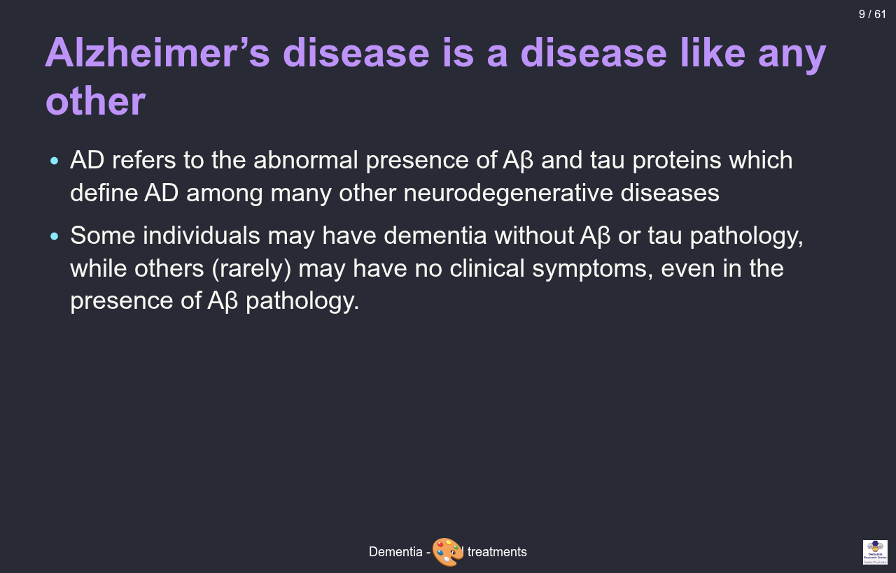
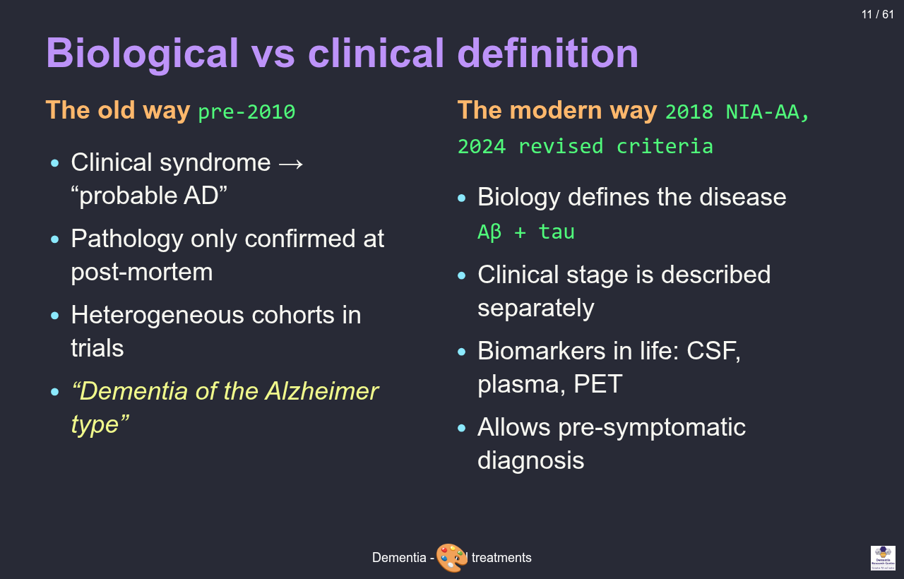
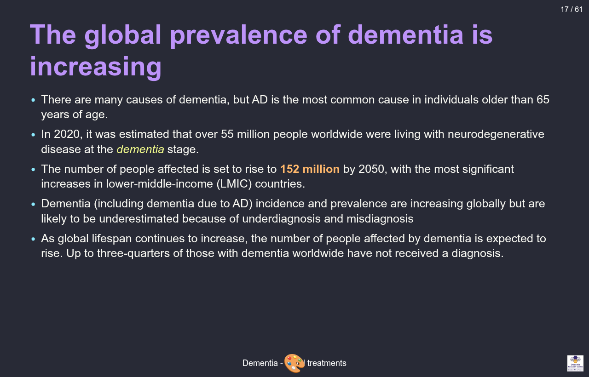
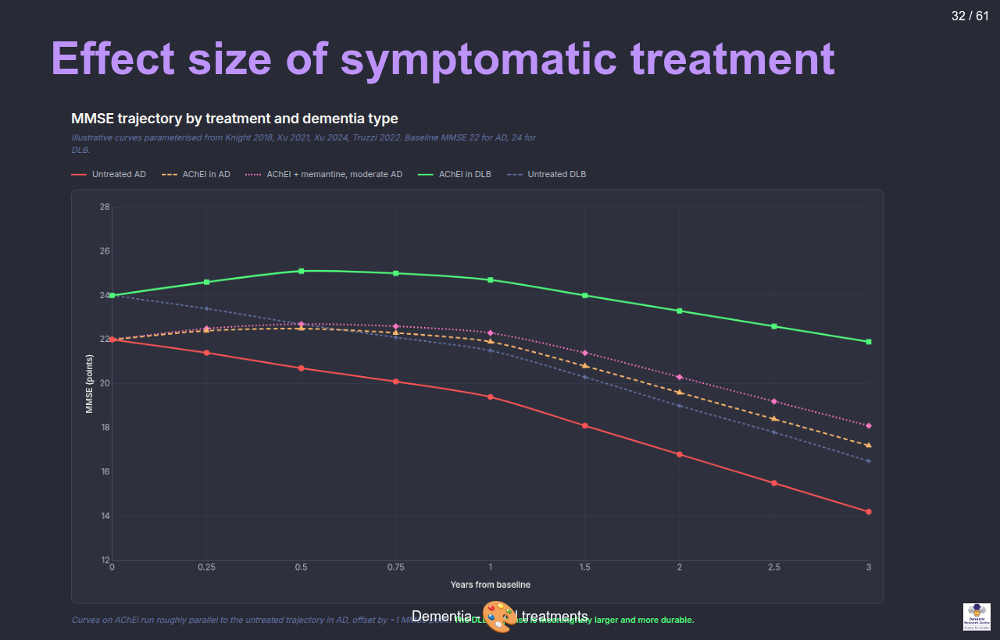
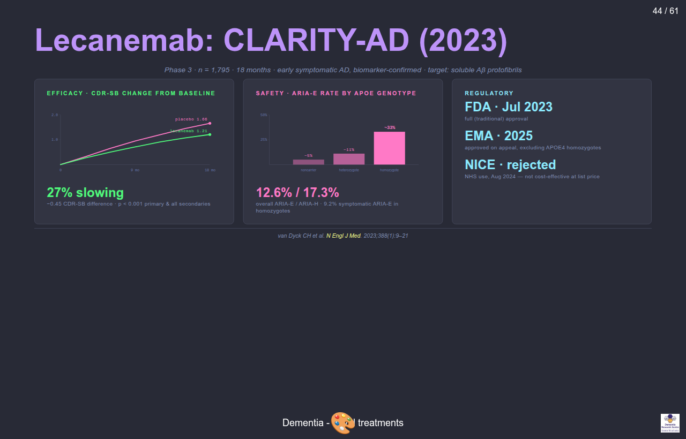
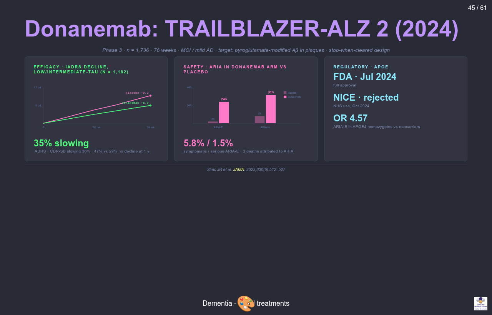
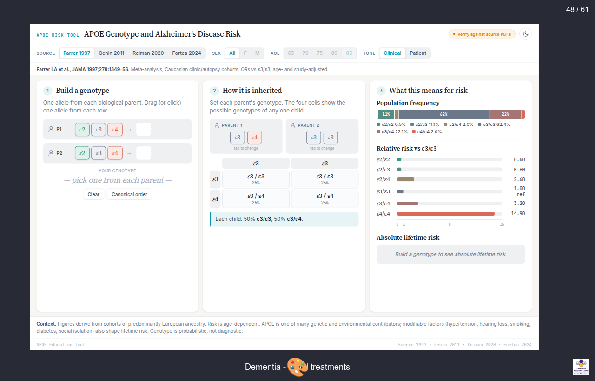
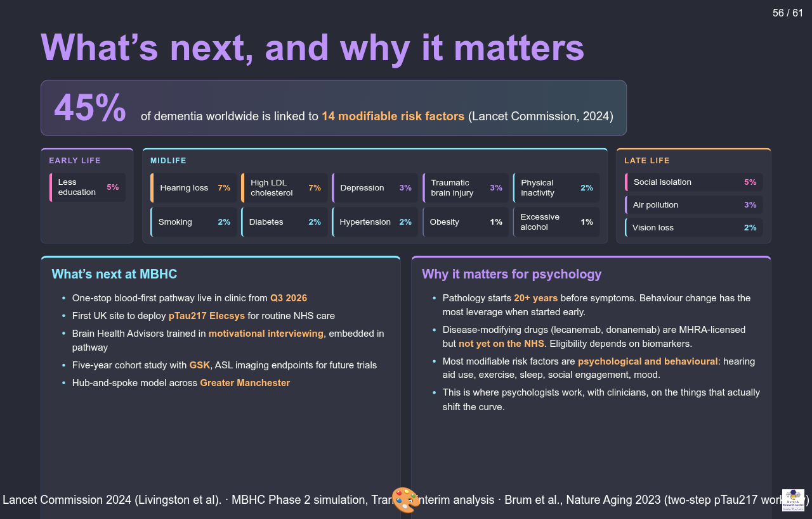

## Outline

- 20 minutes on "Dementia": a modern framework for understanding
- 20 minutes on the development of symptomatic treatments
- 5 minute break
- 20 minutes on disease-modifying treatments
- 5 minutes for questions on the material
- 10–20 minutes for Q&A with our trial participant
- 10 minutes for student questions

## Part 1 — Dementia: a modern framework

This part covers the terminology, the biological versus clinical definition of Alzheimer's disease, the AT(N)(X) biomarker framework, and the clinical assessment workflow.

## Audience poll

The interactive Slido poll used during the live lecture is not reproduced here. Students were invited to scan a QR code to join.

## Alzheimer's disease is not synonymous with dementia

Dementia is an umbrella term used to describe a state where an individual has lost the ability to carry out daily life activities independently because of cognitive impairment.

There are many types and causes of dementia. The most common ones are:

1. Alzheimer's disease (AD) — pathological definition
2. Vascular dementia — aetiological definition
3. Dementia with Lewy bodies — molecular definition
4. Frontotemporal dementia — anatomical definition

## Nature Neuroscience overview

A short Nature Neuroscience overview video was shown at this point.

Video: <https://youtu.be/zTd0-A5yDZI>

## Alzheimer's disease is a disease like any other

- AD refers to the abnormal presence of Aβ and tau proteins which define AD among many other neurodegenerative diseases
- Some individuals may have dementia without Aβ or tau pathology
- Others (rarely) may have no clinical symptoms even in the presence of Aβ pathology

## Alzheimer's disease timeline

::: {.notes}
This figure shows the historical and biological development of Alzheimer's disease. It walks through the original 1907 case description by Alois Alzheimer, the cholinergic hypothesis of the 1970s, the amyloid cascade hypothesis of 1992, the discovery of presenilin and APP mutations, the introduction of PET amyloid imaging in the 2000s, the 2018 NIA-AA biological framework, and the 2023 to 2024 disease-modifying antibody approvals.
:::

## Biological vs clinical definition

:::: {.columns}

::: {.column width="50%"}
**The old way (pre-2010)**

- Clinical syndrome → "probable AD"
- Pathology only confirmed at post-mortem
- Heterogeneous cohorts in trials
- "Dementia of the Alzheimer type"
:::

::: {.column width="50%"}
**The modern way (2018 NIA-AA, 2024 revised criteria)**

- Biology defines the disease (Aβ + tau)
- Clinical stage is described separately
- Biomarkers in life: CSF, plasma, PET
- Allows pre-symptomatic diagnosis
:::

::::

## The biomarker cascade

::: {.notes}
Interactive model based on Jack and colleagues, Lancet Neurology 2010 and 2013. The horizontal axis represents the AD continuum from cognitively normal through preclinical AD, subjective cognitive decline, mild cognitive impairment, mild dementia, to moderate-severe dementia. Five sigmoid curves rise across the axis showing biomarker abnormality: amyloid beta becomes abnormal earliest, then phosphorylated tau, then neurodegeneration on MRI and FDG-PET, then cognition on neuropsychological testing, and finally function on activities of daily living. Pathology precedes clinical symptoms by 15 to 20 years, which is the rationale for early biomarker-based diagnosis and for prevention efforts.
:::

## Audience poll: higher or lower?

Interactive Slido poll on prevalence estimates. Not reproduced in the handout.

## The AT(N)(X) framework

The modern biomarker classification, used to characterise patients independently of clinical stage. Each axis captures a different category of pathology.

## AT(N)(X): A — Amyloid

What it measures: cerebral Aβ pathology.

- CSF Aβ42/40 ratio (low = abnormal)
- Plasma Aβ42/40 (replaces some lumbar punctures)
- Amyloid-PET (florbetapir, flutemetamol)

## AT(N)(X): T — Tau

What it measures: tau pathology.

- CSF p-tau181, p-tau217
- **Plasma p-tau217**
- Tau-PET (flortaucipir, tracks Braak staging)

## AT(N)(X): N — Neurodegeneration

What it measures: downstream injury, not specific to AD.

- Structural MRI atrophy (MTA score)
- FDG-PET (temporo-parietal hypometabolism)
- CSF total tau

## AT(N)(X): X — Other

What it measures: vascular, inflammatory, and synaptic axes added in 2024.

- Vascular markers (WMH, infarcts)
- Inflammatory (GFAP, astrocyte activation)
- Synaptic (neurogranin, SNAP-25)

## Audience poll: question 3

Interactive Slido poll. Not reproduced in the handout.

## The global prevalence of dementia is increasing

- AD is the most common cause of dementia in individuals older than 65 years of age
- In 2020, over 55 million people worldwide were living with neurodegenerative disease at the *dementia* stage
- The number is set to rise to **139 million by 2050**, with the most significant increases in lower-middle-income (LMIC) countries
- Prevalence is likely underestimated because of underdiagnosis and misdiagnosis
- Up to three-quarters of those with dementia worldwide have not received a diagnosis

## 57.4M to 153M by 2050

::: {.notes}
The chart shows two bars: the 2020 figure of approximately 55 to 57 million people living with dementia worldwide, and the 2050 projection of approximately 139 to 153 million. The growth differential is greatest in low- and middle-income countries, which are estimated to bear three quarters of the increase. Approximately 75 percent of people living with dementia worldwide remain undiagnosed today.
:::

## Regions of greatest change

The largest projected increases are in:

- North Africa and the Middle East
- Sub-Saharan Africa
- South Asia
- Latin America

This reflects ageing populations in regions with limited diagnostic infrastructure.

## Historical development of AD diagnostic criteria

:::: {.columns}

::: {.column width="50%"}
- The 2023 revised criteria emphasises that AD is defined by its biology
- Only biomarkers proven to be accurate against an accepted reference standard should be used for diagnosis
- Biomarker tests should always be interpreted with clinical judgment
:::

::: {.column width="50%"}
The clinician's expertise is crucial in three situations:

1. When the biomarker test result contradicts the clinical presentation
2. When evaluating the probable contribution of AD versus other pathologies
3. When assessing how other medical conditions could impact the biomarker results
:::

::::

## AD diagnostic biomarkers

:::: {.columns}

::: {.column width="50%"}
**Core 1** (currently accepted for diagnosis)

- CSF Aβ42/40
- CSF p-tau181/Aβ42
- CSF t-tau/Aβ42
- Accurate plasma assays
- Amyloid-PET
:::

::: {.column width="50%"}
**Core 2** (emerging / research-grade)

- Plasma p-tau217 (near-CSF accuracy)
- Plasma MTBR-tau243
- GFAP (astrocyte activation)
- NfL (non-specific neurodegeneration)
- Tau-PET (Braak staging in life)
:::

::::

## Differential diagnosis

In the rest of this section: the four most common dementia subtypes side by side. The handout shows one slide per subtype.

## Differential diagnosis: AD

- **Onset**: insidious, episodic memory first
- **Signature**: temporo-parietal cognition; language; getting lost
- **Imaging**: medial temporal and parietal atrophy
- **Treatment cue**: AChEi and memantine; now anti-amyloid eligible

## Differential diagnosis: DLB

- **Onset**: fluctuating cognition, visual hallucinations, REM sleep behaviour disorder, parkinsonism
- **Signature**: attention/executive > memory early; very neuroleptic-sensitive
- **Imaging**: relatively preserved MTL; DAT scan abnormal
- **Treatment cue**: rivastigmine often helpful; **avoid antipsychotics**

## Differential diagnosis: FTD

- **Onset**: typically <65 y; behavioural variant or primary progressive aphasia
- **Signature**: disinhibition, apathy, loss of empathy, dietary change (bvFTD)
- **Imaging**: frontal / anterior temporal atrophy
- **Treatment cue**: AChEi unhelpful or may worsen behaviour; SSRIs and environmental management

## Differential diagnosis: VaD

- **Onset**: stepwise, after vascular events
- **Signature**: executive dysfunction, slowed processing, focal neurology
- **Imaging**: infarcts, white matter hyperintensities, microbleeds
- **Treatment cue**: aggressive vascular risk control; modest AChEi benefit

## Reversible mimics

> **Always rule out treatable contributors to cognitive impairment:**

- B12 / folate deficiency
- Hypothyroidism
- Depression (pseudo-dementia)
- Normal pressure hydrocephalus (gait, urinary, cognitive)
- Drug effects (anticholinergics, benzodiazepines, opioids)
- Delirium (often superimposed)
- Obstructive sleep apnoea
- Subdural haematoma
- Alcohol misuse

## Assessment

The full assessment in the live deck is a tabset; the handout shows one slide per assessment domain.

## Assessment: Clinical history

Medical history from the patient and collateral history from an appropriate informant.

**Background factors**

- Educational attainment — quantitative and qualitative
- Occupational attainment — manual / skilled / professional
- Head injury or contact sports (rugby, boxing)
- Lifetime alcohol and substance use — peak and sustained
- Smoking history

**Cognitive features**

- Rapid forgetfulness, repetitive questioning
- Loss of recent memory with relative preservation of remote
- Functional decline (IADLs first, then ADLs)
- BPSD (agitation, depression, sleep)

## Assessment: Cognitive examination

A cognitive, functional, behavioural and mental state examination, preferably using validated assessment scales.

- RBANS — sensitive to different sorts of decline
- Addenbrookes' Cognitive Evaluation (III) — used in 90% of UK memory clinics
- Mini Mental State Examination — insensitive to early decline
- Montreal Cognitive Assessment — better than MMSE, retains ceiling effects

## Assessment: Examination

Physical examination, laboratory tests (to exclude comorbid conditions that may be impairing cognitive function), and review of medication (to identify drugs that may be impairing cognitive function).

## Assessment: Neuroimaging

- **Structural MRI** (first-line): medial temporal atrophy (MTA score), parietal atrophy (Koedam), white-matter disease, microbleeds
- **FDG-PET**: temporo-parietal hypometabolism in AD; frontal in FTD
- **Amyloid-PET**: confirms or excludes Aβ pathology in life
- **Tau-PET**: research and disease-modifying treatment selection
- **DAT scan**: supports DLB when uncertain

## Assessment: Biomarkers

- **CSF panel**: Aβ42/40, p-tau181, t-tau (requires lumbar puncture)
- **Plasma p-tau217**: near-CSF accuracy, primary care feasible
- **Plasma Aβ42/40, GFAP, NfL**: pre-screening tools
- **APOE genotyping**: risk stratification; mandatory before anti-amyloid antibodies
- **Genetic testing**: *APP, PSEN1, PSEN2* in early-onset / familial cases

## Part 2 — Symptomatic treatments

The development of a field over fifty years, from the cholinergic hypothesis to brexpiprazole.

## The cholinergic hypothesis (1976)

- Bowen, Davies, Perry independently observed loss of choline acetyltransferase in post-mortem AD brain
- Source: degenerating cholinergic projections from the **nucleus basalis of Meynert**
- Implication: boost acetylcholine, improve cognition

## AChE inhibitor mechanism

:::: {.columns}

::: {.column width="50%"}
**Cholinergic synapse cartoon**

Presynaptic ACh release → AChE breaking ACh in cleft → AChEi blocking AChE → more ACh available at post-synaptic receptors.
:::

::: {.column width="50%"}
**Clinical implications**

- AD brains have loss of cortical and hippocampal ACh
- AChEi inhibit synaptic breakdown, increasing transmitter availability
- Effect is presynaptic compensation; does not modify disease
- Side-effects from cholinergic excess: ↑ vagal tone, GI cramping, bradycardia, vivid dreams
:::

::::

## AChE inhibitors: clinical use

The three approved AChE inhibitors are presented one per slide.

## AChEi: Donepezil

- Once daily, oral; 5 mg → 10 mg after 4 weeks
- Most common UK first-line agent
- Long half-life
- Side effects: GI upset, vivid dreams, bradycardia
- Cardiac history → ECG before starting

## AChEi: Rivastigmine

- BD oral or **transdermal patch**
- Patch useful when swallowing or compliance issues
- Inhibits both AChE and butyrylcholinesterase
- Patch reduces GI side-effects substantially
- **Drug of choice in DLB and PDD**

## AChEi: Galantamine

- BD oral; also a **nicotinic allosteric modulator**
- Cardiac caution (rare reports of bradyarrhythmia)
- Less commonly used in UK

## Memantine: NMDA receptor antagonism

:::: {.columns}

::: {.column width="50%"}
**Mechanism**

Glutamatergic synapse → NMDA receptor channel → excess glutamate driving pathological tonic activation → memantine sits in the channel as an uncompetitive, low-affinity antagonist.
:::

::: {.column width="50%"}
**Clinical use**

- Memantine sits in the channel only when pathologically open (voltage-dependent)
- Strong physiological NMDA bursts displace it, preserving learning
- **Indication**: moderate to severe AD, or AChEi-intolerant
- Often combined with donepezil
:::

::::

## Effect size of symptomatic treatment

::: {.notes}
This chart shows MMSE trajectories for five groups over three years. Untreated AD starts at MMSE 22 and declines to about 14 — roughly 2.5 points per year. AChEi treatment in AD shifts the curve up by about 1 MMSE point and the curves run in parallel: the disease trajectory is unchanged but patients are about 6 months ahead. AChEi plus memantine in moderate AD adds a small further offset. The DLB curves are the striking comparison: AChEi-treated DLB shows an early bump in cognition above baseline and a much slower trajectory of decline. Curves illustrative, parameterised from Knight 2018, Xu 2021 and 2024, and Truzzi 2022.
:::

## Differential responsiveness across subtypes

:::: {.columns}

::: {.column width="50%"}
**Helpful in**

- **AD** (modest, all severities)
- **DLB** (often substantial; rivastigmine first choice)
- **PDD** (cholinergic deficit prominent)
- **VaD** (mixed disease often benefits)
:::

::: {.column width="50%"}
**Limited or harmful in**

- **bvFTD** (no benefit, may worsen agitation)
- **Pure VaD** (inconsistent)
- **Severe AD** (memantine takes over)
:::

::::

## BPSD

- **B**ehavioural and **P**sychological **S**ymptoms of **D**ementia
- Up to 90% of patients experience at least one over the course of illness
- Drives caregiver burden, institutionalisation, and mortality
- Five clusters:
  1. Agitation / aggression
  2. Psychosis (delusions, hallucinations)
  3. Depression / anxiety
  4. Apathy
  5. Sleep disturbance

## Non-pharmacological management of BPSD

- **Always rule out a precipitant**: pain, infection (UTI, chest), constipation, drug effect, sensory deprivation
- **Cognitive Stimulation Therapy** (NICE-recommended, group-based)
- **Exercise** (aerobic and resistance)
- **Music therapy**: strong evidence in agitation
- **Environmental modification**: light, routine, signage, familiar objects
- **Caregiver education and support**: often high-yield

## Pharmacological management of BPSD

> **Antipsychotics are last-resort**
>
> - ↑ stroke and all-cause mortality (CATIE-AD, FDA black box)
> - **Severe sensitivity in DLB**: can cause irreversible parkinsonism / NMS
> - Use only when behaviour endangers patient or others, lowest dose, short duration, regular review

- **SSRIs** for depression (citalopram has agitation evidence, but QTc concern)
- **Brexpiprazole**: first FDA approval for agitation in AD, 2023 (not yet NICE-approved on NHS)
- **Trazodone**: sleep, agitation; mostly off-label
- **Avoid benzodiazepines**: falls, paradoxical agitation, dependence

## Limits of symptomatic treatment

- They do not slow neuronal loss
- They do not clear Aβ or tau
- They do not change underlying trajectory
- A patient on AChEi 5 years from diagnosis has the same brain pathology as one untreated

## Audience poll: what is important in clinical trials?

Interactive Slido poll. Not reproduced in the handout.

## 5 minute break

## Part 3 — Disease-modifying treatments

Anti-amyloid antibodies enter the clinic.

## The amyloid hypothesis (Hardy & Higgins, 1992)

- **Aβ accumulation** is the upstream driver of AD
- Genetic anchor: every gene mutation that causes autosomal-dominant AD (*APP, PSEN1, PSEN2*) alters Aβ production or clearance
- Down syndrome (trisomy 21 → 3 copies of *APP*) → near-universal AD pathology by age 50
- Tau pathology, inflammation, neurodegeneration: downstream
- Predicted: lower Aβ → less downstream damage → better outcome

## Failed anti-amyloid trials

- **Solanezumab**: Eli Lilly; failed Phase 3 in mild AD (2014, 2016)
- **Bapineuzumab**: Pfizer/J&J; failed (2012); high rate of vasogenic edema
- **Crenezumab**: Roche; failed (2019)
- **Gantenerumab**: Roche; first GRADUATE trials negative (2022); reformulated for prevention

**Lessons learned**:

- Treating too late (pathology has spread for 15+ years)
- Targeting the wrong species (monomer vs oligomer vs plaque)
- Insufficient brain penetration / dosing
- Endpoint too noisy in mild populations

## Aducanumab (2021)

- Two Phase 3 trials (EMERGE, ENGAGE): discordant; pre-specified analysis was negative
- Post-hoc reanalysis at high dose suggested cognitive benefit on EMERGE
- **FDA accelerated approval** June 2021, over near-unanimous advisory panel objection
- EMA **refused** authorisation
- NHS / NICE: **not commissioned**
- Eli Lilly withdrew it from market 2024

## Lecanemab: CLARITY-AD (2023)

::: {.notes}
CLARITY-AD trial of lecanemab (van Dyck and colleagues, NEJM 2023). 1,795 participants with biomarker-confirmed early symptomatic Alzheimer's disease, randomised to lecanemab or placebo for 18 months. Efficacy: 27 percent slowing of decline on CDR Sum of Boxes, with the placebo group ending at 1.66 points worse than baseline and the lecanemab group at 1.21, a difference of minus 0.45 points, p less than 0.001. Safety: ARIA-E rates by APOE genotype: about 5 percent in non-carriers, about 11 percent in heterozygotes, about 33 percent in homozygotes. Overall ARIA-E was 12.6 percent and ARIA-H 17.3 percent. Symptomatic ARIA-E in homozygotes was 9.2 percent. Regulatory: FDA full approval July 2023, EMA approved on appeal in 2025 excluding APOE4 homozygotes, NICE rejected for NHS use August 2024 on cost-effectiveness grounds.
:::

## Donanemab: TRAILBLAZER-ALZ 2 (2024)

::: {.notes}
TRAILBLAZER-ALZ 2 trial of donanemab (Sims and colleagues, JAMA 2023). 1,736 participants with MCI or mild AD over 76 weeks; primary analysis population was 1,182 with low or intermediate tau burden. Donanemab targets pyroglutamate-modified Aβ found only in established plaques; stop-when-cleared design meant patients with negative amyloid PET stopped treatment. Efficacy: 35 percent slowing on iADRS, 36 percent on CDR-SB. 47 percent of donanemab participants had no decline at 1 year versus 29 percent on placebo. Safety: ARIA-E 24 percent (vs 2 percent placebo), ARIA-H 31 percent (vs ~8 percent placebo). Symptomatic ARIA-E 5.8 percent, serious ARIA-E 1.5 percent. Three deaths in donanemab arm attributed to serious ARIA. APOE4 homozygotes had odds ratio 4.57 for ARIA-E versus non-carriers. Regulatory: FDA full approval July 2024, NICE rejected October 2024.
:::

## Antibody specificity

The three anti-amyloid antibodies target different Aβ species along the aggregation pathway:

- **Aducanumab**: oligomers + fibrils
- **Lecanemab**: protofibrils selectively
- **Donanemab**: pyroglutamate-modified plaques only

The aggregation pathway runs: monomer → oligomer → protofibril → plaque.

## Patient selection

- **Confirmed Aβ pathology**: amyloid-PET or CSF Aβ42/40
- **Disease stage**: MCI or mild AD dementia (not moderate or severe)
- **MRI suitable**: no severe cerebral amyloid angiopathy, ≤4 microbleeds, no superficial siderosis
- **Anticoagulation**: caution or contraindication
- **APOE4 genotyping**: needed for ARIA risk counselling
- **Capable of attending infusions** every 2–4 weeks for 18+ months
- **Capacity** to consent

## APOE genotype and ARIA-E risk

::: {.notes}
ARIA-E risk by APOE genotype. Lecanemab in CLARITY-AD: non-carriers about 5 percent, heterozygotes about 11 percent, homozygotes about 33 percent. Symptomatic ARIA-E rises from 1.4 percent in non-carriers to 9.2 percent in homozygotes. Donanemab in TRAILBLAZER-ALZ 2: non-carriers about 16 percent, heterozygotes about 23 percent, homozygotes about 41 percent. APOE4 homozygotes are about 2 percent of the population but bear most of the treatment-attributable ARIA risk.
:::

## ARIA

**ARIA-E (oedema, effusion)**

- Vasogenic oedema, leptomeningeal effusion
- Best seen on **FLAIR**
- Most asymptomatic; caught on surveillance MRI
- Can present with headache, confusion, focal symptoms, seizures

**ARIA-H (haemorrhage)**

- Microbleeds, superficial siderosis
- Best seen on **SWI / GRE**
- Usually asymptomatic; persists indefinitely after resolution

**Severity and surveillance**

- Mostly mild; ~3% serious; rare deaths reported
- Surveillance MRI before infusions 5, 7, 14 (lecanemab) or 2, 3, 4, 7 (donanemab)

## APOE4 and ARIA risk

| APOE genotype | Lecanemab ARIA-E | Donanemab ARIA-E |
|---|---|---|
| Non-carrier | ~5% | ~16% |
| Heterozygote | ~11% | ~23% |
| **Homozygote** | **~33%** | **~41%** |

::: {.notes}
ε4 homozygotes are about 2 percent of the population but bear most of the treatment-attributable ARIA risk. Genotype results have implications beyond the individual: family members may infer their own risk, and there are life insurance considerations. The donanemab US label restricts use in homozygotes; the EMA mandates discussion of relative risk. Patients can decline genotyping but must be counselled to the higher-risk assumption.
:::

## UK implementation

- **Drug cost**: £20–25k per patient per year (lecanemab list)
- **Infrastructure**: infusion suite every 2 (lecanemab) or 4 (donanemab) weeks
- **Surveillance MRI**: 4–7 scans per patient course
- **Workforce**: trained nurses, neurologists, neuroradiologists
- **NICE August 2024**: rejected lecanemab for NHS commissioning; benefit too small at price
- Currently available only privately in the UK; major equity concern
- Open question whether amyloid lowering alone is sufficient or whether combinations will be needed

## Other approaches

- **Anti-tau antibodies**: E2814, JNJ-2056 (Phase 2; zagotenemab discontinued 2023)
- **Tau ASOs**: intrathecal antisense oligonucleotides, e.g. BIIB080
- **Inflammation**: TREM2 agonists in early trials
- **Vaccines**: UB-311, ABvac40 (Phase 2)
- **Prevention trials** in pre-symptomatic carriers:
  - **DIAN-TU**: autosomal-dominant AD families
  - **AHEAD 3-45**: sporadic, plasma p-tau217 stratified
  - *A4 closed early; solanezumab failed*

## Current state

- The first disease-modifying drugs exist. Their effect size is modest. ARIA limits use. Access in the UK is restricted.
- **Diagnosis**: plasma p-tau217 may make primary-care testing feasible.
- **Prevention** may matter more than any antibody:
  - *Lancet Commission 2024*: 14 modifiable risk factors account for ~45% of dementia risk
  - Hearing, education, BP, smoking, obesity, depression, physical inactivity, diabetes, alcohol, social isolation, air pollution, head injury, vision, cholesterol

## What is a Brain Health Centre?

::: {.notes}
Two-track timeline comparing pathways for Mary, 64, presenting with memory concern and a family history of dementia. Memory Assessment Service track: GP referral on day zero, MAS letter day 60, first visit day 90 with MMSE 25, repeat MMSE day 180, clinical diagnosis day 210. Outcome: probable Alzheimer's disease, no biomarkers, ineligible for disease-modifying therapy, no structured risk-reduction plan. Brain Health Centre track: GP referral day zero, single one-day visit day 42 combining plasma p-tau217, MRI, cardiovascular workup, and lumbar puncture if needed, then active follow-up out to day 365 with a Brain Health Advisor and risk modification. Outcome: biomarker-confirmed diagnosis, blood pressure normalised and statin started, hearing aid referral, social plan, DMT-ready, in research, year-on review booked. Three principles: confirm with biology not exclusion; treat the brain like the heart; be ready for therapy. Footnote: today only one in 800 UK patients with memory symptoms gets a biomarker-confirmed diagnosis.
:::

## Manchester Brain Health Centre

::: {.notes}
Three core partners shown as coloured blocks: Greater Manchester Mental Health NHS Foundation Trust as clinical lead in old-age psychiatry, Manchester University NHS Foundation Trust providing imaging, cardiology, labs and the biobank, and the Alzheimer's Society providing funding and Brain Health Advisor training. Academic partner: University of Manchester. Six-station one-day pathway: triage with MMSE above 22 and ACE-III above 85, plasma p-tau217 first-line biomarker, same-day MRI, clinic plus cardiovascular check including pulse-wave velocity, CSF if needed (about 20 percent), disclosure with Brain Health Advisor. Phase 2 model goes live Q3 2026. KPIs: 49 days simulated median pathway versus 187 currently, 73 percent reduction in time to diagnosis, about 80 percent spared a lumbar puncture, zero serious LP adverse events to date with about 92 percent acceptance.
:::

## What's next, and why it matters

::: {.notes}
Headline: 45 percent of dementia worldwide is linked to 14 modifiable risk factors (Lancet Commission 2024, Livingston et al). Risk factors organised by life stage with population attributable fractions. Early life: less education, 5 percent. Midlife: hearing loss 7 percent, high LDL cholesterol 7 percent, depression 3 percent, traumatic brain injury 3 percent, physical inactivity 2 percent, smoking 2 percent, diabetes 2 percent, hypertension 2 percent, obesity 1 percent, excessive alcohol 1 percent. Late life: social isolation 5 percent, air pollution 3 percent, vision loss 2 percent. What's next at MBHC: one-stop blood-first pathway live Q3 2026, first UK site to deploy p-tau217 Elecsys for routine NHS care, Brain Health Advisors trained in motivational interviewing, five-year cohort study with GSK, hub-and-spoke model across Greater Manchester. Why it matters for psychology: pathology starts 20+ years before symptoms; disease-modifying drugs are MHRA-licensed but not yet on NHS, eligibility depends on biomarkers; most modifiable risk factors are psychological and behavioural — hearing aid use, exercise, sleep, social engagement, mood; this is where psychologists work alongside clinicians on the things that actually shift the curve.
:::

## Questions on the material (5 minutes)

Open floor.

## Q&A with our trial participant (10–20 minutes)

Welcome.

## Student questions (10 minutes)

Over to you.

## Summary

1. **Dementia is a syndrome; AD is defined biologically.** Aβ and tau can be detected in life via CSF, plasma p-tau217, or PET.
2. **Symptomatic treatments help modestly and do not change disease course.** AChEi and memantine offer about a 6-month delay. Non-pharmacological BPSD interventions are first-line. Antipsychotics carry mortality risk.
3. **Anti-amyloid antibodies are the first disease-modifying drugs.** Effect size is modest. ARIA limits use. NICE has rejected them for the NHS. Prevention may matter more.

## References (1/2)

- Bowen DM, Smith CB, White P, Davison AN. Neurotransmitter-related enzymes and indices of hypoxia in senile dementia and other abiotrophies. *Brain* 1976; 99(3): 459–96.
- Hardy JA, Higgins GA. Alzheimer's disease: the amyloid cascade hypothesis. *Science* 1992; 256(5054): 184–5.
- Jack CR Jr, Bennett DA, Blennow K, et al. NIA-AA Research Framework: Toward a biological definition of Alzheimer's disease. *Alzheimer's & Dementia* 2018; 14(4): 535–62.
- Livingston G, Huntley J, Liu KY, et al. Dementia prevention, intervention, and care: 2024 report of the Lancet standing Commission. *The Lancet* 2024; 404(10452): 572–628.

## References (2/2)

- Palmqvist S, Tideman P, Mattsson-Carlgren N, et al. Blood biomarkers to detect Alzheimer disease in primary care and secondary care. *JAMA* 2024; 332(15): 1245–57.
- Sims JR, Zimmer JA, Evans CD, et al. Donanemab in early symptomatic Alzheimer's disease: the TRAILBLAZER-ALZ 2 randomized clinical trial. *JAMA* 2023; 330(6): 512–27.
- van Dyck CH, Swanson CJ, Aisen P, et al. Lecanemab in early Alzheimer's disease. *New England Journal of Medicine* 2023; 388(1): 9–21.
