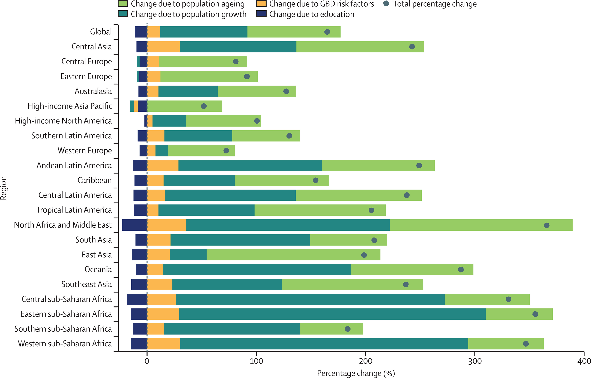

```{=html}
<svg width="0" height="0" style="position:absolute" aria-hidden="true">
  <defs>
    <filter id="chalk" x="-15%" y="-15%" width="130%" height="130%">
      <feTurbulence type="fractalNoise" baseFrequency="0.62" numOctaves="3" seed="7"/>
      <feDisplacementMap in="SourceGraphic" scale="2.4"/>
    </filter>
  </defs>
</svg>
<style>
  /* ── Paper-style panel-tabset ───────────────────────────────────── */
.reveal .panel-tabset > .nav-tabs {
  border-bottom: none;
  margin-bottom: 0;
  padding: 0 0.4em;
  gap: 0.25em;
}

.reveal .panel-tabset > .nav-tabs .nav-link {
  background: rgba(245, 240, 226, 0.05);
  color: rgba(245, 240, 226, 0.62);
  border: 1px solid rgba(245, 240, 226, 0.14);
  border-bottom: none;
  border-radius: 10px 10px 0 0;
  padding: 0.45em 1.1em;
  font-weight: 500;
  letter-spacing: 0.01em;
  position: relative;
  top: 1px;
  transition: background 180ms, color 180ms, transform 180ms;
}

.reveal .panel-tabset > .nav-tabs .nav-link:hover {
  background: rgba(245, 240, 226, 0.10);
  color: rgba(245, 240, 226, 0.95);
}

.reveal .panel-tabset > .nav-tabs .nav-link.active {
  background: rgba(245, 240, 226, 0.10);
  color: #f8f8f2;
  border-color: rgba(245, 240, 226, 0.24);
  font-weight: 600;
  z-index: 2;
  box-shadow: 0 -3px 8px rgba(0, 0, 0, 0.20);
}

.reveal .panel-tabset > .tab-content {
  background:
    linear-gradient(180deg,
      rgba(245, 240, 226, 0.10) 0%,
      rgba(245, 240, 226, 0.04) 35%,
      rgba(245, 240, 226, 0.06) 100%),
    radial-gradient(ellipse at top left,
      rgba(245, 240, 226, 0.08) 0%, transparent 60%);
  border: 1px solid rgba(245, 240, 226, 0.22);
  border-radius: 0 12px 12px 12px;
  padding: 1.1em 1.3em;
  box-shadow:
    0 6px 18px rgba(0, 0, 0, 0.22),
    0 0 0 1px rgba(245, 240, 226, 0.04),
    inset 0 1px 0 rgba(245, 240, 226, 0.06);
}

.reveal .fragment.blur-reveal { opacity: 1 !important; visibility: visible !important; }
.reveal .fragment.blur-reveal img { filter: blur(22px); transition: filter 600ms ease; }
.reveal .fragment.blur-reveal.visible img { filter: blur(0); }
.reveal .fragment.blur-reveal figcaption { color: #6272a4; font-style: italic; }

.reveal .trial-meta { text-align:center; color:#7d8ab0; font-size:0.55em; font-style:italic; margin:0 0 0.6em; }
.reveal .trial-grid { display:grid; grid-template-columns:1fr 1fr 1fr; gap:0.7em; }
.reveal .trial-block { background:rgba(68,71,90,0.35); border:1px solid #44475a; border-radius:8px; padding:0.75em 0.9em; }
.reveal .trial-cat { font-size:0.42em; letter-spacing:0.18em; text-transform:uppercase; color:#bd93f9; margin-bottom:0.75em; font-weight:600; }
.reveal .trial-block.efficacy .trial-cat { color:#50fa7b; }
.reveal .trial-block.safety   .trial-cat { color:#ff79c6; }
.reveal .trial-block.context  .trial-cat { color:#8be9fd; }
.reveal .trial-stat { margin-bottom:0.6em; line-height:1.05; }
.reveal .trial-stat:last-child { margin-bottom:0; }
.reveal .trial-num { font-size:0.95em; font-weight:700; color:#f8f8f2; display:block; }
.reveal .trial-block.efficacy .trial-num { color:#50fa7b; }
.reveal .trial-block.safety   .trial-num { color:#ff79c6; }
.reveal .trial-block.context  .trial-num { color:#8be9fd; }
.reveal .trial-lab { display:block; font-size:0.4em; color:#7d8ab0; letter-spacing:0.04em; margin-top:0.1em; line-height:1.25; }
.reveal .trial-ref { text-align:center; color:#7d8ab0; font-size:0.42em; font-style:italic; margin-top:0.7em; border-top:1px solid #44475a; padding-top:0.55em; }
.reveal .trial-chart { width:100%; height:auto; display:block; margin:0.4em 0 0.7em; }

/* ── Spell-out: per-letter staggered pop-in ─────────────────────── */
.reveal .spell-out { display: inline-block; }
.reveal .spell-out > span {
  display: inline-block;
  opacity: 0;
  transform: scale(0.2) translateX(-0.4em);
  transform-origin: 0% 50%;
  will-change: opacity, transform;
}
.reveal .spell-out.running > span {
  animation: spell-out-letter 380ms cubic-bezier(0.34, 1.56, 0.64, 1) forwards;
  animation-delay: calc(var(--i, 0) * var(--spell-stagger, 80ms));
}
@keyframes spell-out-letter {
  0%   { opacity: 0; transform: scale(0.2) translateX(-0.4em); }
  60%  { opacity: 1; transform: scale(1.08) translateX(0); }
  100% { opacity: 1; transform: scale(1)    translateX(0); }
}

</style>
<script>
(function () {
  function split(el) {
    if (el.dataset.spellSplit === 'true') return;
    el.dataset.spellSplit = 'true';
    var text = el.textContent;
    el.textContent = '';
    var i = 0;
    for (var ch of text) {
      var s = document.createElement('span');
      s.textContent = ch === ' ' ? ' ' : ch;
      s.style.setProperty('--i', i);
      el.appendChild(s);
      i++;
    }
  }
  function activate(slide) {
    if (!slide) return;
    slide.querySelectorAll('.spell-out').forEach(function (el) {
      split(el);
      el.classList.remove('running');
      void el.offsetWidth;          // force reflow so the animation replays
      el.classList.add('running');
    });
  }
  document.addEventListener('DOMContentLoaded', function () {
    document.querySelectorAll('.spell-out').forEach(split);
  });
  function hookReveal() {
    if (typeof Reveal === 'undefined') { setTimeout(hookReveal, 100); return; }
    if (Reveal.isReady && Reveal.isReady()) {
      activate(Reveal.getCurrentSlide());
    } else {
      Reveal.on('ready', function (e) { activate(e.currentSlide); });
    }
    Reveal.on('slidechanged', function (e) { activate(e.currentSlide); });
  }
  hookReveal();
})();
</script>
```
## Welcome :wave:

::: {.callout-note}

### Thank you for having me this evening

A talk about where dementia care has got to: what has changed, what is new, and what we can do about it. Questions very welcome at the end.

:::

## What we'll cover tonight :watch:
- **What dementia is**, and why "Alzheimer's" isn't the whole story
- **Getting the diagnosis right**: the different types, and the causes that can be treated
- **The treatments we already have**, and their limits
- **The new disease-modifying drugs**
- **Prevention, and what we can do**

## Part 1: Dementia {background-color="#44475a"}

::: {.r-fit-text style="color:#bd93f9;"}
A modern framework
:::

## "Dementia" and "Alzheimer's" are not the same thing {.smaller}
::: {.incremental}
**Dementia** is an umbrella term. It describes the point where someone can no longer manage daily life on their own, because of problems with memory and thinking.

It is not one disease. There are several causes, and each is defined in its own way:

1. Alzheimer's disease `by the proteins that build up in the brain`
2. Vascular dementia `by its cause: the brain's blood supply`
3. Dementia with Lewy bodies `by a particular protein deposit`
4. Frontotemporal dementia `by where in the brain it begins`
:::

## Nature Neuroscience overview

<iframe width="1280" height="720"
        src="https://www.youtube-nocookie.com/embed/zTd0-A5yDZI?rel=0&modestbranding=1&cc_load_policy=1&hl=en"
        title="Nature Neuroscience overview"
        frameborder="0"
        allow="accelerometer; autoplay; clipboard-write; encrypted-media; gyroscope; picture-in-picture; web-share"
        allowfullscreen
        style="border:0;"></iframe>

## Alzheimer's is a disease in its own right

- Alzheimer's is defined by two proteins building up in the brain: **amyloid**, which forms plaques, and **tau**, which forms tangles.

- It is the brain changes that make it Alzheimer's, not the symptoms alone. Someone can have dementia without these proteins, and a few people have the proteins without symptoms.

- The difference now is that we can detect these proteins while a person is alive.

##

<iframe src="Widgets/alzheimer_timeline.html" width="1480" height="840" style="border:0;" title="Interactive timeline of Alzheimer's disease pathology and clinical milestones"></iframe>

::: {.notes}
This slide is an interactive timeline showing the historical and biological development of Alzheimer's disease. It walks through the original 1907 case description by Alois Alzheimer, the cholinergic hypothesis of the 1970s, the amyloid cascade hypothesis of 1992, the discovery of presenilin and APP mutations, the introduction of PET amyloid imaging in the 2000s, the 2018 NIA-AA biological framework, and the 2023 to 2024 disease-modifying antibody approvals. Each milestone has a date and short description.
:::

## How we define Alzheimer's has changed {.small}

:::: {.columns}

::: {.column width="45%"}
**The old way** `until about 2010`

- Diagnosed from symptoms alone, as "probable Alzheimer's"
- The proteins could only be confirmed after death, at post-mortem
- So we were never quite certain in life
- Often just called "dementia of the Alzheimer type"
:::
::: {.column width="5%"}
:::
::: {.column width="45%"}
**The modern way** `2018, updated 2024`

- The biology defines the disease: the amyloid and tau themselves
- How advanced it is, is described separately
- We can now measure those proteins in life, through a blood test, a spinal-fluid sample, or a brain scan
- So it can be picked up before symptoms appear
:::

::::

##
<iframe src="Widgets/biomarker_cascade.html" width="1480" height="800" style="border:0;" title="Interactive Jack 2010/2013 biomarker cascade model: drag the cursor across the AD continuum to see Aβ, tau, neurodegeneration, cognition and function curves"></iframe>

::: {.notes}
This is an interactive figure based on Jack and colleagues, Lancet Neurology 2010 and 2013. The horizontal axis represents the Alzheimer's disease continuum from cognitively normal through preclinical AD, subjective cognitive decline, mild cognitive impairment, mild dementia, to moderate-severe dementia. Five sigmoid curves rise across the axis showing biomarker abnormality: amyloid beta becomes abnormal earliest, then phosphorylated tau, then neurodegeneration on MRI and FDG-PET, then cognition on neuropsychological testing, and finally function on activities of daily living. The point I want to land is that pathology precedes clinical symptoms by 15 to 20 years, which is the rationale for early biomarker-based diagnosis and for prevention efforts. The interactive cursor lets us read off ATN status at any point on the continuum and see which biomarkers are above the diagnostic threshold.
:::

## What we can now measure {.smaller}

*The four things clinicians look for, in plain terms. Click each tab.*

::: {.panel-tabset}

### Amyloid
:::: {.columns}

::: {.column width="55%"}
**The plaque protein.** It appears earliest.

- A **blood test** can now pick it up
- A sample of **spinal fluid** (a lumbar puncture: uncomfortable, but safe and quick)
- A **brain scan** (amyloid-PET) that lights up the plaques
:::

::: {.column width="45%"}
::: {.fragment .blur-reveal}

:::
:::

::::
### Tau

:::: {.columns}

::: {.column width="55%"}
**The tangle protein.** It tracks more closely with symptoms.

- A spinal-fluid test
- **A blood test ("p-tau217")**, accurate enough to use in ordinary clinics
- A tau brain scan, mostly used in research
:::

::: {.column width="45%"}

:::

::::

### Damage

:::: {.columns}

::: {.column width="55%"}
**The wear-and-tear signal.** It shows the brain is being injured, but not what is doing it.

- An **MRI scan** showing shrinkage in memory areas
- A scan showing where the brain has slowed down
:::

::: {.column width="45%"}

:::

::::

### Other factors

:::: {.columns}

::: {.column width="55%"}
**Everything else that adds up**, brought into the picture in 2024.

- **Blood-vessel damage** in the brain
- **Inflammation**
- Loss of the **connections** between brain cells
:::

::: {.column width="45%"}

:::

::::

:::

## The number of people with dementia is rising {.smaller}
::: {.incremental}

- Alzheimer's is the most common cause in people over 65, but far from the only one.

- In 2020, more than **55 million** people worldwide were living with dementia.

- It is set to nearly **triple, to over 150 million**, by 2050, with the fastest rise in lower- and middle-income countries.

- These are almost certainly under-counts: dementia is often missed or misdiagnosed.

- Worldwide, up to **three in four** people with dementia have never had a diagnosis.
:::

## From 55 million to over 150 million



## Where the increase will be greatest


## A test result is not a diagnosis {.smaller}

:::: {.columns}

::: {.column width="45%"}
The new tests are useful, but they don't replace the clinician. They are one part of the picture.

- Only tests that have been **properly validated** should be used to diagnose
- A result always has to be read **alongside the person** in front of you
:::
::: {.column width="5%"}
:::
::: {.column width="45%"}
A doctor's judgement matters most when:

1. The test result **doesn't match** what the person is experiencing
2. There may be **more than one thing** going on at once
3. **Other health conditions** could be throwing the test off
:::

::::

## How the main types differ {.smaller}

::: {.panel-tabset}

### Alzheimer's

- **How it starts**: slowly, with **memory** first; recent events slip away
- **Hallmark**: forgetting, losing words, getting lost in familiar places
- **On a scan**: shrinkage in the memory and reasoning areas
- **Treatment**: the standard tablets, and now possibly the new drugs

### Lewy body

- **How it starts**: alertness that **comes and goes**, vivid **visual hallucinations**, acting out dreams, and stiffness like Parkinson's
- **Hallmark**: attention and visual problems early, more than memory
- **Watch out**: very sensitive to antipsychotic drugs
- **Treatment**: one of the standard tablets often helps; **avoid antipsychotics**

### Frontotemporal

- **How it starts**: often **younger** (under 65), as **changes in personality** or in language
- **Hallmark**: loss of inhibition, apathy, loss of empathy, changes in eating
- **On a scan**: shrinkage at the front of the brain
- **Treatment**: the standard tablets don't help; support and environment matter more

### Vascular

- **How it starts**: in **steps**, often after a stroke or mini-strokes
- **Hallmark**: slowed thinking and planning more than forgetting
- **On a scan**: evidence of damage to the brain's blood supply
- **Treatment**: above all, **protect the blood vessels** (blood pressure, and so on)
:::

## Some "dementias" can be reversed {.smaller}

::: {.callout-warning title="Treatable things that can look like dementia"}
Before settling on dementia, these are ruled out first, because they can be **put right**:

- Low vitamin B12 or folate
- An underactive thyroid
- Depression `which can mimic dementia closely`
- Fluid build-up on the brain `unsteadiness, bladder problems, confusion`
- Side-effects of medication `some are surprisingly common culprits`
- Delirium `a sudden confusion, often from infection`
- Untreated sleep apnoea · a slow bleed on the brain · heavy alcohol use
:::

## What a good assessment involves {.smaller}
::: {.panel-tabset}

### The story
:::: {.columns}

::: {.column width="45%"}
The history, from the person and from someone who knows them well. Background that shapes risk:

- Education and the kind of work they did
- Head injuries / contact sports `boxing, rugby`
- Lifetime alcohol and drug use
- Smoking
:::
::: {.column width="45%"}
The changes families notice first:

- Forgetfulness, asking the same question again
- Losing **recent** memories while older ones stay
- Struggling with everyday tasks `bills and cooking before washing and dressing`
- Changes in mood, sleep, or behaviour
:::
::::

### Memory tests
Pen-and-paper tests that measure memory and thinking. Different tests suit different jobs:

- **RBANS** `picks up different kinds of decline`
- **ACE-III** `used in ~90% of UK memory clinics`
- **MMSE** `quick, but misses early changes`
- **MoCA** `more sensitive than the MMSE`

### Physical exam
A physical examination, blood tests, and a careful look at current medications, partly to catch the **treatable** causes from earlier.

:::: {.columns}

::: {.column width=33%}

:::

::: {.column width=6%}
:::

::: {.column width=60%}

:::

::::

### Brain scans

- **MRI** `the usual first scan`: shows shrinkage, and damage to blood vessels
- **PET scans**: can show where the brain has slowed down, or light up the amyloid plaques directly
- **DAT scan**: helps confirm the Lewy body type when it's unclear

### The new tests

- **Spinal fluid**: measures amyloid and tau directly `needs a lumbar puncture`
- **Blood test (p-tau217)**: nearly as good, and simple enough for an ordinary clinic
- **APOE gene test**: needed before the new drugs, to judge their risk
- **Genetic testing**: for the rare families where it runs strongly and starts young

:::

## Part 2: The treatments we already have {background-color="#44475a"}


## The first idea: top up a missing chemical {.smaller}

- In the 1970s, researchers found that Alzheimer's brains were short of **acetylcholine**, a chemical messenger the brain uses for memory and attention.
- It was being lost as a particular set of brain cells degenerated.
- The idea that followed: if we top that messenger up, we might improve memory. That gave us the first generation of drugs.

## How those drugs work {.smaller}

:::: {.columns}

::: {.column width="45%"}

:::
::: {.column width="5%"}
:::
::: {.column width="45%"}
- The brain normally breaks the messenger down quickly after use.
- These drugs **slow that breakdown**, so more of the messenger stays around, making the most of what is left.
- The key point: they help the remaining cells work better. They **do not stop the disease**.
- Side-effects come from too much of the messenger: stomach upset, a slow pulse, vivid dreams.
:::

::::

## The everyday tablets and patches

::: {.panel-tabset}

### Donepezil

- A once-a-day tablet; the **most common first choice in the UK**
- Side-effects: stomach upset, vivid dreams, a slower pulse
- A heart trace (ECG) first if there's any heart history

### Rivastigmine

- A tablet, or a **skin patch** `handy if swallowing tablets is hard`
- The patch causes far less stomach upset
- The **go-to for Lewy body and Parkinson's dementia**

### Galantamine

- A tablet, taken twice a day
- A little caution with some heart conditions
- Used less often in the UK
:::

## A second drug, working a different way {.smaller}

:::: {.columns}

::: {.column width="45%"}


:::
::: {.column width="5%"}
:::
::: {.column width="45%"}
- In Alzheimer's, brain cells can be over-stimulated by another messenger (glutamate), a kind of background noise that wears them down.
- **Memantine** turns that background noise down, while leaving the useful signals, the ones you learn with, alone.
- Used in **moderate-to-severe** Alzheimer's, or when the first drugs aren't tolerated.
- Often taken **alongside** donepezil.
:::

::::

## So how much do they help? {.smaller}

<!-- ::: {style="border:2px dashed #6272a4;padding:2em;margin:1em auto;text-align:center;color:#6272a4;border-radius:8px;max-width:80%;"}
**[FIGURE PLACEHOLDER]**

two cognitive-decline curves running in parallel, untreated vs on AChEi, **offset horizontally by ≈ 6 months**, with annotation: *curves run parallel; disease trajectory unchanged · ADAS-cog ~2–3 points · MMSE ~1 point*
::: -->

<iframe src="Widgets/achei_memantine_mmse_trajectory.html" width="1280" height="1020" style="border:0;" title="MMSE trajectory chart over 3 years comparing untreated AD, AChEi-treated AD, AChEi plus memantine, AChEi-treated DLB, and untreated DLB"></iframe>

::: {.notes}
This chart shows MMSE trajectories over three years for five groups, illustrating the realistic effect size of symptomatic treatment in AD versus DLB. Untreated Alzheimer's disease starts at MMSE 22 and declines to about 14 over three years — roughly 2.5 points per year. AChEi treatment in AD shifts the curve up by about 1 MMSE point and the curves then run in parallel, meaning the disease trajectory is unchanged but patients are on average about 6 months ahead. AChEi plus memantine in moderate AD adds a small further offset. The DLB curves are the striking comparison: untreated DLB declines similarly to AD, but AChEi-treated DLB shows an early bump in cognition above baseline and a much slower trajectory of decline. The take-home is that AChEi do not modify disease in any subtype, but the symptomatic gain is much more meaningful in DLB than in AD. Curves are illustrative, parameterised from Knight 2018, Xu 2021 and 2024, and Truzzi 2022.
:::

## They help some types more than others {.smaller}

:::: {.columns}

::: {.column width="48%"}
**Worth trying in**

- **Alzheimer's** `modest help, at any stage`
- **Lewy body** `often a big difference`
- **Parkinson's dementia** `same chemical shortage`
- **Mixed types** `often benefit`
:::
::: {.column width="4%"}
:::
::: {.column width="48%"}
**Little use, or harmful in**

- **Frontotemporal** `no benefit; can worsen agitation`
- **Pure vascular** `inconsistent`
- **Severe Alzheimer's** `memantine takes over`
:::

::::

## The symptoms that are hardest on families {.smaller}

::: {.incremental}
- Beyond memory, most people develop **changes in behaviour and mood** at some point; up to **9 in 10**.
- These are often what leads to **carer exhaustion**, a move into a care home, and shorter survival.
- They tend to fall into five groups:
  1. Agitation or aggression
  2. Hallucinations or false beliefs
  3. Depression or anxiety
  4. Apathy (withdrawal, loss of drive)
  5. Disturbed sleep
:::

## The first response is *not* a pill {.smaller}

::: {.incremental}
- **Always look for a trigger first**: pain, an infection, constipation, a new medication, not being able to see or hear well.
- **Cognitive Stimulation Therapy** `NICE-recommended group activity`
- **Exercise**
- **Music therapy**: good evidence for calming agitation
- **The environment**: good light, routine, clear signs, familiar things
- **Supporting the carer**, often the most useful of all
:::

## When medication is needed, tread carefully

::: {.callout-important title="Antipsychotics are a last resort"}
- They **raise the risk of stroke and of death** in people with dementia.
- **Especially dangerous in Lewy body dementia**, where they can cause severe, lasting harm.
- Only when someone is at real risk: lowest dose, shortest time, reviewed often.
:::

- **Antidepressants** can help low mood
- **Brexpiprazole**: newly approved in the US for agitation, not yet on the NHS for this
- **Trazodone**: sometimes used for sleep and agitation
- **Avoid sedatives ("benzos")**: falls, dependence, and they can make agitation worse

## The limits of all this

- None of these drugs slow the loss of brain cells
- None of them clear away the amyloid or tau
- They **do not change where the disease is heading**
- Five years on, the brain has the same disease whether or not someone took them


## 5 minute break :potable_water: :toilet:{background-color="#44475a"}

::: {.r-fit-text style="color:#50fa7b;"}

:::

## Part 3: The new disease-modifying drugs {background-color="#44475a"}

## The main idea: clear the amyloid {.smaller}

- The leading theory (from 1992) is that the build-up of **amyloid** is what sets Alzheimer's in motion, with the tau tangles, inflammation and cell loss following on.
- The strongest clue: **every** gene fault that causes inherited Alzheimer's affects amyloid in some way.
- People with **Down's syndrome** carry an extra copy of the amyloid gene, and almost all develop Alzheimer's changes by their 50s.
- So the prediction was straightforward: **clear the amyloid, and the disease should slow.**

## For a long time, nothing worked {.smaller}

- Through the 2010s, **one drug after another failed**: solanezumab, bapineuzumab, crenezumab, gantenerumab. A great deal was spent, with no clear benefit.
- Slowly, the reasons became clearer:
  - They were probably treating **too late**; the disease has a 15–20 year head start
  - They were aiming at the **wrong form** of the amyloid
  - Too little of the drug reached the brain
- What was learned from those failures is what made the more recent results possible.

## One drug divided opinion {.smaller}

**Aducanumab** (2021), the controversial one:

- Two large trials **disagreed** with each other
- The US regulator approved it anyway, against the near-unanimous objection of its own expert panel
- Europe **refused** it; the **NHS never funded** it
- The maker **withdrew it** in 2024

## Lecanemab: the first to show a clear effect {.smaller}

```{=html}
<div class="trial-meta">~1,800 people · 18 months · early Alzheimer's, confirmed by biomarkers · clears soluble amyloid clumps</div>
<div class="trial-grid">
  <div class="trial-block efficacy">
    <div class="trial-cat">Benefit · how fast memory &amp; daily function declined</div>
    <svg viewBox="0 0 280 120" class="trial-chart" xmlns="http://www.w3.org/2000/svg">
      <line x1="22" y1="100" x2="262" y2="100" stroke="#44475a" stroke-width="0.7"/>
      <line x1="22" y1="20" x2="22" y2="100" stroke="#44475a" stroke-width="0.7"/>
      <line x1="20" y1="60" x2="22" y2="60" stroke="#44475a" stroke-width="0.5"/>
      <line x1="20" y1="20" x2="22" y2="20" stroke="#44475a" stroke-width="0.5"/>
      <text x="18" y="62" fill="#6272a4" font-size="6" text-anchor="end" font-family="monospace">1.0</text>
      <text x="18" y="22" fill="#6272a4" font-size="6" text-anchor="end" font-family="monospace">2.0</text>
      <polyline points="22,100 62,87.2 102,74 142,62 182,52 222,42 262,33.6" fill="none" stroke="#ff79c6" stroke-width="1.6" stroke-linecap="round"/>
      <polyline points="22,100 62,89.2 102,80 142,71.6 182,63.6 222,57.2 262,51.6" fill="none" stroke="#50fa7b" stroke-width="1.6" stroke-linecap="round"/>
      <circle cx="262" cy="33.6" r="2.2" fill="#ff79c6"/>
      <circle cx="262" cy="51.6" r="2.2" fill="#50fa7b"/>
      <text x="258" y="29" fill="#ff79c6" font-size="6.5" text-anchor="end" font-family="monospace">placebo 1.66</text>
      <text x="258" y="48" fill="#50fa7b" font-size="6.5" text-anchor="end" font-family="monospace">lecanemab 1.21</text>
      <text x="22" y="111" fill="#6272a4" font-size="6" text-anchor="middle" font-family="monospace">0</text>
      <text x="142" y="111" fill="#6272a4" font-size="6" text-anchor="middle" font-family="monospace">9 mo</text>
      <text x="262" y="111" fill="#6272a4" font-size="6" text-anchor="middle" font-family="monospace">18 mo</text>
    </svg>
    <div class="trial-stat"><span class="trial-num">27% slower</span><span class="trial-lab">decline slowed by about a quarter over 18 months · a real, but modest, effect</span></div>
  </div>
  <div class="trial-block safety">
    <div class="trial-cat">Safety · brain-swelling risk, by gene type</div>
    <svg viewBox="0 0 280 120" class="trial-chart" xmlns="http://www.w3.org/2000/svg">
      <line x1="22" y1="100" x2="262" y2="100" stroke="#44475a" stroke-width="0.7"/>
      <line x1="22" y1="20" x2="22" y2="100" stroke="#44475a" stroke-width="0.7"/>
      <line x1="20" y1="60" x2="22" y2="60" stroke="#44475a" stroke-width="0.5"/>
      <line x1="20" y1="20" x2="22" y2="20" stroke="#44475a" stroke-width="0.5"/>
      <text x="18" y="62" fill="#6272a4" font-size="6" text-anchor="end" font-family="monospace">25%</text>
      <text x="18" y="22" fill="#6272a4" font-size="6" text-anchor="end" font-family="monospace">50%</text>
      <rect x="60" y="92" width="50" height="8" fill="#ff79c6" opacity="0.45"/>
      <rect x="125" y="82.4" width="50" height="17.6" fill="#ff79c6" opacity="0.65"/>
      <rect x="190" y="47.2" width="50" height="52.8" fill="#ff79c6"/>
      <text x="85" y="88" fill="#ff79c6" font-size="6.5" text-anchor="middle" font-family="monospace">~5%</text>
      <text x="150" y="78" fill="#ff79c6" font-size="6.5" text-anchor="middle" font-family="monospace">~11%</text>
      <text x="215" y="43" fill="#ff79c6" font-size="7.5" text-anchor="middle" font-family="monospace" font-weight="700">~33%</text>
      <text x="85" y="111" fill="#6272a4" font-size="5.5" text-anchor="middle">no risk gene</text>
      <text x="150" y="111" fill="#6272a4" font-size="5.5" text-anchor="middle">one copy</text>
      <text x="215" y="111" fill="#6272a4" font-size="5.5" text-anchor="middle">two copies</text>
    </svg>
    <div class="trial-stat"><span class="trial-num">mostly silent</span><span class="trial-lab">brain swelling/bleeding on scans · usually no symptoms, caught on routine MRI</span></div>
  </div>
  <div class="trial-block context">
    <div class="trial-cat">Who can have it?</div>
    <div class="trial-stat"><span class="trial-num">USA · 2023</span><span class="trial-lab">fully approved</span></div>
    <div class="trial-stat"><span class="trial-num">Europe · 2025</span><span class="trial-lab">approved, but not for highest-risk gene carriers</span></div>
    <div class="trial-stat"><span class="trial-num">NHS · rejected</span><span class="trial-lab">NICE, Aug 2024 · benefit too small for the price</span></div>
  </div>
</div>
<div class="trial-ref">van Dyck et al., New England Journal of Medicine, 2023</div>
```

::: {.notes}
This slide summarises the CLARITY-AD trial of lecanemab (van Dyck and colleagues, NEJM 2023). The trial enrolled 1,795 participants with biomarker-confirmed early symptomatic Alzheimer's disease, randomised to lecanemab or placebo for 18 months. The main efficacy chart shows two cognitive decline curves on the Clinical Dementia Rating Sum of Boxes scale, with the placebo group declining faster than the lecanemab group; the placebo group ended at 1.66 points worse than baseline, the lecanemab group at 1.21 points worse, a difference of minus 0.45 points and a 27 percent slowing of decline, p less than 0.001 across primary and all key secondary endpoints. The safety chart shows ARIA-E rates by APOE genotype: about 5 percent in non-carriers, about 11 percent in heterozygotes, and about 33 percent in homozygotes — a striking gradient. Overall ARIA-E was 12.6 percent and ARIA-H 17.3 percent in the lecanemab arm, with 9.2 percent symptomatic ARIA-E in homozygotes specifically. Regulatory: FDA full approval July 2023; EMA approved on appeal in 2025 excluding APOE4 homozygotes; NICE rejected for NHS use in August 2024 on cost-effectiveness grounds.
:::

## Donanemab: the second of these drugs {.smaller}

```{=html}
<div class="trial-meta">~1,700 people · 18 months · early Alzheimer's · clears established plaques, then stops once they're gone</div>
<div class="trial-grid">
  <div class="trial-block efficacy">
    <div class="trial-cat">Benefit · decline in memory &amp; daily function</div>
    <svg viewBox="0 0 280 120" class="trial-chart" xmlns="http://www.w3.org/2000/svg">
      <line x1="22" y1="100" x2="262" y2="100" stroke="#44475a" stroke-width="0.7"/>
      <line x1="22" y1="20" x2="22" y2="100" stroke="#44475a" stroke-width="0.7"/>
      <line x1="20" y1="60" x2="22" y2="60" stroke="#44475a" stroke-width="0.5"/>
      <line x1="20" y1="20" x2="22" y2="20" stroke="#44475a" stroke-width="0.5"/>
      <text x="18" y="62" fill="#6272a4" font-size="6" text-anchor="end" font-family="monospace">6 pt</text>
      <text x="18" y="22" fill="#6272a4" font-size="6" text-anchor="end" font-family="monospace">12 pt</text>
      <polyline points="22,100 60,90 98,80 136,70 186,58.7 224,48 262,38" fill="none" stroke="#ff79c6" stroke-width="1.6" stroke-linecap="round"/>
      <polyline points="22,100 60,93.3 98,86.7 136,80 186,72 224,66 262,60" fill="none" stroke="#50fa7b" stroke-width="1.6" stroke-linecap="round"/>
      <circle cx="262" cy="38" r="2.2" fill="#ff79c6"/>
      <circle cx="262" cy="60" r="2.2" fill="#50fa7b"/>
      <text x="258" y="34" fill="#ff79c6" font-size="6.5" text-anchor="end" font-family="monospace">placebo −9.3</text>
      <text x="258" y="56" fill="#50fa7b" font-size="6.5" text-anchor="end" font-family="monospace">donanemab −6.0</text>
      <text x="22" y="111" fill="#6272a4" font-size="6" text-anchor="middle" font-family="monospace">0</text>
      <text x="142" y="111" fill="#6272a4" font-size="6" text-anchor="middle" font-family="monospace">36 wk</text>
      <text x="262" y="111" fill="#6272a4" font-size="6" text-anchor="middle" font-family="monospace">76 wk</text>
    </svg>
    <div class="trial-stat"><span class="trial-num">35% slower</span><span class="trial-lab">and nearly half had no measurable decline at 1 year (vs 29% on placebo)</span></div>
  </div>
  <div class="trial-block safety">
    <div class="trial-cat">Safety · scan changes, drug vs dummy</div>
    <svg viewBox="0 0 280 120" class="trial-chart" xmlns="http://www.w3.org/2000/svg">
      <line x1="22" y1="100" x2="262" y2="100" stroke="#44475a" stroke-width="0.7"/>
      <line x1="22" y1="20" x2="22" y2="100" stroke="#44475a" stroke-width="0.7"/>
      <line x1="20" y1="60" x2="22" y2="60" stroke="#44475a" stroke-width="0.5"/>
      <line x1="20" y1="20" x2="22" y2="20" stroke="#44475a" stroke-width="0.5"/>
      <text x="18" y="62" fill="#6272a4" font-size="6" text-anchor="end" font-family="monospace">20%</text>
      <text x="18" y="22" fill="#6272a4" font-size="6" text-anchor="end" font-family="monospace">40%</text>
      <rect x="55" y="96" width="22" height="4" fill="#ff79c6" opacity="0.4"/>
      <rect x="80" y="52" width="22" height="48" fill="#ff79c6"/>
      <text x="66" y="92" fill="#6272a4" font-size="5.5" text-anchor="middle" font-family="monospace">2%</text>
      <text x="91" y="48" fill="#ff79c6" font-size="7.5" text-anchor="middle" font-family="monospace" font-weight="700">24%</text>
      <text x="78" y="111" fill="#6272a4" font-size="6" text-anchor="middle">swelling</text>
      <rect x="160" y="84" width="22" height="16" fill="#ff79c6" opacity="0.4"/>
      <rect x="185" y="37.2" width="22" height="62.8" fill="#ff79c6"/>
      <text x="171" y="80" fill="#6272a4" font-size="5.5" text-anchor="middle" font-family="monospace">8%</text>
      <text x="196" y="33" fill="#ff79c6" font-size="7.5" text-anchor="middle" font-family="monospace" font-weight="700">31%</text>
      <text x="183" y="111" fill="#6272a4" font-size="6" text-anchor="middle">bleeding</text>
      <rect x="225" y="28" width="6" height="6" fill="#ff79c6" opacity="0.4"/>
      <text x="234" y="33.5" fill="#6272a4" font-size="5.5">dummy</text>
      <rect x="225" y="38" width="6" height="6" fill="#ff79c6"/>
      <text x="234" y="43.5" fill="#6272a4" font-size="5.5">donanemab</text>
    </svg>
    <div class="trial-stat"><span class="trial-num">rare but real</span><span class="trial-lab">most scan changes silent · a small number serious · 3 deaths linked to them</span></div>
  </div>
  <div class="trial-block context">
    <div class="trial-cat">Who can have it?</div>
    <div class="trial-stat"><span class="trial-num">USA · 2024</span><span class="trial-lab">fully approved</span></div>
    <div class="trial-stat"><span class="trial-num">NHS · rejected</span><span class="trial-lab">NICE, Oct 2024 · same verdict</span></div>
    <div class="trial-stat"><span class="trial-num">gene matters</span><span class="trial-lab">far higher scan-change risk in two-copy gene carriers</span></div>
  </div>
</div>
<div class="trial-ref">Sims et al., JAMA, 2023</div>
```

::: {.notes}
This slide summarises the TRAILBLAZER-ALZ 2 trial of donanemab (Sims and colleagues, JAMA 2023). 1,736 participants total with MCI or mild AD over 76 weeks; the primary analysis population was 1,182 participants with low or intermediate tau burden. Donanemab targets pyroglutamate-modified amyloid beta found only in established plaques; the trial used a stop-when-cleared design where patients with negative amyloid PET stopped treatment. The main efficacy chart shows two iADRS decline curves: the placebo group declined by about 9.3 points, the donanemab group by about 6.0, giving 35 percent slowing on iADRS as the primary endpoint and 36 percent slowing on CDR Sum of Boxes. 47 percent of donanemab participants showed no clinical decline at 1 year versus 29 percent on placebo. The safety chart shows paired bars of ARIA-E and ARIA-H rates: ARIA-E was 24 percent in donanemab vs about 2 percent in placebo, ARIA-H was 31 percent vs about 8 percent. Symptomatic ARIA-E was 5.8 percent and serious ARIA-E 1.5 percent. Three deaths in the donanemab arm were attributed to serious ARIA. APOE4 homozygotes had an odds ratio of 4.57 for ARIA-E versus non-carriers. Regulatory: FDA full approval July 2024; NICE rejected for NHS use October 2024.
:::

## Each drug grabs the amyloid at a different stage

The amyloid builds up in stages, from single molecules, to small clumps, to hardened plaques. Each drug targets a different point along that path, which is part of why they behave differently.


## Not everyone can have them {.smaller}

::: {.incremental}
- **Amyloid must be confirmed**, by a scan or spinal-fluid test first
- **Early stage only**: mild memory problems or mild dementia, not later
- **A suitable brain scan**: too many tiny bleeds already rules it out
- **Not on strong blood thinners**
- **The gene test**, to weigh up the risk
- **Able to attend an infusion** every 2–4 weeks for 18 months or more
- **Able to give informed consent**
:::

##
<iframe src="Widgets/apoe_risk.html" width="130%" height="100%" style="border:0;" title="APOE genotype-stratified ARIA-E risk for lecanemab and donanemab"></iframe>

::: {.notes}
This figure shows ARIA-E risk by APOE genotype for both lecanemab and donanemab. For lecanemab in CLARITY-AD: non-carriers about 5 percent, heterozygotes about 11 percent, homozygotes about 33 percent overall ARIA-E. Symptomatic ARIA-E rises from 1.4 percent in non-carriers to 9.2 percent in homozygotes. For donanemab in TRAILBLAZER-ALZ 2: non-carriers about 16 percent, heterozygotes about 23 percent, homozygotes about 41 percent. APOE4 homozygotes represent only about 2 percent of the population but bear most of the treatment-attributable ARIA risk. This is why APOE genotyping is mandatory before either antibody, and why the donanemab US label restricts use in homozygotes while the EMA label for lecanemab excludes homozygotes entirely.
:::

## The main side-effect, in plain terms {.smaller}

Doctors call it **ARIA**. It shows up on brain scans as one of two things:

:::: {.columns}

::: {.column width="48%"}
**Swelling**

- Temporary fluid build-up in part of the brain
- **Usually causes no symptoms**; picked up on routine scans
- Occasionally headache, confusion, or worse
:::
::: {.column width="4%"}
:::
::: {.column width="48%"}
**Tiny bleeds**

- Small spots of bleeding in the brain
- **Usually silent** too
- But they leave a permanent mark
:::

::::

- Mostly mild, but a small number are serious, and there have been a few deaths.
- So people on these drugs need **repeated MRI scans** to catch problems early.

## One gene drives most of the risk {.smaller}

A common gene, **APOE4**, raises the chance of these scan changes, especially in the ~2% of people who carry **two copies**:

| Gene status | Risk with lecanemab | Risk with donanemab |
|---|---|---|
| No risk gene | ~5% | ~16% |
| One copy | ~11% | ~23% |
| **Two copies** | **~33%** | **~41%** |

- So a **gene test comes first**, to weigh up whether the drug is worth the risk.
- It is a sensitive result: it can have implications for **family members** too, which has to be handled carefully.

## Why you can't get these on the NHS (yet) {.smaller}

::: {.incremental}
- **The drug alone costs £20–25,000 per person, per year**, before any of the care around it.
- It needs an **infusion every 2–4 weeks**, plus **repeated MRI scans**, plus a trained specialist team.
- In **August 2024, NICE said no** to NHS funding: the benefit was judged too small for the cost.
- So in the UK they are currently **private only**, which raises a real question of fairness.
- And a scientific question remains open: is clearing amyloid enough, or will we need combinations?
:::

## More is in the pipeline {.smaller}

- **Drugs aimed at tau**, the other protein, are now in trials
- Approaches that target **inflammation** in the brain
- **Vaccines** against amyloid
- And **prevention trials**: treating people at risk before symptoms start

## Where we stand {.smaller}

::: {.incremental}
- The first disease-modifying drugs now **exist**. But the benefit is modest, the side-effects are real, and UK access is restricted.
- A simple **blood test** may soon make diagnosis easier and earlier.
- And **prevention may matter more than any drug**:
  - *In 2024, the Lancet Commission found that **45% of dementia** is linked to **14 risk factors we can do something about**.*
  - hearing · education · blood pressure · smoking · weight · depression · exercise · diabetes · alcohol · loneliness · air pollution · head injury · eyesight · cholesterol
:::


## What is a Brain Health Centre? {.slide-cascade}

::: {.slide-grid-cascade}

::: {.cascade-header}
<h2 class="big-q">Same patient. Same disease. Different future.</h2>
<p class="lede">A Brain Health Centre is not a relabelled memory clinic. It redesigns the pathway so that biomarkers, vascular workup, and behavioural support arrive together, early, before too much brain has been lost.</p>
:::

::: {.cascade-figure}

```{=html}
<svg viewBox="0 0 1500 410" xmlns="http://www.w3.org/2000/svg" class="cascade-svg" role="img" aria-label="Two parallel timelines comparing a Memory Assessment Service journey and a Brain Health Centre journey for the same hypothetical patient, Mary aged 64">

  <!-- Patient header -->
  <rect x="0" y="0" width="1500" height="44" fill="#bd93f9"/>
  <text x="40" y="28" font-family="Fraunces, Georgia, serif" font-size="20" font-weight="800" fill="#fff">Mary, 64.</text>
  <text x="170" y="28" font-family="Inter, Helvetica, Arial, sans-serif" font-size="16" fill="#fff" opacity="0.95" font-style="italic">"My memory's not what it was. My dad had dementia. Should I be worried?"</text>

  <!-- ===== MAS TRACK =====
       Time scale: x=200 (D0) → x=1380 (D365),  3.233 px/day -->
  <text x="40" y="84" font-family="Inter, Helvetica, Arial, sans-serif" font-size="14" font-weight="800" fill="#bd93f9">MEMORY ASSESSMENT SERVICE</text>
  <text x="40" y="101" font-family="Inter, Helvetica, Arial, sans-serif" font-size="11.5" fill="#b1bac4" font-style="italic">cognition-led, no biomarkers, sequential appointments</text>

  <line x1="200" y1="148" x2="879" y2="148" stroke="#bd93f9" stroke-width="3"/>
  <line x1="879" y1="148" x2="1380" y2="148" stroke="#bd93f9" stroke-width="2" stroke-dasharray="3 5" opacity="0.45"/>

  <g font-family="Inter, Helvetica, Arial, sans-serif">
    <!-- D0 GP referral -->
    <circle cx="200" cy="148" r="8" fill="#bd93f9"/>
    <text x="200" y="130" text-anchor="middle" font-size="11" font-weight="700" fill="#f8f8f2">GP referral</text>
    <text x="200" y="172" text-anchor="middle" font-size="10" fill="#6272a4">Day 0</text>
    <!-- D60 MAS letter -->
    <circle cx="394" cy="148" r="8" fill="#bd93f9"/>
    <text x="394" y="130" text-anchor="middle" font-size="11" font-weight="700" fill="#f8f8f2">MAS letter</text>
    <text x="394" y="172" text-anchor="middle" font-size="10" fill="#6272a4">Day 60</text>
    <!-- D90 First visit -->
    <circle cx="491" cy="148" r="8" fill="#bd93f9"/>
    <text x="491" y="130" text-anchor="middle" font-size="11" font-weight="700" fill="#f8f8f2">First visit</text>
    <text x="491" y="172" text-anchor="middle" font-size="10" fill="#6272a4">Day 90 · MMSE 25</text>
    <!-- D180 Repeat MMSE -->
    <circle cx="782" cy="148" r="8" fill="#bd93f9"/>
    <text x="782" y="130" text-anchor="middle" font-size="11" font-weight="700" fill="#f8f8f2">Repeat MMSE</text>
    <text x="782" y="172" text-anchor="middle" font-size="10" fill="#6272a4">Day 180</text>
    <!-- D210 Clinical diagnosis (label BELOW line, emphasised) -->
    <circle cx="879" cy="148" r="11" fill="#bd93f9" stroke="#fff" stroke-width="2"/>
    <text x="879" y="200" text-anchor="middle" font-size="11.5" font-weight="800" fill="#bd93f9">Clinical diagnosis</text>
    <text x="879" y="216" text-anchor="middle" font-size="10" fill="#6272a4">Day 210</text>
  </g>

  <!-- MAS outcome box -->
  <rect x="1080" y="100" width="380" height="96" rx="8" fill="#44475a" stroke="#bd93f9" stroke-width="2"/>
  <text x="1098" y="123" font-family="Fraunces, Georgia, serif" font-size="14" font-weight="800" fill="#bd93f9">"probable Alzheimer's disease"</text>
  <g font-family="Inter, Helvetica, Arial, sans-serif" font-size="11" fill="#f8f8f2">
    <text x="1098" y="144">✗ no biomarkers, no diagnostic certainty</text>
    <text x="1098" y="161">✗ ineligible for disease-modifying therapy</text>
    <text x="1098" y="178">✗ no structured risk-reduction plan</text>
  </g>

  <!-- ===== BHC TRACK ===== -->
  <text x="40" y="244" font-family="Inter, Helvetica, Arial, sans-serif" font-size="14" font-weight="800" fill="#50fa7b">BRAIN HEALTH CENTRE</text>
  <text x="40" y="261" font-family="Inter, Helvetica, Arial, sans-serif" font-size="11.5" fill="#b1bac4" font-style="italic">biomarker-led, integrated, with active follow-up</text>

  <!-- BHC spine: solid up to D42, then active follow-up bar to D365 -->
  <line x1="200" y1="305" x2="336" y2="305" stroke="#00A499" stroke-width="3"/>
  <rect x="336" y="297" width="734" height="16" rx="8" fill="#00A499" opacity="0.25"/>
  <text x="703" y="309" text-anchor="middle" font-family="Inter, Helvetica, Arial, sans-serif" font-size="11" font-weight="700" fill="#50fa7b" letter-spacing="1">ACTIVE FOLLOW-UP · BRAIN HEALTH ADVISOR · RISK MODIFICATION</text>

  <g font-family="Inter, Helvetica, Arial, sans-serif">
    <!-- D0 GP referral -->
    <circle cx="200" cy="305" r="8" fill="#00A499"/>
    <text x="200" y="287" text-anchor="middle" font-size="11" font-weight="700" fill="#f8f8f2">GP referral</text>
    <text x="200" y="329" text-anchor="middle" font-size="10" fill="#6272a4">Day 0</text>
    <!-- D42 ONE-DAY visit (emphasised) -->
    <circle cx="336" cy="305" r="13" fill="#00A499" stroke="#fff" stroke-width="2"/>
    <text x="336" y="284" text-anchor="middle" font-size="11.5" font-weight="800" fill="#50fa7b">ONE-DAY visit</text>
    <text x="336" y="335" text-anchor="middle" font-size="10" fill="#b1bac4">Day 42</text>
    <text x="336" y="349" text-anchor="middle" font-size="10" fill="#b1bac4">pTau217 + MRI + CV (+LP)</text>
  </g>

  <!-- BHC outcome box -->
  <rect x="1080" y="245" width="380" height="96" rx="8" fill="#44475a" stroke="#00A499" stroke-width="2"/>
  <text x="1098" y="268" font-family="Fraunces, Georgia, serif" font-size="14" font-weight="800" fill="#50fa7b">biomarker-confirmed diagnosis</text>
  <g font-family="Inter, Helvetica, Arial, sans-serif" font-size="11" fill="#f8f8f2">
    <text x="1098" y="289">✓ blood pressure normalised, statin started</text>
    <text x="1098" y="306">✓ hearing aid referral, social plan</text>
    <text x="1098" y="323">✓ DMT-ready, in research, year-on review booked</text>
  </g>

  <!-- ===== Day axis ===== -->
  <line x1="200" y1="383" x2="1380" y2="383" stroke="#6272a4" stroke-width="1"/>
  <g font-family="Inter, Helvetica, Arial, sans-serif" font-size="10" fill="#b1bac4">
    <line x1="200"  y1="380" x2="200"  y2="386" stroke="#6272a4"/>
    <text x="200"  y="400" text-anchor="middle">0</text>
    <line x1="491"  y1="380" x2="491"  y2="386" stroke="#6272a4"/>
    <text x="491"  y="400" text-anchor="middle">90</text>
    <line x1="782"  y1="380" x2="782"  y2="386" stroke="#6272a4"/>
    <text x="782"  y="400" text-anchor="middle">180</text>
    <line x1="1073" y1="380" x2="1073" y2="386" stroke="#6272a4"/>
    <text x="1073" y="400" text-anchor="middle">270</text>
    <line x1="1380" y1="380" x2="1380" y2="386" stroke="#6272a4"/>
    <text x="1380" y="400" text-anchor="end" font-weight="700">365 days</text>
  </g>
</svg>
```

:::

::: {.cascade-bottom}

::: {.principle-card}
<div class="principle-num">1</div>
<div class="principle-body"><strong>Confirm with biology, not exclusion.</strong> Plasma pTau217, MRI and CSF give a positive diagnosis of Alzheimer's pathology, instead of a diagnosis of last resort.</div>
:::

::: {.principle-card}
<div class="principle-num">2</div>
<div class="principle-body"><strong>Treat the brain like the heart.</strong> Forty-five percent of dementia worldwide is linked to fourteen modifiable risk factors. Most are vascular and behavioural.</div>
:::

::: {.principle-card}
<div class="principle-num">3</div>
<div class="principle-body"><strong>Be ready for therapy.</strong> Lecanemab and donanemab need confirmed amyloid. Without biomarkers, eligibility is impossible to establish.</div>
:::

:::

:::

::: footer
Today only **1 in 800** UK patients with memory symptoms gets a biomarker-confirmed diagnosis. The other 799 are Mary on the upper track.
:::

::: {.notes}
This slide is built around a hypothetical patient: Mary, 64, presenting with memory concern and a family history of dementia. The central figure is a two-track timeline comparing two pathways over 365 days. The upper track is the standard Memory Assessment Service: GP referral on day zero, a letter on day 60, first visit on day 90 with an MMSE of 25, repeat MMSE at day 180, and a clinical diagnosis of probable Alzheimer's disease at day 210. The outcome box reads: no biomarkers, no diagnostic certainty, ineligible for disease-modifying therapy, no structured risk reduction plan. The lower track is a Brain Health Centre pathway: GP referral on day zero, a single one-day visit on day 42 combining plasma p-tau217, MRI, cardiovascular workup and a lumbar puncture if needed, followed by an active follow-up phase out to day 365 with a Brain Health Advisor and risk modification. The outcome box reads: biomarker-confirmed diagnosis, blood pressure normalised and statin started, hearing aid referral and social plan, DMT-ready, in research, year-on review booked. Three principle cards below the figure: one, confirm with biology not exclusion; two, treat the brain like the heart, citing the 45 percent of dementia worldwide linked to fourteen modifiable risk factors; three, be ready for therapy, since lecanemab and donanemab need confirmed amyloid. The footnote reads: today only one in 800 UK patients with memory symptoms gets a biomarker-confirmed diagnosis, so the other 799 are Mary on the upper track.
:::

---

## Manchester Brain Health Centre {.slide-mbhc}

::: {.slide-grid-mbhc}

::: {.mbhc-partners}
```{=html}
<svg viewBox="0 0 1100 130" xmlns="http://www.w3.org/2000/svg" class="partners-svg" role="img" aria-label="Three-way partnership: GMMH, MFT, Alzheimer's Society, with University of Manchester academic partner">
  <!-- Three core partners -->
  <g>
    <rect x="40"   y="20" width="320" height="90" rx="14" fill="#bd93f9"/>
    <text x="200"  y="58" text-anchor="middle" font-family="Inter, Helvetica, Arial, sans-serif" font-size="22" font-weight="800" fill="#fff">GMMH</text>
    <text x="200"  y="84" text-anchor="middle" font-family="Inter, Helvetica, Arial, sans-serif" font-size="13" fill="#fff" opacity="0.9">mental health · old-age psychiatry · clinical lead</text>
  </g>
  <g>
    <rect x="390"  y="20" width="320" height="90" rx="14" fill="#005EB8"/>
    <text x="550"  y="58" text-anchor="middle" font-family="Inter, Helvetica, Arial, sans-serif" font-size="22" font-weight="800" fill="#fff">MFT</text>
    <text x="550"  y="84" text-anchor="middle" font-family="Inter, Helvetica, Arial, sans-serif" font-size="13" fill="#fff" opacity="0.9">imaging · cardiology · labs · biobank host</text>
  </g>
  <g>
    <rect x="740"  y="20" width="320" height="90" rx="14" fill="#00A499"/>
    <text x="900"  y="58" text-anchor="middle" font-family="Inter, Helvetica, Arial, sans-serif" font-size="22" font-weight="800" fill="#fff">Alzheimer's Society</text>
    <text x="900"  y="84" text-anchor="middle" font-family="Inter, Helvetica, Arial, sans-serif" font-size="13" fill="#fff" opacity="0.9">funding · Brain Health Advisors · public voice</text>
  </g>
  <!-- Academic partner ribbon -->
  <text x="550" y="125" text-anchor="middle" font-family="Inter, Helvetica, Arial, sans-serif" font-size="13" font-style="italic" fill="#b1bac4">academic partner: The University of Manchester</text>
</svg>
```
:::

::: {.mbhc-pathway}
```{=html}
<svg viewBox="0 0 1100 240" xmlns="http://www.w3.org/2000/svg" class="pathway-svg" role="img" aria-label="One-day pathway: triage, blood test, MRI, clinical assessment with cardiovascular check, lumbar puncture if indicated, disclosure and Brain Health Advisor follow-up">
  <!-- Backbone line -->
  <line x1="80" y1="120" x2="1020" y2="120" stroke="#bd93f9" stroke-width="3" stroke-dasharray="2 6"/>

  <!-- Station: Triage -->
  <g>
    <circle cx="100" cy="120" r="34" fill="#fff" stroke="#bd93f9" stroke-width="3"/>
    <text x="100" y="127" text-anchor="middle" font-family="Inter, Helvetica, Arial, sans-serif" font-size="22">📋</text>
    <text x="100" y="80" text-anchor="middle" font-family="Inter, Helvetica, Arial, sans-serif" font-size="13" font-weight="700" fill="#f8f8f2">Triage</text>
    <text x="100" y="180" text-anchor="middle" font-family="Inter, Helvetica, Arial, sans-serif" font-size="11" fill="#b1bac4">MMSE &gt;22</text>
    <text x="100" y="195" text-anchor="middle" font-family="Inter, Helvetica, Arial, sans-serif" font-size="11" fill="#b1bac4">ACE-III &gt;85</text>
  </g>

  <!-- Station: Blood -->
  <g>
    <circle cx="265" cy="120" r="34" fill="#fff" stroke="#e8762a" stroke-width="3"/>
    <text x="265" y="127" text-anchor="middle" font-family="Inter, Helvetica, Arial, sans-serif" font-size="22">🩸</text>
    <text x="265" y="80" text-anchor="middle" font-family="Inter, Helvetica, Arial, sans-serif" font-size="13" font-weight="700" fill="#f8f8f2">Plasma pTau217</text>
    <text x="265" y="180" text-anchor="middle" font-family="Inter, Helvetica, Arial, sans-serif" font-size="11" fill="#b1bac4">first-line</text>
    <text x="265" y="195" text-anchor="middle" font-family="Inter, Helvetica, Arial, sans-serif" font-size="11" fill="#b1bac4">biomarker</text>
  </g>

  <!-- Station: MRI -->
  <g>
    <circle cx="430" cy="120" r="34" fill="#fff" stroke="#1f6feb" stroke-width="3"/>
    <text x="430" y="127" text-anchor="middle" font-family="Inter, Helvetica, Arial, sans-serif" font-size="22">🧠</text>
    <text x="430" y="80" text-anchor="middle" font-family="Inter, Helvetica, Arial, sans-serif" font-size="13" font-weight="700" fill="#f8f8f2">Same-day MRI</text>
    <text x="430" y="180" text-anchor="middle" font-family="Inter, Helvetica, Arial, sans-serif" font-size="11" fill="#b1bac4">T1, FLAIR, dMRI,</text>
    <text x="430" y="195" text-anchor="middle" font-family="Inter, Helvetica, Arial, sans-serif" font-size="11" fill="#b1bac4">swMRI, ASL</text>
  </g>

  <!-- Station: Clinic + CV -->
  <g>
    <circle cx="595" cy="120" r="34" fill="#fff" stroke="#d62728" stroke-width="3"/>
    <text x="595" y="127" text-anchor="middle" font-family="Inter, Helvetica, Arial, sans-serif" font-size="22">❤️</text>
    <text x="595" y="80" text-anchor="middle" font-family="Inter, Helvetica, Arial, sans-serif" font-size="13" font-weight="700" fill="#f8f8f2">Clinic + CV</text>
    <text x="595" y="180" text-anchor="middle" font-family="Inter, Helvetica, Arial, sans-serif" font-size="11" fill="#b1bac4">RBANS, history,</text>
    <text x="595" y="195" text-anchor="middle" font-family="Inter, Helvetica, Arial, sans-serif" font-size="11" fill="#b1bac4">pulse-wave velocity</text>
  </g>

  <!-- Station: LP -->
  <g>
    <circle cx="760" cy="120" r="34" fill="#fff" stroke="#2ca02c" stroke-width="3"/>
    <text x="760" y="127" text-anchor="middle" font-family="Inter, Helvetica, Arial, sans-serif" font-size="22">💉</text>
    <text x="760" y="80" text-anchor="middle" font-family="Inter, Helvetica, Arial, sans-serif" font-size="13" font-weight="700" fill="#f8f8f2">CSF (if needed)</text>
    <text x="760" y="180" text-anchor="middle" font-family="Inter, Helvetica, Arial, sans-serif" font-size="11" fill="#b1bac4">~20% of</text>
    <text x="760" y="195" text-anchor="middle" font-family="Inter, Helvetica, Arial, sans-serif" font-size="11" fill="#b1bac4">patients</text>
  </g>

  <!-- Station: Disclosure -->
  <g>
    <circle cx="925" cy="120" r="34" fill="#fff" stroke="#00A499" stroke-width="3"/>
    <text x="925" y="127" text-anchor="middle" font-family="Inter, Helvetica, Arial, sans-serif" font-size="22">🤝</text>
    <text x="925" y="80" text-anchor="middle" font-family="Inter, Helvetica, Arial, sans-serif" font-size="13" font-weight="700" fill="#f8f8f2">Disclosure + BHA</text>
    <text x="925" y="180" text-anchor="middle" font-family="Inter, Helvetica, Arial, sans-serif" font-size="11" fill="#b1bac4">Brain Health</text>
    <text x="925" y="195" text-anchor="middle" font-family="Inter, Helvetica, Arial, sans-serif" font-size="11" fill="#b1bac4">Advisor follow-up</text>
  </g>

  <!-- Day banner -->
  <rect x="60" y="218" width="980" height="22" rx="11" fill="#bd93f9"/>
  <text x="550" y="234" text-anchor="middle" font-family="Inter, Helvetica, Arial, sans-serif" font-size="13" font-weight="700" fill="#fff" letter-spacing="2">ONE VISIT, ONE DAY (Phase 2, Q3 2026)</text>
</svg>
```
:::

::: {.mbhc-kpis}
::: {.kpi}
<div class="kpi-num">49<span class="kpi-unit">d</span></div>
<div class="kpi-lbl">simulated median pathway, referral to disclosure</div>
<div class="kpi-foot">vs 187 days currently</div>
:::

::: {.kpi}
<div class="kpi-num">73<span class="kpi-unit">%</span></div>
<div class="kpi-lbl">reduction in time to diagnosis</div>
<div class="kpi-foot">Phase 2 vs Phase 1b</div>
:::

::: {.kpi}
<div class="kpi-num">~80<span class="kpi-unit">%</span></div>
<div class="kpi-lbl">of patients spared a lumbar puncture</div>
<div class="kpi-foot">blood-first triage</div>
:::

::: {.kpi}
<div class="kpi-num">0</div>
<div class="kpi-lbl">serious LP adverse events to date</div>
<div class="kpi-foot">~92% acceptance, atraumatic technique</div>
:::
:::

:::

::: footer
HSJ-recognised model · UK's first Alzheimer's Society-funded Brain Health Advisors in post · pTau217 Elecsys live by mid-2026 (first site globally)
:::

::: {.notes}
This slide describes the Manchester Brain Health Centre. The top section shows the three core partners as coloured blocks: Greater Manchester Mental Health NHS Foundation Trust as clinical lead in old-age psychiatry, Manchester University NHS Foundation Trust providing imaging, cardiology, labs and the biobank, and the Alzheimer's Society providing funding and training the Brain Health Advisors. Academic partner is the University of Manchester. The middle section is a one-day pathway with six stations connected by a horizontal line: triage with MMSE above 22 and ACE-III above 85, then plasma p-tau217 as the first-line biomarker, then same-day MRI with T1 FLAIR diffusion susceptibility-weighted and arterial spin labelling sequences, then clinic plus cardiovascular check including RBANS history and pulse-wave velocity, then CSF if needed in about 20 percent of patients, then disclosure with the Brain Health Advisor following up. The phase 2 model is one visit, one day, going live in Q3 2026. Four headline KPIs along the bottom: 49 days simulated median pathway from referral to disclosure versus 187 days currently, 73 percent reduction in time to diagnosis from phase 2 versus phase 1b, about 80 percent of patients spared a lumbar puncture by blood-first triage, and zero serious LP adverse events to date with about 92 percent acceptance using atraumatic technique. Footnote: HSJ-recognised model, UK's first Alzheimer's Society-funded Brain Health Advisors, p-tau217 Elecsys live by mid-2026 as the first site globally.
:::

---

## What's next, and why it matters {.slide-why}

::: {.slide-grid-why}

::: {.why-headline}
<div class="big-stat"><span class="num">45%</span><span class="lbl">of dementia worldwide is linked to <strong>14 modifiable risk factors</strong> (Lancet Commission, 2024)</span></div>
:::

::: {.why-grid}
```{=html}
<div class="rf-grid">
  <div class="rf-life early">
    <div class="rf-life-label">Early life</div>
    <div class="rf rf-5"><span class="rf-name">Less education</span><span class="rf-paf">5%</span></div>
  </div>
  <div class="rf-life mid">
    <div class="rf-life-label">Midlife</div>
    <div class="rf rf-7"><span class="rf-name">Hearing loss</span><span class="rf-paf">7%</span></div>
    <div class="rf rf-7"><span class="rf-name">High LDL cholesterol</span><span class="rf-paf">7%</span></div>
    <div class="rf rf-3"><span class="rf-name">Depression</span><span class="rf-paf">3%</span></div>
    <div class="rf rf-3"><span class="rf-name">Traumatic brain injury</span><span class="rf-paf">3%</span></div>
    <div class="rf rf-2"><span class="rf-name">Physical inactivity</span><span class="rf-paf">2%</span></div>
    <div class="rf rf-2"><span class="rf-name">Smoking</span><span class="rf-paf">2%</span></div>
    <div class="rf rf-2"><span class="rf-name">Diabetes</span><span class="rf-paf">2%</span></div>
    <div class="rf rf-2"><span class="rf-name">Hypertension</span><span class="rf-paf">2%</span></div>
    <div class="rf rf-1"><span class="rf-name">Obesity</span><span class="rf-paf">1%</span></div>
    <div class="rf rf-1"><span class="rf-name">Excessive alcohol</span><span class="rf-paf">1%</span></div>
  </div>
  <div class="rf-life late">
    <div class="rf-life-label">Late life</div>
    <div class="rf rf-5"><span class="rf-name">Social isolation</span><span class="rf-paf">5%</span></div>
    <div class="rf rf-3"><span class="rf-name">Air pollution</span><span class="rf-paf">3%</span></div>
    <div class="rf rf-2"><span class="rf-name">Vision loss</span><span class="rf-paf">2%</span></div>
  </div>
</div>
```
:::

::: {.why-bottom}

::: {.next-block}
<h3>What's next at MBHC</h3>

<ul class="next-list">
<li>One-stop blood-first pathway live in clinic from <strong>Q3 2026</strong></li>
<li>First UK site to deploy <strong>pTau217 Elecsys</strong> for routine NHS care</li>
<li>Brain Health Advisors trained in <strong>motivational interviewing</strong>, embedded in pathway</li>
<li>Five-year cohort study with <strong>GSK</strong>, ASL imaging endpoints for future trials</li>
<li>Hub-and-spoke model across <strong>Greater Manchester</strong></li>
</ul>
:::

::: {.matters-block}
<h3>Why this matters for all of us</h3>

<ul class="matters-list">
<li>The disease starts <strong>20+ years</strong> before symptoms, so the earlier we act, the more we can do.</li>
<li>Most of those 14 risk factors are <strong>everyday, changeable things</strong>: using a hearing aid, staying active, sleeping well, staying connected, treating low mood.</li>
<li>None of this is out of reach. <strong>Brain health is something we can work on</strong>, for ourselves and the people we care for.</li>
<li>And one of the most useful things many of us can do is on the next slide.</li>
</ul>
:::

:::

:::

::: footer
Lancet Commission 2024 (Livingston et al). · MBHC Phase 2 simulation, Tranoca interim analysis · Brum et al., Nature Aging 2023 (two-step pTau217 workflow)
:::

::: {.notes}
The headline statistic on this slide is from the Lancet Commission on dementia prevention 2024, Livingston and colleagues: 45 percent of dementia worldwide is linked to 14 modifiable risk factors. The body of the slide is a grid of those 14 factors organised by life stage with their population attributable fractions. Early life: less education, 5 percent. Midlife factors are the largest cluster: hearing loss 7 percent, high LDL cholesterol 7 percent, depression 3 percent, traumatic brain injury 3 percent, then physical inactivity, smoking, diabetes, and hypertension at 2 percent each, and obesity and excessive alcohol at 1 percent each. Late life: social isolation 5 percent, air pollution 3 percent, vision loss 2 percent. The bottom of the slide is in two columns. Left column, what's next at MBHC: one-stop blood-first pathway live from Q3 2026, first UK site to deploy p-tau217 Elecsys for routine NHS care, Brain Health Advisors trained in motivational interviewing embedded in the pathway, a five-year cohort study with GSK using arterial spin labelling endpoints for future trials, and a hub-and-spoke model across Greater Manchester. Right column, why this matters for all of us: the disease starts 20-plus years before symptoms, so the earlier we act the more we can do; most of the 14 risk factors are everyday changeable things — hearing aid use, exercise, sleep, staying connected, treating low mood; brain health is something we can all work on, for ourselves and the people we care for; and the most powerful single action — joining dementia research — is on the next slide.
:::

## Something everyone here can do {background-color="#44475a" .smaller}

::: {.r-fit-text style="color:#50fa7b;"}
Join Dementia Research
:::

::: {style="text-align:center; margin-top:0.6em;"}
Every drug I've talked about exists because people **volunteered**.

You don't need a diagnosis. **Anyone over 18 can sign up**, with or without memory problems, including carers. You are matched to studies near you, and you choose what to take part in.

**[joindementiaresearch.nihr.ac.uk](https://www.joindementiaresearch.nihr.ac.uk/)**  ·  or call the Alzheimer's Society on **0333 150 3456**
:::

::: {.notes}
The single clearest call to action for this audience. NIHR Join Dementia Research, run with the Alzheimer's Society, Alzheimer's Research UK and Alzheimer Scotland. Open to anyone over 18 — people with and without memory problems, and carers. Registering takes a few minutes; you're then matched to suitable studies and remain free to opt in or out of any one.
:::

## To sum up {.smaller}

::: {.incremental}
1. **"Dementia" isn't one thing, and Alzheimer's is now a disease we can measure.** The amyloid and tau proteins can be found in life, increasingly through a simple blood test.

2. **The treatments we've had for years help a little, but don't stop it.** They are still worth having, and looking after behaviour, mood and the carer matters just as much.

3. **The first disease-modifying drugs have arrived.** The benefit is modest, the side-effects are real, and they are not yet on the NHS.

4. **Prevention may matter most of all**, and it is something we can act on now.
:::

## Thank you, over to you :wave: {data-confetti=true data-confetti-large=true data-confetti-duration="5" background-color="#44475a"}

::: {.r-fit-text style="color:#8be9fd;"}
Questions?
:::

## References {data-stack-name="Vertical" .tiny}

::: {#refs} 
:::

::: {.notes}
Key sources for the deck:

- Jack et al. 2018: NIA-AA AT(N) framework (Alzheimer's & Dementia)
- Palmqvist et al. 2024: plasma p-tau217 in primary and secondary care (JAMA)
- van Dyck et al. 2023: CLARITY-AD lecanemab (NEJM)
- Sims et al. 2023: TRAILBLAZER-ALZ 2 donanemab (JAMA)
- Livingston et al. 2024: Lancet Commission on dementia prevention
:::
